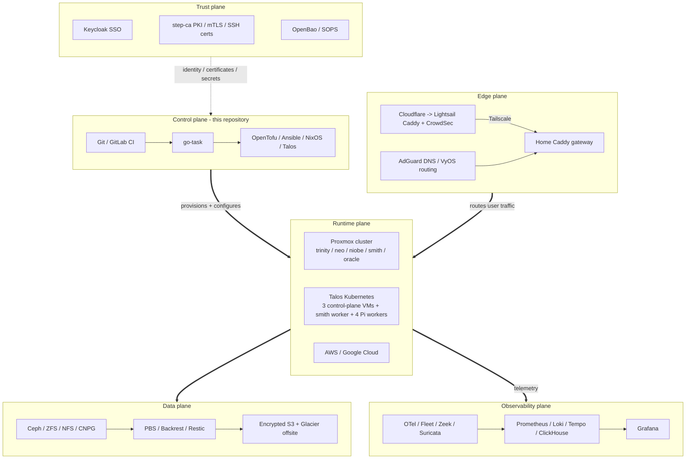

# Aether

Infrastructure as code for a private cloud spanning a Proxmox home cluster,
bare-metal ARM nodes, Talos Kubernetes, AWS, Google Cloud, Cloudflare, and
Tailscale.


## Features

| Area | Components |
| --- | --- |
| Compute | **Proxmox hosts:** `trinity`, `neo`, `niobe`, `smith`, `oracle`<br>**Talos control-plane VMs:** `trinity`, `neo`, `niobe`<br>**Talos worker VM:** `smith`<br>**Bare-metal ARM workers:** `mouse`, `dozer`, `tank`, `sparks`<br>**Core and edge host:** `oracle` |
| Kubernetes | **Network and ingress:** Cilium, Gateway API, Istio Ambient<br>**Platform:** vcluster, wasmCloud, CloudNativePG<br>**Storage:** Ceph CSI, NFS CSI<br>**Policy and secrets:** Kyverno, External Secrets, architecture guardrails |
| Network and edge | **Routing:** VyOS, VLANs, Tailscale<br>**DNS:** AdGuard<br>**Internal ingress:** home Caddy gateway<br>**Public ingress:** Cloudflare, AWS Lightsail, CrowdSec |
| Storage and backup | **Storage:** ZFS, Ceph RBD, CephFS, Ceph RGW, NFS, SMB<br>**Local backup:** Proxmox Backup Server, Kubernetes volume and database backups<br>**Offsite:** Restic, Backrest, encrypted and versioned S3, Glacier Deep Archive |
| Identity and secrets | **Identity:** Keycloak SSO<br>**PKI:** step-ca, mTLS, SSH certificates<br>**Secrets:** OpenBao, SOPS, OpenBao Transit, AWS KMS, offline Age recovery key |
| Observability | **Primary UI:** Grafana<br>**Metrics:** Prometheus<br>**Logs:** Loki<br>**Traces:** Tempo<br>**Network telemetry:** ClickHouse, Zeek, Suricata<br>**Host and pipeline:** Fleet, OpenTelemetry |
| Runtime security | Suricata, Zeek, CrowdSec, Tetragon, Trivy Operator, Policy Reporter, Kyverno, Kepler |
| AI and GPU | **Inference:** llama-swap<br>**Routing:** LiteLLM<br>**Interfaces and tools:** OpenWebUI, ComfyUI, Docling, Speaches, Jupyter<br>**GPU nodes:** `neo`, `smith` |
| Applications | **Development:** GitLab<br>**Communication:** Matrix and bridges<br>**Home:** Home Assistant, Z-Wave, Matter<br>**Media:** Jellyfin, Sunshine<br>**Files and photos:** Nextcloud, Immich |
| Cloud services | **AWS:** public ingress, SES, identity, budgets, offsite backup<br>**Google Cloud:** uptime monitoring, identity federation, budgets, APIs<br>**Cloudflare:** DNS and edge services |
| Automation | OpenTofu, Ansible, NixOS, Talos, go-task, GitLab CI/CD |

## Architecture



Feature declarations are spread across multiple ownership layers. Start with
[`config/vm.yml`](config/vm.yml), [`tofu/`](tofu), [`ansible/`](ansible),
[`nix/`](nix), and [`Taskfile.yml`](Taskfile.yml), then use the focused docs
below. Historical material under `docs/exploration/` and `docs/worklogs/` is not
current-state documentation.

## Start Here

[Nix](https://nixos.org/) is the only host dependency. The flake supplies
OpenTofu, Ansible, SOPS, OpenBao, AWS and Google CLIs, `kubectl`, `talosctl`,
Helm, Babashka, go-task, and the remaining workspace tools.

```bash
# Enter the pinned toolchain. Direnv may do this automatically.
nix develop

# Existing environment: reuse cached credentials when they are still valid.
task login:status
task login                 # only when status or a command shows auth is missing

# Discover supported workflows, including tasks without descriptions.
task --list-all
```

Before Kubernetes or Talos work, verify the exact cluster context:

```bash
kubectl config current-context    # expect: admin@aether-k8s
```

If it is wrong, clear an externally supplied kubeconfig and regenerate Aether's
credentials from OpenTofu state:

```bash
unset KUBECONFIG
task k8s:auth
kubectl config current-context
```

Read [`AGENTS.md`](AGENTS.md) before making changes. It contains the
state-lock, live-patching, authentication, and shared-repository guardrails.

## Source Of Truth

| Concern | Authoritative paths |
| --- | --- |
| Shared VM, LXC, and Talos facts | [`config/vm.yml`](config/vm.yml) |
| SSH inventory and host groups | [`ansible/inventory/hosts.yml`](ansible/inventory/hosts.yml) |
| Root cloud and home module wiring | [`tofu/main.tf`](tofu/main.tf) |
| Proxmox, Talos, identity, and home infrastructure | [`tofu/home/`](tofu/home) |
| Kubernetes platform and applications | [`tofu/home/kubernetes/`](tofu/home/kubernetes) |
| AWS and Google resources | [`tofu/aws/`](tofu/aws), [`tofu/google/`](tofu/google) |
| Host and service configuration | [`ansible/playbooks/`](ansible/playbooks), [`ansible/roles/`](ansible/roles) |
| NixOS systems and reusable modules | [`nix/hosts/`](nix/hosts), [`nix/modules/`](nix/modules), [`flake.nix`](flake.nix) |
| Supported workflows | [`Taskfile.yml`](Taskfile.yml) |
| Encrypted secret policy and data | [`.sops.yaml`](.sops.yaml), `secrets/secrets.yml` |

OpenTofu uses one root state under `tofu/`. Home addresses begin with
`module.home`; Kubernetes addresses begin with `module.home.module.kubernetes`.
Even a targeted operation parses all loaded configuration, so `-target` does
not isolate unrelated syntax or provider errors.

## Common Workflows

Use narrowly scoped tasks. There is deliberately no `configure:all`: gateway,
monitoring, GitLab, backup, identity, and other subsystems have independent
failure domains and should not be changed as one operation.

```bash
# OpenTofu
task tofu:plan
task tofu:apply

# Examples of scoped host/service configuration
task configure:gateway
task configure:monitoring
task configure:backup
task configure:keycloak

# Examples of scoped NixOS deployment
task configure:adguard
task configure:bastion
task configure:ids-stack
```

Prefer a Taskfile workflow over the underlying command because tasks supply
cached tokens, generated outputs, inventory settings, and other required
environment. Do not use Ansible `--start-at-task` on secret-dependent
playbooks; use supported tags so prerequisite secret loaders still run.

### Secrets And Login

`task login` performs Keycloak device authentication and obtains the configured
AWS, Google Workload Identity Federation, OpenBao, Ceph RGW, and SSH
credentials. Individual providers may be skipped when they are not configured.

```bash
task sv              # view secrets/secrets.yml
task se              # edit secrets/secrets.yml
task sg -- '.path'   # read one value
task sl              # list keys without printing values
task sops:rotate     # rewrap encrypted files with current .sops.yaml recipients
```

The Age private key is an offline bootstrap and recovery recipient, not a
day-to-day credential. Follow [Secrets](docs/secrets.md) and the bootstrap
procedures rather than copying recovery material into the repository.

### Initial Backend Bootstrap

Initial bootstrap comes before unified login. `task login` relies on identity
resources and OpenTofu outputs that do not exist in a blank environment.

With pre-existing human AWS administrator credentials available through the
standard AWS environment or profile chain, `task bootstrap` creates or updates
the AWS CloudFormation stack for the remote OpenTofu backend, writes
`config/tofu-state.config`, and initializes the root. It does not provision the
rest of Aether.

```bash
aws sts get-caller-identity
task bootstrap
```

The first root apply also needs the bootstrap credentials required by providers
whose federated identities have not been created yet. For Google Cloud, that is
a human Application Default Credential from
`gcloud auth application-default login`. After the identity resources have
been applied and outputs written, use `task login` for normal keyless access.
Run only the scoped provisioning or configuration tasks for each subsystem
being introduced.

## Documentation

### Infrastructure

| Doc | Scope |
| --- | --- |
| [Hosts](docs/hosts.md) | Physical hosts and roles |
| [Virtual Machines](docs/virtual-machines.md) | VM/LXC placement and capacity |
| [Networking](docs/networking.md) | VLANs, firewall, DNS, gateways, and routing |
| [Storage](docs/storage.md) | Ceph, ZFS, NFS, SMB, and CephFS |
| [Backups](docs/backups.md) | PBS, database, volume, and offsite backups |
| [PaaS](docs/paas.md) | Talos Kubernetes and platform services |
| [Namespace Strategy](docs/namespace-strategy.md) | Namespace ownership and policy contracts |
| [NixOS](docs/nixos.md) | Declarative systems and migration direction |
| [UPS](docs/ups.md) | Power monitoring and shutdown behavior |

### Operations And Services

| Doc | Scope |
| --- | --- |
| [Monitoring](docs/monitoring.md) | Metrics, logs, traces, dashboards, and alerts |
| [AI/ML](docs/ai-ml.md) | GPU workloads, inference, model routing, and user interfaces |
| [Communication](docs/communication.md) | Matrix, bridges, notifications, and mail relay |
| [GitLab Kubernetes Runner](docs/gitlab-k8s-runner.md) | Runner architecture and operations |
| [Bastion](docs/bastion.md) | Administrative access path |

### Trust And External Systems

| Doc | Scope |
| --- | --- |
| [Trust Model](docs/trust-model.md) | Identity planes and authentication architecture |
| [Secrets](docs/secrets.md) | OpenBao, SOPS, recipients, and recovery |
| [AWS](docs/aws.md) | Public gateway, identity, backups, KMS, SES, and budgets |
| [Google Cloud](docs/google-cloud.md) | Uptime monitoring, identity federation, Maps APIs, and budgets |
| [Cloudflare](docs/cloudflare.md) | DNS and edge configuration |
| [Tailscale](docs/tailscale.md) | Mesh networking and remote access |

[`docs/todos.md`](docs/todos.md), `docs/exploration/`, and `docs/worklogs/`
describe plans or historical work. Confirm their claims against current code
before acting on them.
