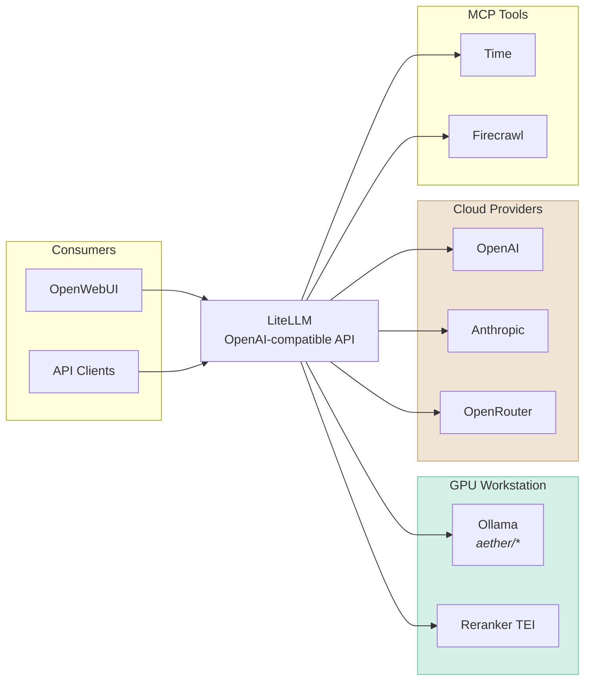

# AI/ML

GPU-accelerated inference and development infrastructure running on Neo.

## GPU Workstation

Primary AI/ML compute VM with full GPU passthrough. Runs on Neo with Nvidia RTX Pro 6000 Max-Q (48GB VRAM).

| Component  | Purpose                                      |
| ---------- | -------------------------------------------- |
| Ollama     | Local LLM inference server                   |
| ComfyUI    | Node-based Stable Diffusion interface        |
| SwarmUI    | Alternative Stable Diffusion interface       |
| JupyterLab | Interactive notebook environment             |
| Docling    | Document parsing and extraction              |
| ClearML    | MLOps platform (experiment tracking, queues) |

### Ollama Models

Models are stored locally on the VM's 1TB NVME. Ollama serves as the primary inference backend for all LLM requests. See [`gpu_workstation/ollama.yml`](../ansible/playbooks/gpu_workstation/ollama.yml) for the current model list.

### Image Generation

ComfyUI provides node-based Stable Diffusion workflows. SwarmUI offers a more user-friendly interface using ComfyUI as its backend (shared model directory). See [`gpu_workstation/comfyui.yml`](../ansible/playbooks/gpu_workstation/comfyui.yml) for the current model list.

Supported features:

- SDXL, SD 1.5, Flux, Qwen-Image models
- ControlNet, IP-Adapter
- Custom LoRAs and embeddings

## AI Tool Stack

Frontend and orchestration layer running on Neo (separate VM, no GPU passthrough). Provides user-facing AI interfaces backed by the GPU Workstation.

| Component | Purpose                           |
| --------- | --------------------------------- |
| LiteLLM   | LLM gateway and proxy             |
| OpenWebUI | ChatGPT-like web interface        |
| LibreChat | Alternative chat interface        |
| SearXNG   | Privacy-focused metasearch engine |
| Firecrawl | Web scraping and crawling         |
| Bytebot   | Browser automation                |

### LiteLLM

Unified API gateway proxying requests to multiple LLM backends:

| Provider   | Models                                   |
| ---------- | ---------------------------------------- |
| Ollama     | Local models (`aether/*` prefix)         |
| OpenAI     | GPT-5.2, GPT-5.2-Pro                     |
| Anthropic  | Claude Opus 4.5, Claude Sonnet 4.5       |
| OpenRouter | Gemini 3 Pro, Grok 4, GLM-4.6            |
| TEI        | BGE reranker (routed to GPU Workstation) |

Also provides:

- MCP tool servers (time, Firecrawl)
- Virtual API keys for consumer services

See [`ai_tool_stack/litellm/config.yaml.j2`](../ansible/playbooks/ai_tool_stack/litellm/config.yaml.j2) for the model list.

### OpenWebUI

Primary chat interface with:

- Multi-model support via LiteLLM
- RAG with hybrid search (Qwen3 embeddings + BGE reranker)
- Document extraction via Docling
- Web search via SearXNG
- Code execution via JupyterLab
- Tool integrations via MCPO (MCP over HTTP)
- OAuth via Keycloak

See [`ai_tool_stack/openwebui/`](../ansible/playbooks/ai_tool_stack/openwebui/) for configuration.

### Search and Retrieval

SearXNG provides privacy-focused web search aggregation. Firecrawl handles web page extraction for RAG pipelines.

### Access

- LiteLLM: `litellm.home.shdr.ch`
- OpenWebUI: `openwebui.home.shdr.ch`
- SearXNG: `search.home.shdr.ch`

## Reranker

Cross-encoder reranking service for RAG pipelines. Runs on the GPU Workstation via [Text Embeddings Inference (TEI)](https://github.com/huggingface/text-embeddings-inference).

| Setting | Value                     |
| ------- | ------------------------- |
| Model   | `BAAI/bge-reranker-large` |
| Runtime | TEI with CUDA             |

See [`gpu_workstation/reranker.yml`](../ansible/playbooks/gpu_workstation/reranker.yml) for configuration.
