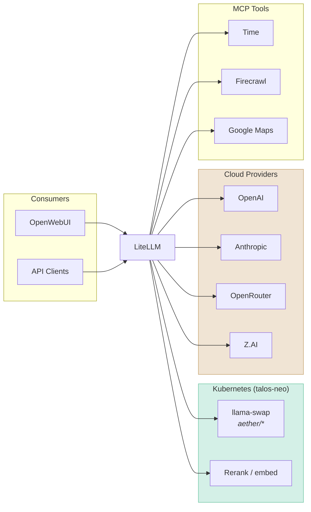

# AI/ML

GPU-accelerated inference runs on **Talos Kubernetes**. Most shared AI workloads, including SnapOtter's file-processing AI tools, use `talos-neo` (RTX Pro 6000 Blackwell).

## Kubernetes GPU stack

| Workload    | Role                                      | Terraform / notes |
| ----------- | ----------------------------------------- | ----------------- |
| llama-swap  | Local GGUF inference (`aether/*` models)  | `tofu/home/kubernetes/llama_swap.tf` |
| ComfyUI     | Stable Diffusion workflows                | `tofu/home/kubernetes/comfyui.tf` |
| Docling     | Document parsing for RAG                  | `tofu/home/kubernetes/docling.tf` |
| JupyterLab  | Notebooks (OpenWebUI code execution)      | `tofu/home/kubernetes/jupyter.tf` |
| Speaches    | STT/TTS                                   | `tofu/home/kubernetes/speaches.tf` |
| OpenWebUI   | Chat UI                                   | `tofu/home/kubernetes/openwebui.tf` |
| SnapOtter   | File-processing AI tools                  | `tofu/home/kubernetes/snapotter.tf` |

Model weights and ComfyUI state live on the **local NVMe** PV mounted on `talos-neo` (`gpu_model_storage.tf`).
`llama-swap`, ComfyUI, Docling, JupyterLab, and Speaches are explicitly pinned to `talos-neo`
with `local.gpu_neo_node_selector`; they still require the NVIDIA Talos
extension selector in addition to the hostname.

SnapOtter uses a Ceph RBD PVC for app data and its AI cache, requests one `nvidia.com/gpu`, uses the `nvidia` runtime class, and pins to `talos-neo` with `local.snapotter_gpu_node_selector`. `SNAPOTTER_GPU=true` keeps rembg/ONNX background-removal models on CUDA; the older `talos-smith` GTX 1660 Super placement could not reliably run the BiRefNet ONNX models through CUDA.

Image generation features (SDXL, Flux, Qwen-Image, ControlNet, LoRAs, etc.) follow upstream ComfyUI; manage models on the GPU PV / ComfyUI paths.

**Not migrated to K8s in-repo:** SwarmUI and ClearML previously ran on the GPU VM; Caddy routes for those hostnames were removed. Re-introduce them when/if you deploy replacements.

## AI Tool Stack (K8s)

LiteLLM, chat, search, crawl, and GPU services are reached via the cluster Gateway. The old **ai-tool-stack** VM has been removed.

| Component | Purpose                           |
| --------- | --------------------------------- |
| LiteLLM   | LLM gateway and proxy             |
| OpenWebUI | Chat UI (K8s)                     |
| SearXNG   | Metasearch (K8s)                  |
| Firecrawl | Crawl + MCP (K8s)                 |

### LiteLLM

Unified OpenAI-compatible API: local models via **llama-swap**, embeddings + reranker on the same credential, cloud providers, Cursor Composer routes, and MCP tools. The Cursor Composer models are exposed as `cursor/composer-2.5` and `cursor/composer-2.5-fast`; LiteLLM bridges `/responses` clients to the self-hosted composer-api chat-completions endpoint, and also exposes first-class Cursor BYOK routes under `/cursor/*`.

GLM and Kimi deployments are pooled across their configured providers under the
canonical `router/glm-5.2` and `router/kimi-k2.7-code` model groups. Routing
uses simple shuffle with same-group weighted failover; the existing
provider-prefixed model names, plus `glm` and `kimi`, remain compatibility
aliases. The same routing pattern covers `router/deepseek-v4-pro`,
`router/deepseek-v4-flash`, `router/qwen3.7-max`, `router/minimax-m3`, and
`router/mimo-v2.5-pro` where multiple providers are configured. Ollama Cloud's
Kimi K2.6 deployment remains separate. Production routing uses a 120-second
upstream timeout for agentic turns, three retries, and one failed deployment
before a 300-second cooldown; detailed debug mode is disabled.

```mermaid
flowchart LR
    subgraph Consumers
        OWUI[OpenWebUI]
        API[API Clients]
    end

    LLM[LiteLLM]

    subgraph K8s["Kubernetes (talos-neo)"]
        LS[llama-swap<br/><i>aether/*</i>]
        RR[Rerank / embed]
    end

    subgraph Cloud["Cloud Providers"]
        OAI[OpenAI]
        ANT[Anthropic]
        OR[OpenRouter]
        ZAI[Z.AI]
    end

    subgraph MCP["MCP Tools"]
        TIME[Time]
        FC[Firecrawl]
        GMAPS[Google Maps]
    end

    OWUI & API --> LLM
    LLM --> LS & RR
    LLM --> OAI & ANT & OR & ZAI
    LLM --> TIME & FC & GMAPS

    style K8s fill:#d4f0e7,stroke:#6ac4a0
    style Cloud fill:#f0e4d4,stroke:#c4a06a
```

See [`tofu/home/kubernetes/litellm_config.yaml.tftpl`](../tofu/home/kubernetes/litellm_config.yaml.tftpl) for the live model list and MCP registry. Google Maps MCP is opt-in: when `google.project_id` exists in SOPS, [`tofu/google/main.tf`](../tofu/google/main.tf) provisions the Google Maps API key, keeps it in Terraform state, restricts it to Maps APIs, and passes it to the LiteLLM sidecar as `GOOGLE_MAPS_API_KEY`. Google Cloud admin access is keyless after bootstrap: the first apply uses a human Application Default Credential from `gcloud auth application-default login`, then `task login` writes Workload Identity Federation external-account credentials for future OpenTofu runs instead of using a service-account JSON key.

### OpenWebUI

Configured in [`tofu/home/kubernetes/openwebui.tf`](../tofu/home/kubernetes/openwebui.tf): LiteLLM backend, RAG (Docling + reranker URLs), SearXNG, Jupyter, OAuth via Keycloak.

### Access (via Caddy on gateway)

- LiteLLM: `https://litellm.home.shdr.ch`
- OpenWebUI: `https://openwebui.home.shdr.ch`
- llama-swap (OpenAI-compatible): `https://llama-swap.apps.home.shdr.ch`
- ComfyUI: `https://comfyui.home.shdr.ch`
- Docling: `https://docling.home.shdr.ch`
- Jupyter: `https://jupyter.home.shdr.ch`

## Reranker and embeddings

Cross-encoder reranking and Qwen3 embeddings are served through **llama-swap** on the cluster (same `llama_swap_credential` as chat models in LiteLLM), not a separate TEI VM.
