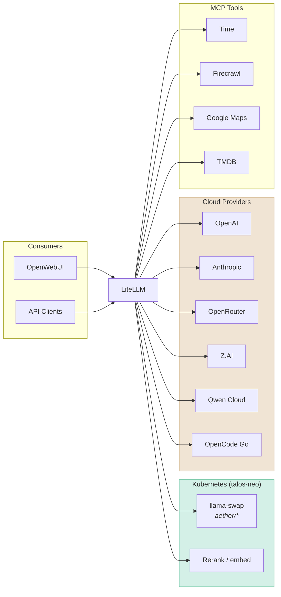

# AI/ML

GPU-accelerated inference runs on **Talos Kubernetes**. Most shared AI workloads, including SnapOtter's file-processing AI tools, use `talos-neo` (RTX Pro 6000 Blackwell).

## Kubernetes GPU stack

| Workload    | Role                                      | Terraform / notes |
| ----------- | ----------------------------------------- | ----------------- |
| llama-swap  | Local GGUF inference (`aether/*` models)  | `tofu/home/kubernetes/llama_swap.tf` |
| ComfyUI     | Stable Diffusion workflows                | `tofu/home/kubernetes/comfyui.tf` |
| Docling     | Document parsing for RAG                  | `tofu/home/kubernetes/docling.tf` |
| JupyterLab  | Notebooks (OpenWebUI code execution)      | `tofu/home/kubernetes/jupyter.tf` |
| Speech      | STT/TTS (Qwen3-ASR + Qwen3-TTS via audio.cpp under llama-swap) | `tofu/home/kubernetes/llama_swap.tf` |
| OpenWebUI   | Chat UI                                   | `tofu/home/kubernetes/openwebui.tf` |
| SnapOtter   | File-processing AI tools                  | `tofu/home/kubernetes/snapotter.tf` |

Model weights and ComfyUI state live on the **local NVMe** PV mounted on `talos-neo` (`gpu_model_storage.tf`).
`llama-swap`, ComfyUI, Docling, and JupyterLab are explicitly pinned to `talos-neo`
with `local.gpu_neo_node_selector`; they still require the NVIDIA Talos
extension selector in addition to the hostname.

Speech (STT/TTS) is served by `audiocpp_server` spawned as llama-swap child
processes: an init container copies the official audio.cpp image's binaries
onto the GPU PV, GGUF packages live under `llama-swap/models/audiocpp/models/`,
and TTS voices are wav + transcript pairs in `.../audiocpp/voices/` selected via
the OpenAI `voice` field. The former Speaches deployment is decommissioned.

SnapOtter uses a Ceph RBD PVC for app data and its AI cache, requests one `nvidia.com/gpu`, uses the `nvidia` runtime class, and pins to `talos-neo` with `local.snapotter_gpu_node_selector`. `SNAPOTTER_GPU=true` keeps rembg/ONNX background-removal models on CUDA; the older `talos-smith` GTX 1660 Super placement could not reliably run the BiRefNet ONNX models through CUDA.

Image generation features (SDXL, Flux, Qwen-Image, ControlNet, LoRAs, etc.) follow upstream ComfyUI; manage models on the GPU PV / ComfyUI paths.

**Not migrated to K8s in-repo:** SwarmUI and ClearML previously ran on the GPU VM; Caddy routes for those hostnames were removed. Re-introduce them when/if you deploy replacements.

## AI Tool Stack (K8s)

LiteLLM, chat, search, crawl, and GPU services are reached via the cluster Gateway. The old **ai-tool-stack** VM has been removed.

| Component | Purpose                           |
| --------- | --------------------------------- |
| LiteLLM   | LLM gateway and proxy             |
| OpenWebUI | Chat UI (K8s)                     |
| SearXNG   | Metasearch (K8s)                  |
| Firecrawl | Crawl + MCP (K8s)                 |

### LiteLLM

Unified OpenAI-compatible API: local models via **llama-swap**, embeddings +
reranker on the same credential, cloud providers, Cursor Grok, and MCP tools.
Cursor is exposed only as `cursor/grok-4.6`.

The self-hosted Composer API is a thin OMP bridge for Cursor's native HTTP/2
`Run` transport. It exchanges the server-owned Cursor credential, discovers
Grok 4.6 effort variants, and translates OpenAI chat completions. Client
function tools remain client-owned: Composer pauses the native Cursor turn,
returns OpenAI `tool_calls`, and resumes that same in-memory turn when the
client submits the complete result set. Pending turns are intentionally
at-most-once and are lost on expiry, restart, or a disconnect after result
acceptance.

LiteLLM has no native Cursor inference adapter. Its `/cursor/*` routes concern
the separate Cursor Cloud Agents API and Cursor-as-BYOK integration, not chat
inference. The `cursor/grok-4.6` model therefore uses LiteLLM's OpenAI adapter
against Composer's internal endpoint and authenticates with a bridge-only
bearer; the Cursor credential never leaves the Composer pod.

Qwen Cloud provides the standalone `qwen-cloud/qwen3.8-max` and
`qwen-cloud/qwen3.8-flash` models through Alibaba MaaS. Inquest sends Holmes
investigations to `qwen-cloud/qwen3.8-max`.

Clinepass also exposes `clinepass/qwen3.8-max`, `clinepass/muse-spark-1.3`,
and `clinepass/muse-spark-1.3-contributor` as standalone provider pins.

Google Antigravity is exposed through the single-tenant bridge as
`antigravity/gemini-3.8-flash`; `antigravity/gemini-3.7-flash` remains
available for compatibility. The bridge translates OpenAI chat-completions
requests to the subscription API; clients retain ownership of tool execution
and follow-up results. OMP and Colony virtual keys may use both models, but no
Colony agent selects either by default.

The private Muse bridge exchanges the operator's Muse Code account grant for
the subscription-backed key and exposes `muse-subscription/muse-spark-1.3`.
Rotated OAuth and subscription credentials persist in a dedicated OpenBao
record; the bridge never falls back to a PAYG Meta key.

GLM 5.2 deployments remain pooled under the canonical
`router/glm-5.2` group for the Clinepass and Ollama Cloud providers.
Z.AI GLM 5.3 uses the separate `router/glm-5.3` group, backed only by the
configured Z.AI key; the `glm` alias and first-party agent defaults use GLM 5.3.
GLM 5.3 Flash is a third group, `router/glm-5.3-flash`, shuffled across
Clinepass, Z.AI, Command Code, OpenCode Go, and Ollama Cloud. Provider-prefixed
pins (`clinepass/glm-5.3-flash`, `commandcode/glm-5.3-flash`,
`ollama-cloud/glm-5.3-flash`, `opencode-go/glm-5.3-flash`,
`zai/glm-5.3-flash`) stay standalone. Flash is the
named successor to the ended OpenCode Go Ox Alpha preview; do not mix it with
`router/glm-5.3`. The provider-prefixed GLM names remain compatibility aliases.
Other shared groups include `router/deepseek-v4-flash`,
`router/qwen3.7-max`, `router/minimax-m3`, `router/mimo-v2.5-pro`,
`router/muse-spark-1.3`, `router/muse-spark-1.3-contributor`, and
`router/hy4-preview`. The normal Muse pool uses the private subscription,
Command Code, and Clinepass. The contributor pool uses Command Code,
Clinepass, and OpenCode Go; contributor prompts may be used as training data,
so that pool is for public work only. Both Muse routers require streaming.
The CodeBuddy international route is pinned as `codebuddy/hy4-preview` rather
than added to the router pool: its endpoint accepts only streaming requests
whose first message is `system`. Colony's Pi transport satisfies both constraints.
OpenCode Go provides `opencode-go/muse-spark-1.3-contributor` and
`opencode-go/glm-5.3-flash` through `https://opencode.ai/zen/go/v1`.
Ollama Cloud's Kimi K2.6 deployment remains separate. Production routing uses
a 120-second upstream timeout for agentic turns, three retries, and one failed
deployment before a 300-second cooldown; detailed debug mode is disabled.

```mermaid
flowchart LR
    subgraph Consumers
        OWUI[OpenWebUI]
        API[API Clients]
    end

    LLM[LiteLLM]

    subgraph K8s["Kubernetes (talos-neo)"]
        LS[llama-swap<br/><i>aether/*</i>]
        RR[Rerank / embed]
    end

    subgraph Cloud["Cloud Providers"]
        OAI[OpenAI]
        ANT[Anthropic]
        OR[OpenRouter]
        ZAI[Z.AI]
        QWEN[Qwen Cloud]
        OCGO[OpenCode Go]
    end

    subgraph MCP["MCP Tools"]
        TIME[Time]
        FC[Firecrawl]
        GMAPS[Google Maps]
        TMDB[TMDB]
    end

    OWUI & API --> LLM
    LLM --> LS & RR
    LLM --> OAI & ANT & OR & ZAI & QWEN & OCGO
    LLM --> TIME & FC & GMAPS & TMDB

    style K8s fill:#d4f0e7,stroke:#6ac4a0
    style Cloud fill:#f0e4d4,stroke:#c4a06a
```

See [`tofu/home/kubernetes/litellm_config.yaml.tftpl`](../tofu/home/kubernetes/litellm_config.yaml.tftpl) for the live model list and MCP registry. Google Maps MCP is opt-in: when `google.project_id` exists in SOPS, [`tofu/google/main.tf`](../tofu/google/main.tf) provisions the Google Maps API key, keeps it in Terraform state, restricts it to Maps APIs, and passes it to the LiteLLM sidecar as `GOOGLE_MAPS_API_KEY`. Google Cloud admin access is keyless after bootstrap: the first apply uses a human Application Default Credential from `gcloud auth application-default login`, then `task login` writes Workload Identity Federation external-account credentials for future OpenTofu runs instead of using a service-account JSON key.

### OpenWebUI

Configured in [`tofu/home/kubernetes/openwebui.tf`](../tofu/home/kubernetes/openwebui.tf): LiteLLM backend, RAG (Docling + reranker URLs), SearXNG, Jupyter, OAuth via Keycloak.

### Access (via Caddy on gateway)

- LiteLLM: `https://litellm.home.shdr.ch`
- OpenWebUI: `https://openwebui.home.shdr.ch`
- llama-swap (OpenAI-compatible): `https://llama-swap.apps.home.shdr.ch`
- ComfyUI: `https://comfyui.home.shdr.ch`
- Docling: `https://docling.home.shdr.ch`
- Jupyter: `https://jupyter.home.shdr.ch`

## Reranker and embeddings

Cross-encoder reranking and Qwen3 embeddings are served through **llama-swap** on the cluster (same `llama_swap_credential` as chat models in LiteLLM), not a separate TEI VM.
