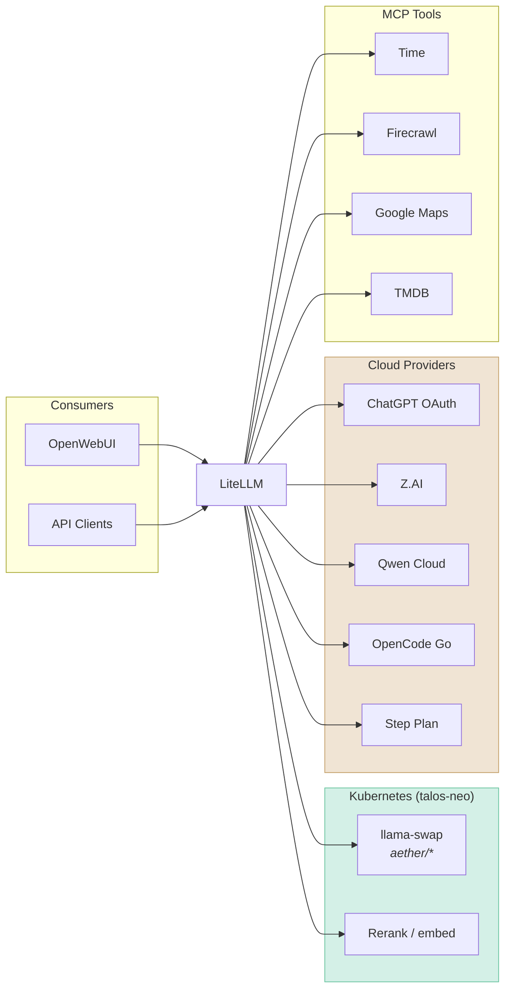

# AI/ML

GPU-accelerated inference runs on **Talos Kubernetes**. Most shared AI workloads, including SnapOtter's file-processing AI tools, use `talos-neo` (RTX Pro 6000 Blackwell).

## Kubernetes GPU stack

| Workload    | Role                                      | Terraform / notes |
| ----------- | ----------------------------------------- | ----------------- |
| llama-swap  | Local GGUF inference (`aether/*` models)  | `tofu/home/kubernetes/llama_swap.tf` |
| ComfyUI     | Stable Diffusion workflows                | `tofu/home/kubernetes/comfyui.tf` |
| Docling     | Document parsing for RAG                  | `tofu/home/kubernetes/docling.tf` |
| JupyterLab  | Notebooks (OpenWebUI code execution)      | `tofu/home/kubernetes/jupyter.tf` |
| Speech      | STT/TTS (Qwen3-ASR + Qwen3-TTS via audio.cpp under llama-swap) | `tofu/home/kubernetes/llama_swap.tf` |
| OpenWebUI   | Chat UI                                   | `tofu/home/kubernetes/openwebui.tf` |
| SnapOtter   | File-processing AI tools                  | `tofu/home/kubernetes/snapotter.tf` |

Model weights and ComfyUI state live on the **local NVMe** PV mounted on `talos-neo` (`gpu_model_storage.tf`).
`llama-swap`, ComfyUI, Docling, and JupyterLab are explicitly pinned to `talos-neo`
with `local.gpu_neo_node_selector`; they still require the NVIDIA Talos
extension selector in addition to the hostname.

Do not run a display server on the `talos-neo` GPU. Any running X server,
such as the game server's `steam-headless` Xorg, sets the card to
`Display Active`. The NVIDIA driver then enforces a kernel-runtime watchdog on
compute work. Long `qwen3.8-27b` kernels trip it with `NVRM: Xid 8` and
`CUDA error: the launch timed out and was terminated`, which kills the
llama-server. From 2026-09-25, when Inquest sent its long Holmes prompts to
the 27B, this caused about 40–110 crashes a day. With `game-server`
`replicas = 0` (`game_server.tf`), the card reports `Display Active: Disabled`,
and the same 46k-token workload ran 35 minutes on 2026-09-30 with no Xid.

Speech (STT/TTS) is served by `audiocpp_server` spawned as llama-swap child
processes: an init container copies the official audio.cpp image's binaries
onto the GPU PV, GGUF packages live under `llama-swap/models/audiocpp/models/`,
and TTS voices are wav + transcript pairs in `.../audiocpp/voices/` selected via
the OpenAI `voice` field. The former Speaches deployment is decommissioned.

SnapOtter uses a Ceph RBD PVC for app data and its AI cache, requests one `nvidia.com/gpu`, uses the `nvidia` runtime class, and pins to `talos-neo` with `local.snapotter_gpu_node_selector`. `SNAPOTTER_GPU=true` keeps rembg/ONNX background-removal models on CUDA; the older `talos-smith` GTX 1660 Super placement could not reliably run the BiRefNet ONNX models through CUDA.

Image generation features (SDXL, Flux, Qwen-Image, ControlNet, LoRAs, etc.) follow upstream ComfyUI; manage models on the GPU PV / ComfyUI paths.

**Not migrated to K8s in-repo:** SwarmUI and ClearML previously ran on the GPU VM; Caddy routes for those hostnames were removed. Re-introduce them when/if you deploy replacements.

## AI Tool Stack (K8s)

LiteLLM, chat, search, crawl, and GPU services are reached via the cluster Gateway. The old **ai-tool-stack** VM has been removed.

| Component | Purpose                           |
| --------- | --------------------------------- |
| LiteLLM   | LLM gateway and proxy             |
| OpenWebUI | Chat UI (K8s)                     |
| SearXNG   | Metasearch (K8s)                  |
| Firecrawl | Crawl + MCP (K8s)                 |

### LiteLLM

Unified OpenAI-compatible API: local models via **llama-swap**, embeddings +
reranker on the same credential, cloud providers, and MCP tools.

**Maintenance hold (2026-09-24):** The model retirements, alias removal,
SuperGrok upgrade, and Cursor integration removal are staged changes.
Their rollout and virtual-key synchronization have not been performed;
do not apply them during server maintenance.

Cursor/Composer is no longer registered with LiteLLM: its model entry,
`composer_credential`, `CURSOR_BRIDGE_API_KEY` injection, and model permissions
have been removed. The standalone Composer deployment and its own credentials
remain declared in [`composer.tf`](../tofu/home/kubernetes/composer.tf).
It still exposes Grok 4.6 over Cursor's native HTTP/2 transport for direct
clients; this change neither upgrades nor decommissions that service.

Qwen Cloud provides the standalone `qwen-cloud/qwen3.8-max` and
`qwen-cloud/qwen3.8-flash` models through Alibaba MaaS. Inquest is configured
to send Holmes investigations to the local `aether/qwen3.8-flash-next:think`.

Holmes is paused (`replicas = 0` in `tofu/home/kubernetes/holmesgpt.tf`) since
2026-09-29. From 05:30Z that day, Inquest investigations sent 20–45
`qwen3.8-27b:think` requests per 30 minutes. That load held the llama-swap GPU
at its 300 W cap and 84–87 °C, and `GPU High Temperature` fired 81 times in
4 hours. While Holmes is paused, Inquest still creates and deduplicates
incident issues. Its `holmes` task soft-fails (`allowFailure: true` in
`../inquest/flows/process-alert.yaml.tftpl`), so incidents get no RCA note.
Restore `replicas` once that alert no longer routes to local-model RCA.

Step Plan exposes only `step/step-5-preview` through the OpenAI-compatible
`https://api.stepfun.ai/step_plan/v1` endpoint. The credential is stored as
`litellm.step_api_key` in SOPS and injected as `STEP_API_KEY`. OMP and Colony
virtual keys can select this model; their defaults are unchanged. The route
has no PAYG or OpenRouter fallback.

ChatGPT subscription OAuth uses LiteLLM's native `chatgpt/` provider. Run
`nix develop --command task litellm:login:chatgpt` and complete the displayed
OpenAI device authorization. The dedicated `litellm-chatgpt-auth` Ceph RBD PVC
stores `/var/lib/litellm/chatgpt/auth.json`; LiteLLM updates it during token
refresh. The login task restricts the directory to `0700` and the file to
`0600`. Use a dedicated LiteLLM login rather than sharing a rotating refresh
token with desktop Codex or OMP. Direct OpenAI API-key access is no longer
configured in LiteLLM.

The subscription routes are `chatgpt/gpt-6-astra`, `chatgpt/gpt-6.1-sol`, and
`chatgpt/gpt-6-luna`, available to OMP and Colony without changing their
defaults; Deskplane's MCP uses `chatgpt/gpt-6.1-sol`. They declare Responses
mode and native streaming explicitly because LiteLLM 1.99.1 does not include
GPT-6 in its bundled model catalog. GPT-6.1 Sol replaced GPT-6 Sol on
2026-09-29 and rejects `reasoning_effort` `none`/`minimal`.

Use `stream: true` with these routes and list-form `input` for `/v1/responses`.
All three passed streaming Responses inference; streaming Chat Completions
also passed. Non-streaming Chat Completions fail with
`Unknown items in responses API response: []` (verified on LiteLLM 1.99.1;
1.99.4 has the same code): the Responses bridge reads the upstream stream and
keeps only the `response.completed` payload, whose `output` the Codex backend
leaves empty; the message only arrives in `response.output_item.done`.
Moira's `tiers.yaml` marks the `chatgpt/` provider `chat_requires_stream`, so
non-streaming Chat requests to a Moira tier never route to ChatGPT. No paid
API-key or OpenRouter fallback is configured.

OpenWebUI's single household model is `router/family` ("Family Assistant"), a
LiteLLM priority pool: GPT-6 Astra on the ChatGPT subscription (`order: 1`),
Muse Spark 1.3 on the subscription bridge and Command Code (`order: 2`), then
MiMo V2.6 Pro on the Xiaomi token plan (`order: 3`). `DEFAULT_MODELS` points
OpenWebUI at it, and it is the only model entry non-admin users can read. The
fallbacks were chosen from the family's own prompts (447 unique, March to
September 2026: study and homework 31%, writing 28%, health 12%; 41% where a
wrong answer could cause harm; 8% need images and 13% documents), so every leg
reads images. On 2026-09-25 the ChatGPT plan hit its weekly usage limit
(`usage_limit_reached`, resetting about 2026-10-02); the `seven30-foundry` key
drove about 84% of that day's ChatGPT-route tokens, so the household pool now
falls through to Muse instead of failing.

Muse reasons privately for up to about 50 seconds before its first token, and
Meta redacts that reasoning on Chat Completions for external keys. The family
pool's Muse legs therefore call Meta's Responses API (`openai/responses/…`)
with `reasoning.summary: concise`; LiteLLM streams the summary as
`reasoning_content`, which OpenWebUI shows as a thinking block. Measured on
2026-09-26, a 250-word explanation showed its summary at 6.8 s and its answer
at 23.7 s. Colony and the other Muse routes stay on Chat Completions.

Clinepass also exposes `clinepass/qwen3.8-max`, `clinepass/muse-spark-1.3`,
and `clinepass/muse-spark-1.3-contributor` as standalone provider pins.

Google Antigravity is exposed through the single-tenant bridge as
`antigravity/gemini-3.8-flash`. The bridge translates OpenAI chat-completions
requests to the subscription API; clients retain ownership of tool execution
and follow-up results. OMP and Colony virtual keys include this model. Colony
uses it in the developer and architect fallback chains, not as a primary.

SuperGrok is exposed only as the subscription-backed
`supergrok/grok-4.7` pin. Stock LiteLLM uses the bridge's
`/v1/chat/completions` endpoint; the bridge translates native Responses
events and preserves tool calls and terminal failures. Native `/v1/responses`
remains available. Neither path falls back to `api.x.ai`, a PAYG key, Cursor,
or OpenRouter. Readiness fails closed unless live xAI metadata confirms Grok
Code access, coding-data retention opt-out or ZDR, and the reviewed model.
Run `task grok:login` to authorize the account and write rotating credentials
to `kv/aether/grok-bridge/credentials` in OpenBao. Runtime infrastructure is
owned by [`tofu/home/kubernetes/grok.tf`](../tofu/home/kubernetes/grok.tf);
bridge source is the private `so/grok-bridge` GitLab project. `/usage` is
best-effort and is not a readiness gate.

Claude is exposed through the pi-ai-backed single-tenant bridge as
`claude/sonnet-5-5`, `claude/opus-5-5`, and `claude/fable-5-1`. The bridge
speaks native Anthropic `/v1/messages`; LiteLLM's `anthropic/` provider owns
Chat Completions translation at its boundary. Its credential base URL is
`https://claude.home.shdr.ch` without `/v1`: LiteLLM appends `/v1/messages`.
All Anthropic connectivity —
OAuth login, refresh, and the Claude Code client identity on every request —
comes from the pinned `@earendil-works/pi-ai` dependency, so identity churn
is absorbed by dependency updates, never bridge edits. Since Anthropic's
2026-04 billing split, detected third-party clients draw per-token "extra
usage" instead of plan limits; `task claude:login` verifies plan-limit
classification with a marker request before persisting anything, and the
running bridge fails closed (503, readiness false) on that classification.
This is the same CLI-identity bridging posture as grok/muse and is not
sanctioned by Anthropic. There is no PAYG/Console fallback and no `/usage`
endpoint. Credentials persist at `kv/aether/claude-bridge/credentials`;
runtime infrastructure is owned by
[`tofu/home/kubernetes/claude.tf`](../tofu/home/kubernetes/claude.tf);
bridge source is the private `so/claude-bridge` GitLab project. Only the OMP
virtual key may select these pins. In-cluster egress is limited to
`bao.home.shdr.ch`, `platform.claude.com` (refresh), and
`api.anthropic.com` (inference and catalog); `claude.ai` is used only by the
workstation login. The bridge preserves native custom-tool controls, cache
markers, tool-result ordering, image/document inputs, thinking, sampling, and
stop sequences through pi-ai's payload hook. Native response events retain
distinct parallel-tool IDs, redacted thinking, refusal/stop metadata, and usage
breakdowns. Unsupported fields/tool types fail explicitly with 400; model-specific
restrictions remain Anthropic's responsibility. Image publication is gated on
the shipped bundle and tool cycles through the pinned LiteLLM image. See the
bridge's `docs/protocol-audit.md` for supported boundaries; this is not a claim
of compatibility with all current or future Anthropic features.

Only standard Grok 4.7 is approved; retired 4.6, Fast variants, and unknown
model IDs are rejected. A cached 4.6-only credential catalog cannot mark the
upgraded bridge ready: fresh account and catalog checks must approve 4.7.
The subscription selector is `grok-4.7`; native Responses reported
`grok-4.7-build` during verification, not a separate client-selectable model.
Bounded streaming Chat, a forced function-call/result round trip, and native
Responses passed against the real subscription using the upgraded local
bridge. Credentials were updated only in an isolated in-memory store;
no deployed bridge or OpenBao credential was changed by those checks.

The private Muse bridge exchanges the operator's Muse Code account grant for
the subscription-backed key and exposes `muse-subscription/muse-spark-1.3` and
`muse-subscription/muse-spark-1.3-contributor` on both `/v1/chat/completions`
and `/v1/responses`. The key is entitled to both tiers (Meta's `/v1/models`
lists them), and both draw on the same subscription quota: on 2026-09-26 each
returned `Subscription quota exhausted` with the same reset time.
Rotated OAuth and subscription credentials persist in a dedicated OpenBao
record; the bridge never falls back to a PAYG Meta key.

`router/glm-5.3` uses weighted shuffle across Z.AI and Ollama Cloud with
weights 4:1. Holmes primary and Hermes Tungsten use this canonical group.
`router/glm-5.3-flash` is a separate pool across Z.AI, Command Code,
OpenCode Go, and Ollama Cloud. Provider-prefixed Flash pins remain standalone,
including the Clinepass pin; Clinepass is not a pool member.

Other multi-provider pools are `router/muse-spark-1.3`,
`router/muse-spark-1.3-contributor`, and `router/hy4-preview`. The normal Muse
pool uses Command Code and the private subscription. The Contributor pool uses
Command Code's Contributor model and the subscription bridge's Contributor
model. Until 2026-09-26 the bridge leg served standard Muse, so Colony's
Contributor traffic on that leg (about 94M prompt tokens from 2026-09-25) ran on
the Standard model. OpenCode Go is not a Contributor leg: its Muse
Contributor endpoint answered "Endpoint is unavailable" (region-limited per
OpenCode's docs, 2026-09-25). Both Muse routers require streaming. Both are
priority pools: the subscription bridge leg (`order: 1`) takes every request
while healthy, and Command Code (`order: 2`) serves only while the
subscription is failing or cooling down. Hy4 pools Command Code and OpenCode Go.

`router/deepseek-v4-pro` and `router/minimax-m3` each have one Ollama Cloud
backend. Their `router/*` names remain canonical.

`router/mimo-v2.6-pro` and `router/mimo-v2.6-flash` are priority pools, not
shuffles: the Xiaomi MiMo token-plan leg (`order: 1`,
`https://token-plan-sgp.xiaomimimo.com/v1`, SOPS `litellm.xiaomi_api_key`)
takes every request while healthy, and the Command Code and OpenCode Go legs
(`order: 2`) serve only while Xiaomi is failing or cooling down. The
`xiaomi/*`, `commandcode/*`, and `opencode-go/*` MiMo pins stay addressable.
Clinepass also lists MiMo 2.6 but is not wired: it answers
`insufficient_credits` (2026-09-25).

Command Code and OpenCode Go deployments set `use_chat_completions_api: true`,
so LiteLLM serves `/v1/responses` callers through Chat Completions on those
legs. OpenCode Go answers `ModelProtocolUnsupported` on native `/responses` for
every model LiteLLM routes to it, and Command Code gave the same answer for MiMo.
On 2026-09-27 at 14:28 the Xiaomi leg entered its 300-second cooldown. Until
14:33 every `/v1/responses` request to `router/mimo-v2.6-pro` then failed on
the unbridged order-2 legs.

The CodeBuddy international route is pinned as `codebuddy/hy4-preview` rather
than added to the router pool: its endpoint accepts only streaming requests
whose first message is `system`. Colony's Pi transport satisfies both constraints.
OpenCode Go provides `opencode-go/glm-5.3-flash`, `opencode-go/hy4-preview`,
and the `opencode-go/mimo-v2.6-*` pins through `https://opencode.ai/zen/go/v1`. Go
rejects requests without `x-opencode-session` (`MissingSessionID`), so every
OpenCode Go deployment sends a static `x-opencode-session: aether-litellm` and
`User-Agent: aether-litellm/1.0` via `extra_headers`; all gateway traffic shares
that one session.
Kimi is exposed only as `kimi/k3`. Router defaults use a 120-second upstream
timeout for agentic turns, three retries, and one failed deployment before a
300-second cooldown; detailed debug mode is disabled.

The gateway declares 60 unique model names and no `model_group_alias` redirects.
Clients must send an exact `model_name`: use `router/*` for a routing group
or a provider-specific pin to choose that provider deliberately. All 13
compatibility aliases were removed; the Holmes, OMP, and Colony key allowlists
use canonical model names.
Upstream `litellm_params.model` identifiers and Colony's client-local model
labels are not gateway aliases.

Clients such as OMP and Pi discover capabilities from `/model_group/info`.
LiteLLM fills those fields from its bundled model map, which has no entry for
the custom `openai/<id>` backends, so every chat deployment except the native
`zai/` legs declares `model_info` in
[`litellm_config.yaml.tftpl`](../tofu/home/kubernetes/litellm_config.yaml.tftpl):
`mode`, `supports_reasoning`, `supports_function_calling`, `supports_vision`,
`max_input_tokens`, and `max_output_tokens` where one is published. Speech,
rerank, and embedding routes declare `audio_transcription`, `audio_speech`,
`rerank`, or `embedding`. LiteLLM 1.99.1 builds a group's entry from the first
deployment's `mode`, sets a `supports_*` flag if any deployment sets it, and
reports the largest token limit among the legs. `router/family` therefore
reports 1048576 input tokens although its order-1 Astra leg takes 272000.

`openai/` and `chatgpt/` deployments do not list `reasoning_effort` as a
supported parameter, so `drop_params` strips it unless the deployment sets
`allowed_openai_params: ["reasoning_effort"]`. The allow-list is set on
the Kimi, Qwen Cloud, Step, OpenCode Go, Xiaomi, CodeBuddy, Clinepass,
ChatGPT, Muse bridge, SuperGrok, and Antigravity deployments. These deployments
and the Ollama legs also declare `supported_openai_params` including
`reasoning_effort`. LiteLLM derives that list from the provider and ignores
the allow-list, and OMP sends an effort level only when the list names it.
Command Code
legs were left without it: their weekly limit (reset 2026-10-01) prevented
testing. Ollama legs map it to `think` natively. Z.AI's provider drops it, and
GLM reasons by default. For `reasoning_effort: "none"`, the Antigravity bridge
selects Gemini's thinking-off route. The Muse bridge raises it to `minimal`,
because Meta rejects `none`. ChatGPT returns reasoning text only when a summary
is requested, for example `reasoning_effort: {effort: high, summary: auto}`.

Local llama-swap variants have a fixed thinking mode:
`setParamsByID` overrides the client's `chat_template_kwargs`, so base IDs
never think and `:code`/`:think` IDs always do. On 2026-09-27, neither
`reasoning_effort` nor a client `enable_thinking` changed that for
`qwen3.8-27b`. Base variants therefore report `supports_reasoning: false`.

Since 2026-09-30, `qwen3.8-flash-next` (Qwen3.8-Flash-Next UD-Q3_K_XL) is the
pinned local default (`ttl: 0`, preloaded). orion, frame-gallery, assay,
openwebui task generation, docling VLM, Inquest/Holmes, and the shdrch image
generator use it. `qwen3.8-27b` loads on demand (`ttl: 900`) and evicts it,
because both cannot stay resident in 96 GB. Flash-Next pins `reasoning_effort`
per ID: the base ID has thinking off, `:code` and `:think` use `medium`, and
`:xhigh` is opt-in. The model's own default is `xhigh`, which spent 57–84k
tokens (13–21 minutes) on small coding tasks on 2026-09-30, while `medium`
passed the same tasks in 2–5k tokens. Thinking variants use Unsloth's
thinking sampling (temperature 1.0, top_p 0.95, top_k 20, presence_penalty 0).

The declared retirement removes Kimi K2.x, pre-5.3 GLM, DeepSeek V4 Flash,
MiMo V2.5 Pro, pre-3.8 Gemini chat models, direct OpenAI API-key models, and
all OpenRouter model routes and their retired aliases. DeepSeek V4 Pro
remains; no V4.1 route is configured. The OpenAI provider key was
removed from SOPS and the LiteLLM Secret/environment declarations.

Since 2026-10-06 one OpenRouter route exists, for a $0 model only:
`router/ling-3.1-flash` (Ling 3.1 Flash, AA Intelligence 41, in `moira/flash`)
pools `openrouter/ling-3.1-flash` (`order: 1`) and Command Code's free variant
`commandcode-free/ling-3.1-flash` (`order: 2`; its upstream 429s
intermittently). The OpenRouter leg sends `provider.max_price` 0 with
`allow_fallbacks: false`, so OpenRouter rejects the request instead of billing
if the model stops being free. The SOPS OpenRouter key is injected into
LiteLLM for this route only. OpenCode Zen also lists the model free, but its
free tier rejects non-OpenCode clients (`FreeTierError`), so it is not wired.
Moira tracks no quota for either leg (`quota: none`), so they rank after
providers with known quota.

All 19 `aether/*` routes matched llama-swap's advertised catalog in the
pre-maintenance inventory on 2026-09-24, so none was removed. Unloaded
on-demand models were retained; their cached weight files were not all
verified. `gemini-embedding-001` and `text-embedding-3-large` remain local Qwen
embedding compatibility IDs, not Gemini/OpenAI cloud integrations.

Colony's production and example configs are owned by sibling `so/colony`.
Its role chains were re-picked on 2026-09-25 from Colony's run history (45
days to 2026-09-09), AA Intelligence Index v4.3.2 (plus AA-LCR where exposed),
and a 98-session role-suitability run through LiteLLM that submitted via
Colony's real envelope validators with the steer-then-force finalizer:

| Role | Lead | Fallbacks, in order |
| --- | --- | --- |
| architect | Muse Spark Contributor | GLM 5.3, Grok 4.7, Kimi K3, MiMo 2.6 Pro, DeepSeek V4 Pro |
| plan reviewer | GPT-6.1 Sol | Kimi K3, GLM 5.3, MiMo 2.6 Pro, Step 5 Preview |
| code reviewer | Grok 4.7 | Kimi K3, GLM 5.3, MiMo 2.6 Pro, DeepSeek V4 Pro, Muse Spark 1.3 |
| developer | Muse Spark Contributor | MiMo 2.6 Pro, Gemini 3.8 Flash, GLM 5.3 Flash, DeepSeek V4 Pro |

No Muse model reviews plans because Muse writes them, and Muse Spark 1.3 is the
last code-review fallback because Muse writes the code. Qwen 3.8 Max (9-11
minute sessions, rejects a forced `tool_choice`), Qwen 3.8 Flash (0/2 as
developer), and Hy4 (no longer free; its launch promotion ended) left Colony.
Models with good Artificial Analysis unit economics get four concurrent runs
once their pool passes a burst of six concurrent agent turns without errors:
MiMo 2.6 Pro ($0.13 per AA Intelligence Index task, all on the Xiaomi priority
leg), GLM 5.3 Flash ($0.25), DeepSeek V4 Pro ($0.67), Step 5 ($0.72), and
Muse Contributor ($0.10/$0.20 per million tokens on Command Code). Grok 4.7
keeps four on its flat subscription; Kimi K3 and GLM 5.3 stay at two for their
weekly usage windows, and Gemini 3.8 Flash at two. Sol shares the household ChatGPT
subscription behind OpenWebUI, so Colony caps it at one run with an
operational 272,000-token context cap because the subscription route's limit is
unverified. MiMo and Step do not honour a named forced `tool_choice`, so their
Colony entries set `supportsForcedToolChoice: false` and finalizers steer them;
Step also carries a 32,768-token output cap against its verbose prose reasoning.
Muse Spark's 33-49 s first-token wait on open-ended prose is hidden reasoning
(4.7k-9.9k unstreamed reasoning tokens) on every leg, including the subscription
bridge; its agent-shaped tool turns at `xhigh` answer in 1.2-2.8 s.
The configuration is baked into Colony's image, so editing the source YAML
alone does not update a running daemon.

A verified `linux/amd64` SuperGrok bridge image is published under
`source-grok47-20260925` and pinned by digest in
[`grok.tf`](../tofu/home/kubernetes/grok.tf). Colony runs the CI-built image
of `so/colony` commit `b010fca`, pinned by digest in
[`colony.tf`](../tofu/home/kubernetes/colony.tf). Three rollouts on 2026-09-25
(14:01Z, 14:22Z, 14:35Z) ran during planning scopes: the new daemon adopted
and resumed three in-flight architect runs (audit `run.adopted`) but
crash-reaped a fourth, which restarted from scratch; in-flight plan reviews
were reaped and requeued within two seconds. Adoption is not guaranteed.

After maintenance, quiesce Colony scopes and coordinate the updated SuperGrok
and Colony images, LiteLLM configuration, virtual-key synchronization,
Holmes/Kestra model changes, and OpenWebUI catalog refresh before resuming
traffic. Update saved client selections that still use removed aliases or
the retired SuperGrok 4.6 name; no compatibility redirects are configured.

```mermaid
flowchart LR
    subgraph Consumers
        OWUI[OpenWebUI]
        API[API Clients]
    end

    LLM[LiteLLM]

    subgraph K8s["Kubernetes (talos-neo)"]
        LS[llama-swap<br/><i>aether/*</i>]
        RR[Rerank / embed]
    end

    subgraph Cloud["Cloud Providers"]
        OAI[ChatGPT OAuth]
        ZAI[Z.AI]
        QWEN[Qwen Cloud]
        OCGO[OpenCode Go]
        STEP[Step Plan]
    end

    subgraph MCP["MCP Tools"]
        TIME[Time]
        FC[Firecrawl]
        GMAPS[Google Maps]
        TMDB[TMDB]
    end

    OWUI & API --> LLM
    LLM --> LS & RR
    LLM --> OAI & ZAI & QWEN & OCGO & STEP
    LLM --> TIME & FC & GMAPS & TMDB

    style K8s fill:#d4f0e7,stroke:#6ac4a0
    style Cloud fill:#f0e4d4,stroke:#c4a06a
```

See [`tofu/home/kubernetes/litellm_config.yaml.tftpl`](../tofu/home/kubernetes/litellm_config.yaml.tftpl) for the declared model list and MCP registry. Google Maps MCP is opt-in: when `google.project_id` exists in SOPS, [`tofu/google/main.tf`](../tofu/google/main.tf) provisions the Google Maps API key, keeps it in Terraform state, restricts it to Maps APIs, and passes it to the LiteLLM sidecar as `GOOGLE_MAPS_API_KEY`. Google Cloud admin access is keyless after bootstrap: the first apply uses a human Application Default Credential from `gcloud auth application-default login`, then `task login` writes Workload Identity Federation external-account credentials for future OpenTofu runs instead of using a service-account JSON key.

MCP tool calls get LiteLLM's default 60 s cap (`LITELLM_MCP_CLIENT_TIMEOUT`). An overrun returns HTTP 504, which closes the caller's whole MCP session, so a registry entry can raise its own cap with `timeout`; Firecrawl has 110 s. The Seven30 Foundry virtual key (`seven30-foundry`) was created through the LiteLLM API and its value is not in SOPS. `ansible/playbooks/register_litellm_virtual_keys.yml` (`task configure:litellm-keys`) finds it by alias and sets its `object_permission.mcp_servers`: Firecrawl and Finviz since 2026-09-26, plus Deskplane (browser-backed `search_web`, `scrape`, `parse_document`) for research since 2026-10-10.

The `openwebui` virtual key has MCP tool search on
(`object_permission.mcp_tool_search_enabled`, set by
`ansible/playbooks/register_litellm_virtual_keys.yml`). OpenWebUI's native MCP
client sees only `mcp_tool_search` and `mcp_tool_call`, not every gateway tool.
On 2026-10-04 that cut the schema payload per chat from 328 tools (~73.6k
tokens) to ~210 tokens. The model searches by keyword, then calls the tool by
name. Ranking is token overlap on tool name plus description, with no
embeddings. Siren's generated tools have no descriptions, so they match on
name only, and long natural-language queries can rank them below other
servers. Search covers only the servers listed in
`litellm_openwebui_mcp_servers`, so update that list when a server is added to
`mcp_servers`. In LiteLLM 1.99.1, search returns results over `/mcp/` but `[]`
over `/mcp-rest`.

LiteLLM converts MCP tools without a description into OpenAI tools with
`description: null`, and llama.cpp b11223+ rejects that. The
`tool_description_sanitizer` hook in `litellm_hooks.py` removes the null
before deployment selection.

### Moira

Moira ([`tofu/home/kubernetes/moira.tf`](../tofu/home/kubernetes/moira.tf),
source `so/moira`) is a quota-aware decision service behind LiteLLM. It is not
in the request path and never proxies: clients call LiteLLM as always, and the
`moira_router` pre-call hook
([`tofu/home/kubernetes/litellm_hooks.py`](../tofu/home/kubernetes/litellm_hooks.py),
mounted as `aether_hooks.py`) asks Moira's `POST /decide` (bearer
`MOIRA_DECIDE_TOKEN`, 0.3 s timeout) which concrete model a `moira/<tier>` or
`router/*` request should use. Moira answers from an in-memory quota cache
refreshed from Postgres every 30 s: the chosen model rewrites the request,
anything else passes through unchanged. Its tiers are Artificial Analysis
Intelligence Index bands (score table in the Moira repo's `data/aa_scores.yaml`,
refreshed from [artificialanalysis.ai](https://www.artificialanalysis.ai/leaderboards/models)):

| Tier           | AA score band |
| -------------- | ------------- |
| `moira/frontier` | 48 and up   |
| `moira/strong`   | 43–47       |
| `moira/flash`   | 36–42       |
| `moira/cyber`   | Cyber Index 40 and up, 0% refusals |

`moira/cyber` ranks by the AA [Cyber Index](https://artificialanalysis.ai/evaluations/artificial-analysis-cyber-index)
(defensive vulnerability finding and patching) instead of the Intelligence
Index, using the `cyber:` table in `data/aa_scores.yaml`. Each entry carries the
model's highest refusal rate across the index's three evals, and the tier's
`max_refusal: 0` drops any model that declined a task on safety grounds (GPT-6
Sol and Astra, Gemini 3.8 Flash, Qwen3.8). Qualifying models as of 2026-10-05:
Grok 4.7, MiMo V2.6 Pro, GPT-6 Luna, GLM-5.3 Flash, Muse Spark 1.3 and Kimi K3.

`gpt-6-astra` and the `ollama-cloud`/`aether` providers never enter a tier;
unlisted (unscored) models never do either.

Effort semantics: a model with a single `default` score qualifies at any
effort and the request's effort passes through. A model with per-effort scores
qualifies only at efforts whose score is in the band; when the request carries
no effort, Moira picks the lowest qualifying effort and the hook sets it on
the rewritten request. Ranking orders candidates by quota freshness (fresh >
stale > unknown), then urgency (remaining quota per hour until reset), then
score. Sessions stick: `x-session-id`, `metadata.session_id`, or `user` pins
the chosen model (30 min idle). A route decision returns the chosen model, its
effort, and up to two same-effort fallbacks, which the hook hands to LiteLLM
as request fallbacks. With no candidate left Moira refuses with
`429 {"error":{"type":"tier_exhausted",...}}` including `earliest_reset` —
the hook raises it to the caller with `Retry-After`; unknown tiers return
`400 {"error":{"type":"unknown_tier",...}}`.

The hook fails open: Moira unreachable, timing out, or answering anything
unexpected leaves the request unchanged and logs one warning line, so the
`moira/<tier>` aliases in LiteLLM's model list — real deployments copying
`meta/muse-spark-1.3-contributor`, `kimi/k3` and `zai/glm-5.3-flash` — serve their static
default models (`moira/frontier`, `moira/strong`, `moira/flash` respectively;
`moira/cyber` also defaults to `zai/glm-5.3-flash`).
Because routing happens inside LiteLLM, every caller gets it regardless of
entry point (gateway or in-cluster Service DNS).

A second hook in the same file, `deployment_adapter`, adapts every deployment
attempt from the selected deployment's `model_info`: `supports_forced_tool_choice:
false` (MiMo V2.6 Pro and Step 5 Preview, both unreliable with a named forced
`tool_choice` in the 2026-09-25 probes) softens a forced `tool_choice` to
`"auto"`, and `max_output_tokens` clamps `max_tokens`, `max_completion_tokens`
and `max_output_tokens` to the deployment's cap. Each change logs one INFO
line; a fallback attempt still sees the client's original request. Proved by
`tofu/home/kubernetes/litellm_hooks_contract/run.sh` against the pinned image.

Keys that call `moira/*` need the `moira/<tier>` aliases in their model
allowlist (the `colony` and `omp` keys have all four),
and Moira only chooses among the key's allowed models: the hook passes the
allowlist to `/decide`, because LiteLLM does not re-check the rewritten model
against the key allowlist after the hook replaces `data["model"]`.

ChatGPT is excluded from non-streaming Chat: the `chatgpt/` provider is
`chat_requires_stream` in tiers.yaml, so Moira never routes a non-streaming
Chat request to it (the LiteLLM Responses bridge fails those with
`Unknown items in responses API response: []`, see above). Streaming chat and
`/v1/responses` stay routable.

Quota sources per provider: Z.AI, Kimi, Command Code, OpenCode Go, Clinepass
and Ollama Cloud are polled at their quota endpoints by `moira-poller`; Muse,
Antigravity and SuperGrok windows come from the in-cluster bridges' `/usage`;
Xiaomi, Step, Qwen Cloud and CodeBuddy are counted locally from LiteLLM spend
logs; ChatGPT windows come from the `moira-chatgpt-usage` sidecar in the
LiteLLM pod, which reads the subscription OAuth `auth.json` from the
`litellm-chatgpt-auth` PVC and serves `/usage` to the poller on `:9090`.
Passive signals (response headers, 429 bodies, Muse usage events, CodeBuddy
credits) refine the same windows.

Quota plans in [`tofu/home/kubernetes/moira/tiers.yaml`](../tofu/home/kubernetes/moira/tiers.yaml):
Xiaomi's Lite annual credit pool (anniversary-anchored cycle, calibrated from
the console reading), Step's Flash Mini monthly credits, and Qwen Cloud's
180k credits per 30-day cycle (usage unknown — Alibaba publishes no per-model
rates) are counted from LiteLLM spend logs against each plan's `total_credits`
and `cycle`; Ollama Cloud has no plan and is polled at its quota endpoint.
CodeBuddy's plan still needs the operator's tier (`total_credits`) and renewal
date (`cycle.anchor`) before local credit counting is meaningful. Moira's state
lives in the `moira` database on `litellm-cnpg` (managed role `moira`, which
also reads the `litellm` database read-only for the ledger).

### OpenWebUI

Configured in [`tofu/home/kubernetes/openwebui.tf`](../tofu/home/kubernetes/openwebui.tf): LiteLLM backend, RAG (Docling + reranker URLs), SearXNG, Jupyter, OAuth via Keycloak.

Pinned to `v0.11.4`. Its pod-template annotation hashes LiteLLM's model
configuration; include the OpenWebUI deployment when applying model-route
changes so its startup catalog refreshes through IaC rather than an
imperative restart.

### Access (via Caddy on gateway)

- LiteLLM: `https://litellm.home.shdr.ch`
- OpenWebUI: `https://openwebui.home.shdr.ch`
- llama-swap (OpenAI-compatible): `https://llama-swap.apps.home.shdr.ch`
- ComfyUI: `https://comfyui.home.shdr.ch`
- Docling: `https://docling.home.shdr.ch`
- Jupyter: `https://jupyter.home.shdr.ch`

## Reranker and embeddings

Cross-encoder reranking and Qwen3 embeddings are served through **llama-swap** on the cluster (same `llama_swap_credential` as chat models in LiteLLM), not a separate TEI VM.
