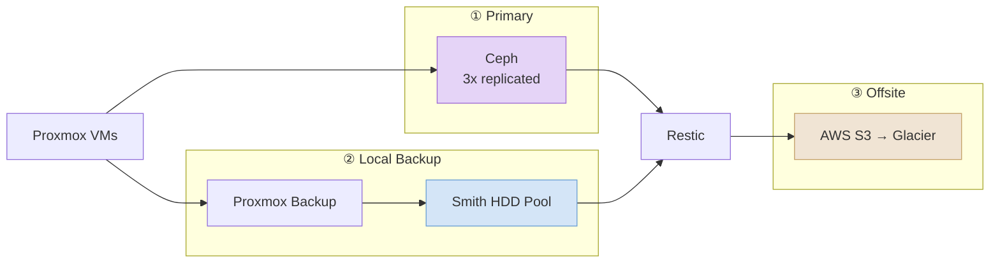

# Backups

Layered approach (snapshots, local backups/replicas, offsite S3) following the 3-2-1 rule.

### 3-2-1 Breakdown

| Rule              | Implementation                                     |
| ----------------- | -------------------------------------------------- |
| **3** copies      | Primary (Ceph) + Local backup (HDD) + Offsite (S3) |
| **2** media types | NVMe (Ceph OSDs) + HDDs (+ Glacier tape)           |
| **1** offsite     | AWS S3 with Glacier transition                     |

## Proxmox Backup Server

Handles local, deduplicated backups for VMs and LXCs on the Proxmox cluster. Runs as an LXC on Smith.

| Frequency   | Retention                       |
| ----------- | ------------------------------- |
| Daily @ 2AM | Daily: 3, Weekly: 2, Monthly: 3 |

## Offsite Backups

Restic + Backrest sync critical data to AWS S3 for offsite disaster recovery.

### Components

- **Restic** — Deduplicating backup program with encryption
- **Backrest** — Web UI and scheduler for Restic (port 9898)
- **Web UI** — `https://backrest.home.shdr.ch`

### Backup Sources

| Source              | Description                | Frequency   |
| ------------------- | -------------------------- | ----------- |
| /mnt/cephfs         | CephFS distributed storage | Daily @ 3AM |
| /mnt/hdd/data       | HDD pool data              | Daily @ 3AM |
| /mnt/hdd/backups-vm | PBS VM backups             | Daily @ 3AM |

### Retention Policy

| Type    | Keep |
| ------- | ---- |
| Last N  | 7    |
| Daily   | 7    |
| Weekly  | 4    |
| Monthly | 6    |

### AWS Authentication

Uses **IAM Roles Anywhere** with step-ca certificates — no static credentials:

- TLS certificate from step-ca (`backup-stack.home.shdr.ch`)
- AWS Signing Helper fetches temporary credentials via certificate
- Automatic certificate renewal via `step ca renew --daemon`

### AWS S3 Configuration

S3 bucket for offsite backups with:

- Server-side encryption (AES256)
- Immediate transition to Glacier Flexible Retrieval
- IAM Roles Anywhere authentication (no static credentials)
- Public access blocked
