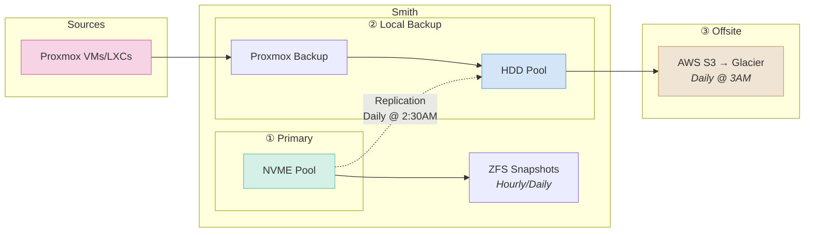

# Backups

Layered approach (snapshots, local backups/replicas, offsite S3) following the 3-2-1 rule.

### 3-2-1 Breakdown

| Rule              | Implementation                                     |
| ----------------- | -------------------------------------------------- |
| **3** copies      | Primary (NVME) + Local backup (HDD) + Offsite (S3) |
| **2** media types | NVMe SSDs + HDDs (+ Glacier tape archive)          |
| **1** offsite     | AWS S3 with Glacier transition                     |

## ZFS Snapshots

Snapshots provide instant rollback capability. PBS handles longer-term retention for VMs.

| Dataset          | Frequency      | Retention                        | Notes                           |
| ---------------- | -------------- | -------------------------------- | ------------------------------- |
| nvme/personal    | Hourly         | Hourly: 12                       | PBS covers daily/weekly/monthly |
| nvme/vm          | Hourly         | Hourly: 12                       | PBS covers daily/weekly/monthly |
| nvme/data        | Hourly         | Hourly: 12                       | PBS covers daily/weekly/monthly |
| hdd/vm           | Daily @ 1:30AM | Daily: 7                         | PBS covers weekly/monthly       |
| hdd/data         | Daily @ 1:30AM | Daily: 14, Weekly: 8, Monthly: 6 | Write-once media, low overhead  |
| hdd/backups-data | Daily @ 2:00AM | Daily: 3                         | Backup of backups               |
| hdd/backups-vm   | Disabled       | -                                | PBS handles own versioning      |

## Proxmox Backup Server

Handles local, deduplicated backups for VMs and LXCs on the Proxmox cluster. Runs as an LXC on Smith.

| Frequency   | Retention                       |
| ----------- | ------------------------------- |
| Daily @ 2AM | Daily: 3, Weekly: 2, Monthly: 3 |

## Local Replication

ZFS send/receive replication from NVME tier to HDD tier for data durability.

| Source Dataset | Target Dataset            | Frequency      |
| -------------- | ------------------------- | -------------- |
| nvme/personal  | hdd/backups-data/personal | Daily @ 2:30AM |
| nvme/data      | hdd/backups-data/data     | Daily @ 2:30AM |

## Offsite Backups

Rclone syncs the HDD pool to AWS S3 for offsite disaster recovery.

| Source Dataset | Target                         | Frequency   |
| -------------- | ------------------------------ | ----------- |
| hdd            | S3: Glacier Flexible Retrieval | Daily @ 3AM |

### AWS S3 Configuration

S3 bucket for offsite backups with:

- Server-side encryption (AES256)
- Immediate transition to Glacier Flexible Retrieval
- Dedicated IAM user with minimal required permissions
- Public access blocked
