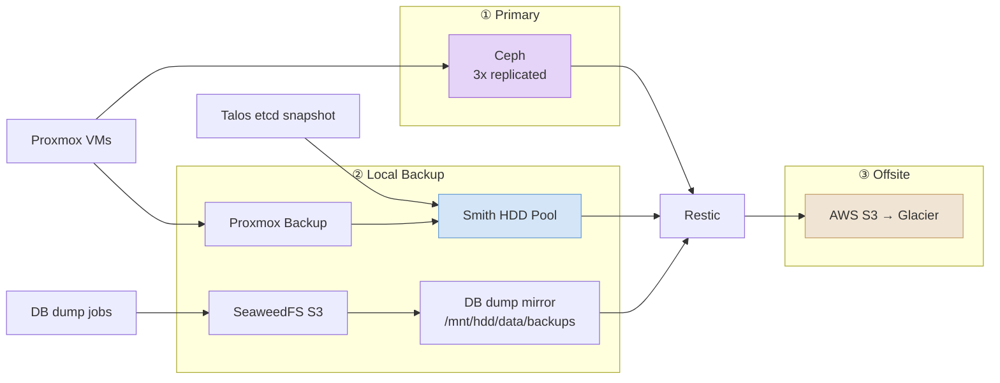

# Backups

Layered approach (snapshots, local backups/replicas, offsite S3) following the 3-2-1 rule.


```mermaid
flowchart LR
    subgraph Copy1["① Primary"]
        Ceph[Ceph<br/>3x replicated]
    end

    subgraph Copy2["② Local Backup"]
        PBS[Proxmox Backup]
        HDD[Smith HDD Pool]
    Seaweed[SeaweedFS S3]
    DumpMirror[DB dump mirror<br/>/mnt/hdd/data/backups]
    end

    subgraph Copy3["③ Offsite"]
        S3[AWS S3 → Glacier]
    end

    VMs[Proxmox VMs] --> Ceph
    VMs --> PBS
    PBS --> HDD
    Ceph --> Restic[Restic]
    HDD --> Restic
    DBs[DB dump jobs] --> Seaweed
    Seaweed --> DumpMirror
    DumpMirror --> Restic
    Etcd[Talos etcd snapshot] --> HDD
    Restic --> S3

    style Ceph fill:#e5d4f7,stroke:#9f6ad4
    style HDD fill:#d4e5f7,stroke:#6a9fd4
    style S3 fill:#f0e4d4,stroke:#c4a06a
```

### 3-2-1 Breakdown

| Rule              | Implementation                                     |
| ----------------- | -------------------------------------------------- |
| **3** copies      | Primary (Ceph) + Local backup (HDD) + Offsite (S3) |
| **2** media types | NVMe (Ceph OSDs) + HDDs (+ Glacier tape)           |
| **1** offsite     | AWS S3 with Glacier transition                     |

## Proxmox Backup Server

Handles local, deduplicated backups for VMs and LXCs on the Proxmox cluster. Runs as an LXC on Smith.

| Frequency   | Retention                       |
| ----------- | ------------------------------- |
| Daily @ 2AM | Daily: 3, Weekly: 2, Monthly: 3 |

## Offsite Backups

Restic + Backrest sync critical data to AWS S3 for offsite disaster recovery.

### Components

- **Restic** — Deduplicating backup program with encryption
- **Backrest** — Web UI and scheduler for Restic (port 9898)
- **Web UI** — `https://backrest.home.shdr.ch`
- **Repository** — `s3:s3.amazonaws.com/aether-home-offsite-backup/restic-v2`

### Backup Sources

| Source              | Description                | Frequency   |
| ------------------- | -------------------------- | ----------- |
| /mnt/cephfs         | CephFS distributed storage | Daily @ 8AM |
| /mnt/hdd/data       | HDD pool data              | Daily @ 8AM |
| /mnt/hdd/backups-vm | PBS VM backups             | Daily @ 8AM |

The PBS datastore plan uses restic `--compression off` and `--read-concurrency 4`. PBS chunk data is already content-addressed/compressed, and the offsite window is bounded by the 12-hour IAM Roles Anywhere session maximum.

`/mnt/hdd/data` also contains backup-stack generated control-plane snapshots under
`/mnt/hdd/data/backups/talos-etcd`, so those snapshots are swept offsite by the same Backrest plan
after the next successful `/mnt/hdd/data` run.

### Retention Policy

| Type    | Keep |
| ------- | ---- |
| Last N  | 7    |
| Daily   | 7    |
| Weekly  | 4    |
| Monthly | 6    |

### AWS Authentication

Uses **IAM Roles Anywhere** with step-ca certificates — no static AWS credentials:

- TLS certificate from step-ca (`backup-stack.home.shdr.ch`)
- The Backrest restic wrapper uses AWS Signing Helper to fetch fresh temporary credentials per restic process
- Certificate renewal uses a oneshot `backrest-cert-renew.service` on a twice-daily systemd timer. It only re-splits the renewed bundle for IAM Roles Anywhere; it must not restart Backrest because active restic backups would be interrupted.

### AWS S3 Configuration

S3 bucket for offsite backups with:

- Server-side encryption (AES256)
- Versioning enabled
- Restic data pack prefixes transition to Deep Archive after 1 day
- Restic metadata (`config`, `keys`, `index`, `snapshots`, locks) stays in the active class
- No bucket-level object expiration; retention is controlled by Restic/Backrest and explicit operator action
- IAM Roles Anywhere authentication (no static credentials)
- Public access blocked

## On-Prem S3 Backup Target

SeaweedFS is deployed as the on-prem S3-compatible target for Kubernetes backup clients.

| Endpoint | Purpose |
| --- | --- |
| `https://s3.seaweed.home.shdr.ch` | S3 API |
| `https://seaweed.home.shdr.ch` | Filer UI/API |
| `https://master.seaweed.home.shdr.ch` | Master status |

Current deployment:

- LXC `seaweedfs` (`1022`) on Smith, managed by NixOS
- Data root: `hdd/seaweedfs` mounted at `/mnt/hdd/seaweedfs`
- Active Seaweed data path: `/mnt/hdd/seaweedfs/current`
- S3 admin credentials come from SOPS (`seaweedfs.s3_admin_*`)

Current DB dump flow:

- Kubernetes CronJobs write logical dumps to bucket `aether-db-dumps`
- Postgres jobs use `pg_dump --format=custom --no-owner`; the Mongo job uses `mongodump --archive --gzip`
- Miniflux, Hoppscotch, Coder, Temporal, Affine, OpenWebUI, LiteLLM, Nextcloud, Matrix, and Immich
  are CNPG-backed and their dump jobs target the matching `*-cnpg-rw` writer services; other
  Postgres jobs still target their current app Postgres services until they are migrated
- Jobs run between 01:03 and 02:07, before the offsite Backrest window
- `backup-stack` runs `seaweed-db-dumps-sync.timer` daily at 02:35
- The sync mirrors `aether-db-dumps` to `/mnt/hdd/data/backups/seaweed-db-dumps/aether-db-dumps`
- Backrest carries that mirror offsite through its existing `/mnt/hdd/data` plan

Backrest does **not** mount or snapshot `/mnt/hdd/seaweedfs/current`; that directory is Seaweed's
live internal storage and is not a stable backup interface.

This is an interim target for DB/PVC backup work. It is useful now, but it is still on Smith and
therefore does not replace the planned off-smith copy on Neo or a dedicated backup box.

## Kubernetes Control-Plane Backups

`backup-stack` runs `aether-talos-etcd-snapshot.timer` daily at 02:20. The service uses the
Tofu-generated Talos client config and runs:

```bash
talosctl --nodes 10.0.3.16 --endpoints 10.0.3.16,10.0.3.17,10.0.3.18 etcd snapshot
```

Snapshots are written to `/mnt/hdd/data/backups/talos-etcd` with 30-day local retention. A manual
proof run on 2026-06-27 created a 412MB snapshot; the scheduled 2026-06-28 run created a 424MB
snapshot, and the scheduled Backrest `/mnt/hdd/data` offsite snapshot includes both files.
Snapshot generation emits `aether_talos_etcd_snapshot_*` metrics through the `aether-restic`
Prometheus scrape. Grafana alerts cover failed and stale Talos etcd snapshots.
