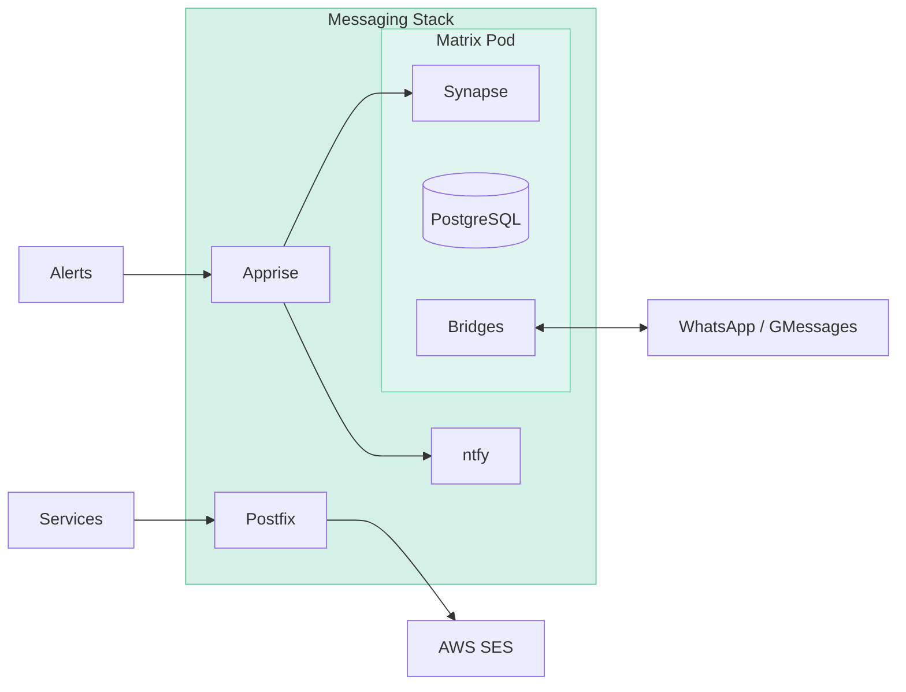

# Communication

Messaging infrastructure running on Niobe, providing unified notifications, Matrix-based chat with platform bridges, and outbound email relay.

## Architecture

## Matrix

Self-hosted Matrix homeserver for federated chat and unified messaging.

| Component         | Purpose                            |
| ----------------- | ---------------------------------- |
| Synapse           | Matrix homeserver                  |
| Element           | Web client                         |
| PostgreSQL        | Synapse database                   |
| mautrix-whatsapp  | WhatsApp bridge (double puppeting) |
| mautrix-gmessages | Google Messages bridge (RCS/SMS)   |

### Bridges

Bridges connect external messaging platforms to Matrix, allowing unified inbox management:

| Bridge            | Platform        | Features                           |
| ----------------- | --------------- | ---------------------------------- |
| mautrix-whatsapp  | WhatsApp        | Double puppeting, media, reactions |
| mautrix-gmessages | Google Messages | RCS/SMS via linked Android device  |

### Users

| User       | Purpose                              |
| ---------- | ------------------------------------ |
| Admin      | Homeserver administration            |
| Aether Bot | Automated notifications from Apprise |

## Notifications

Push notifications for infrastructure alerts and application events.

| Component | Purpose                                     |
| --------- | ------------------------------------------- |
| ntfy      | Push notification server                    |
| Apprise   | Notification gateway with multiple backends |

### Notification Flow

Apprise acts as a unified notification gateway, routing alerts to multiple destinations:

| Source          | → Apprise | → Destinations      |
| --------------- | --------- | ------------------- |
| Grafana alerts  | ✓         | ntfy (push), Matrix |
| Backup status   | ✓         | ntfy (push), Matrix |
| CI/CD pipelines | ✓         | ntfy (push), Matrix |
| Service events  | ✓         | ntfy (push), Matrix |

### Severity Routing

| Severity | ntfy Priority | Matrix Room | Use Case                     |
| -------- | ------------- | ----------- | ---------------------------- |
| critical | urgent        | #alerts     | Immediate action required    |
| warning  | default       | #alerts     | Attention needed, not urgent |

## Email

### Outbound (AWS SES)

Postfix runs as an SMTP relay, allowing internal services to send email without direct AWS credentials.

| Component     | Purpose                    |
| ------------- | -------------------------- |
| Postfix Relay | SMTP relay on port 25      |
| AWS SES       | Email delivery (us-east-1) |

**Allowed sender domains:** `shdr.ch`, `home.shdr.ch`

Internal services connect to `messaging-stack:25` to send email, which Postfix relays through SES.

### Inbound (ProtonMail)

Personal email uses ProtonMail with custom domain. DNS MX records managed in Cloudflare.

## Metrics

Prometheus metrics exposed for monitoring:

| Exporter         | Port | Metrics                    |
| ---------------- | ---- | -------------------------- |
| Synapse          | 9000 | Federation, rooms, users   |
| ntfy             | 9090 | Messages, subscriptions    |
| Postfix Exporter | 9154 | Queue size, delivery stats |
