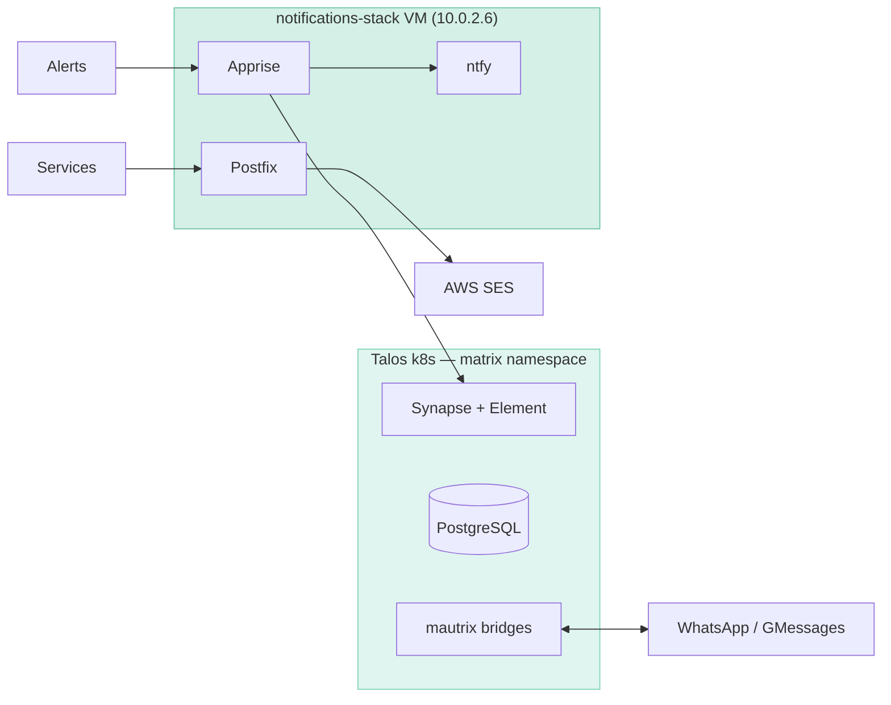

# Communication

Matrix chat (with platform bridges) runs on the Talos k8s cluster; unified
notifications and outbound email relay run on the `notifications-stack` VM
(`10.0.2.6`, VLAN 2, formerly `messaging-stack`).

## Architecture

```mermaid
flowchart LR
    subgraph K8s["Talos k8s — matrix namespace"]
        Synapse["Synapse + Element"]
        Postgres[(PostgreSQL)]
        Bridges["mautrix bridges"]
    end

    subgraph VM["notifications-stack VM (10.0.2.6)"]
        Apprise["Apprise"]
        ntfy["ntfy"]
        Postfix["Postfix"]
    end

    Alerts["Alerts"] --> Apprise
    Apprise --> ntfy & Synapse
    Services["Services"] --> Postfix --> SES["AWS SES"]
    Bridges <--> External["WhatsApp / GMessages"]

    style K8s fill:#e0f5ef,stroke:#7ad4b0
    style VM fill:#d4f0e7,stroke:#6ac4a0
```

## Matrix

Self-hosted Matrix homeserver, deployed in the `matrix` namespace
(`tofu/home/kubernetes/matrix.tf`): one pod runs synapse, element, and both
mautrix bridges; postgres is a separate StatefulSet on Ceph RBD. Login
supports Keycloak SSO (aether realm) alongside passwords. Migration history:
[worklogs/messaging-stack-migration.md](./worklogs/messaging-stack-migration.md).

| Component         | Purpose                            |
| ----------------- | ---------------------------------- |
| Synapse           | Matrix homeserver                  |
| Element           | Web client                         |
| PostgreSQL        | Synapse database                   |
| mautrix-whatsapp  | WhatsApp bridge (double puppeting) |
| mautrix-gmessages | Google Messages bridge (RCS/SMS)   |

### Bridges

Bridges connect external messaging platforms to Matrix, allowing unified inbox management:

| Bridge            | Platform        | Features                           |
| ----------------- | --------------- | ---------------------------------- |
| mautrix-whatsapp  | WhatsApp        | Double puppeting, media, reactions |
| mautrix-gmessages | Google Messages | RCS/SMS via linked Android device  |

### Users

| User       | Purpose                              |
| ---------- | ------------------------------------ |
| Admin      | Homeserver administration            |
| Aether Bot | Automated notifications from Apprise |

## Notifications

Push notifications for infrastructure alerts and application events.

| Component | Purpose                                     |
| --------- | ------------------------------------------- |
| ntfy      | Push notification server                    |
| Apprise   | Notification gateway with multiple backends |

### Notification Flow

Apprise acts as a unified notification gateway, routing alerts to multiple destinations:

| Source          | → Apprise | → Destinations      |
| --------------- | --------- | ------------------- |
| Grafana alerts  | ✓         | ntfy (push), Matrix |
| Backup status   | ✓         | ntfy (push), Matrix |
| CI/CD pipelines | ✓         | ntfy (push), Matrix |
| Service events  | ✓         | ntfy (push), Matrix |

### Severity Routing

| Severity | ntfy Priority | Matrix Room | Use Case                     |
| -------- | ------------- | ----------- | ---------------------------- |
| critical | urgent        | #alerts     | Immediate action required    |
| warning  | default       | #alerts     | Attention needed, not urgent |

## Email

### Outbound (AWS SES)

Postfix runs as an SMTP relay, allowing internal services to send email without direct AWS credentials.

| Component     | Purpose                    |
| ------------- | -------------------------- |
| Postfix Relay | SMTP relay on port 25      |
| AWS SES       | Email delivery (us-east-1) |

**Allowed sender domains:** `shdr.ch`, `home.shdr.ch`

Internal services connect to `notifications-stack:25` (`10.0.2.6`, also `smtp.home.shdr.ch`) to send email, which Postfix relays through SES. GitLab (VLAN 3) reaches it via a dedicated `SERVICES-to-TRUSTED` firewall rule.

### Inbound (ProtonMail)

Personal email uses ProtonMail with custom domain. DNS MX records managed in Cloudflare.

## Metrics

Prometheus metrics exposed for monitoring:

| Exporter         | Where                  | Metrics                    |
| ---------------- | ---------------------- | -------------------------- |
| Synapse          | k8s (`synapse` svc :9091) | Federation, rooms, users |
| ntfy             | VM :9092               | Messages, subscriptions    |
| Postfix Exporter | VM :9154               | Queue size, delivery stats |
