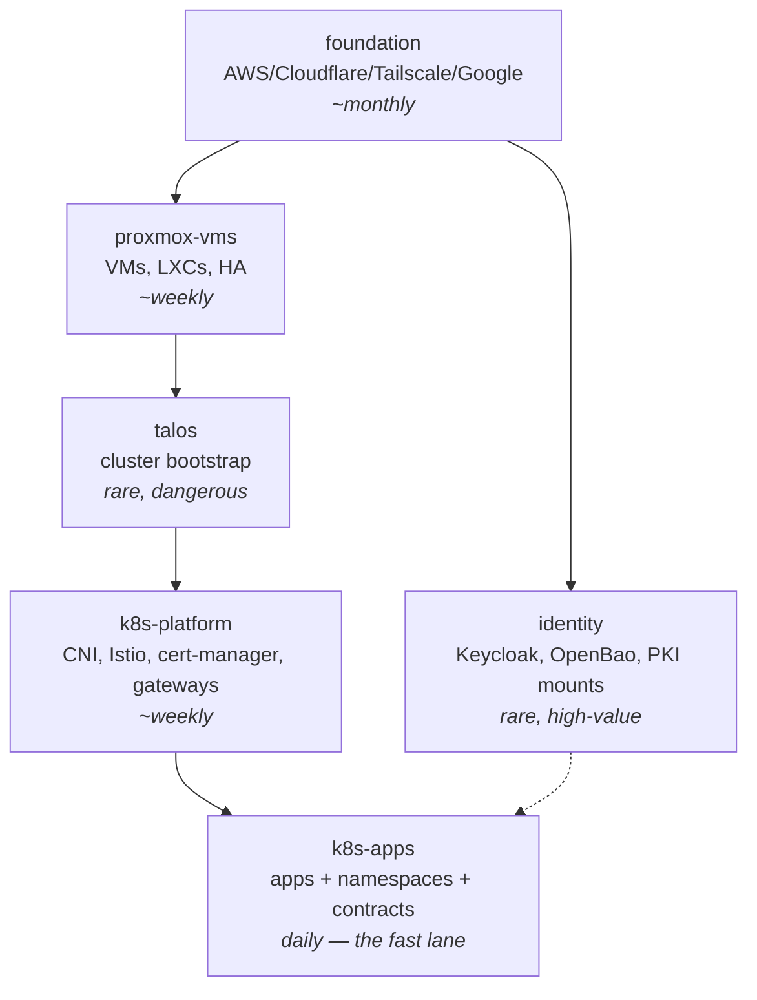

# Continuous Deployment

Plan for making the repo the primary interface to the estate: plans computed automatically
on every MR, applies always a deliberate human click (CI UI **or** laptop — both doors stay
first-class), and the pipeline as the actuation layer for agent-authored changes
(Inquest remediation MRs, plan-doc implementation MRs).

Explicit non-goal, by decision: **no auto-apply tier, ever** (revisitable, but the design
assumes a human click per apply). This deletes the usual "progressive automation" phases
and simplifies everything downstream — the click is the safety model.

## Current state (audited)

More exists than expected:

| Primitive | State |
| --- | --- |
| GitLab mirror + CI | `so/aether` runs CI — `.gitlab-ci.yml` has a scheduled nightly `tofu plan -detailed-exitcode` job, but it declares **no auth at all** (no `id_tokens`, no Bao login, no AWS creds, no toolchain bootstrap; the Taskfile it calls expects a laptop-cached token). Presumed broken — phase 0 replaces it with a *proven* authenticated plan job |
| Canonical repo | GitHub (`shedrachokonofua/aether`) is the only local remote — external source of truth survives estate loss. Verify mirror direction/automation GitHub↔GitLab |
| CI → Bao identity | `vault_jwt_auth_backend.gitlab` live. `seven30-ci` proves the *shape* (transit decrypt + KV policy, TTL 900s, built for CI tofu applies) but is **bound to `project_path = seven30/*` — unusable by `so/aether`**; `so-ci` (in-flight) is read-only Inquest KV, no transit. New `aether-ci-plan` / `aether-ci-apply` policies + roles are required work, not reuse |
| CI → certs/SSH | step-ca `gitlab-ci` OIDC provisioner live, **with an SSH certificate template** (`ssh_gitlab_ci.tpl`) — CI-minted SSH certs were already designed |
| CI → AWS | Roles Anywhere trusts step-ca; a CI cert can assume a role for the S3/DynamoDB backend (new profile needed) |
| Runner | `gitlab-runner-k8s`: privileged, in-cluster, built for image builds/e2e — **wrong actuator** (self-modification hazard: applies that disturb the cluster kill their own runner) |
| State | Single root state, S3+DynamoDB (external — load-bearing; the RGW todo was killed for this) |
| Secrets in tofu | `carlpett/sops` provider reads `secrets/secrets.yml` directly → any plan/apply needs SOPS decrypt capability (Bao transit or AWS KMS) |

## Design decisions (settled)

| Decision | Choice |
| --- | --- |
| Apply model | **Dual-door**: CI manual jobs (UI click, artifact-pinned) AND local applies from pushed main. Drift detection is the cross-door reconciler, not an honor system |
| Auto-apply | None. Plan auto, apply human, always |
| State layout | 5–7 stacks split by cadence × blast radius (below). Goal: app deployment stays single-stack — but `namespace_contracts.tf` feeds ESO policies, OpenBao k8s roles, Kyverno generation, DB-backup selection, and the `synthetic_probe_targets` output, so the contracts split is a **phase-1 design task with a full consumer inventory**, not a settled one-liner (likely: per-app contract entries live with apps; shared generators consume a defined contracts interface) |
| Orchestration | **Terramate from day 1**, constrained charter (below). Terragrunt rejected (wrapper lock-in); HCP Stacks unavailable to OpenTofu |
| k8s apps reconciler (Argo/Flux) | Not now — pipeline-CD via tofu keeps one model; revisit only if app deploy latency chafes |
| Apply semantics | The **post-merge plan is the approval artifact**: MR plans are advisory (branch context); the main-pipeline plan against merged HEAD is what the human reads and clicks. Apply consumes that saved artifact — never re-plans; stale (state moved) = refused, re-run pipeline |
| Actuator | Dedicated runner LXC/VM **outside k8s**, tagged `actuator`, protected-branch jobs only |
| Cycle-breakers (invariant) | Canonical repo external (GitHub), state external (S3+DynamoDB), SOPS KMS/Age fallback tiers, laptop door never deleted |

### Terramate charter

Allowed: generate per-stack backend/provider boilerplate (`generate_hcl` + `terramate
generate --check` as CI lint); compute changed stacks (`terramate run --changed`);
hold ordering metadata (`before`/`after`).
Forbidden: orchestrating applies (`run-all apply` banned — applies are manual UI jobs);
becoming load-bearing (every stack must plan/apply with bare `tofu` from its directory —
this guarantee is what keeps the local door tool-free).

## Stack decomposition



- Interfaces: `terraform_remote_state` only where a stable name won't do (kubeconfig from
  `talos`); prefer consuming names over outputs to keep the DAG near-empty.
- `tf-outputs.json`: today one monolithic root output consumed directly by the Ansible
  `common` role and nix facts — define the merged per-stack format (atomic write, stack
  ordering, staleness rule) and land it **before** decomposition so consumers never notice.
- Migration is a per-stack runbook, not a vibe — the import/removed dance has a
  dual-ownership interval that must be squeezed into one sitting per stack:
  1. change freeze for the resources moving (no other applies against either state)
  2. `import` blocks in the new stack → plan shows adopt-only → apply (both states now
     reference the objects; **no writes during this interval**)
  3. immediately apply `removed { destroy = false }` in the monolith
  4. zero-diff plans on both sides = move complete; rollback at any step =
     `tofu state rm` from the new stack (old state still owns everything until step 3)
  Order: `k8s-apps` first (daily churn), `identity` second (wants its own gate),
  `foundation`/`talos` last or never. New resources land in new stacks immediately.
- Cross-stack DAG is hand-declared (CI `needs:` + Terramate ordering). Assessed low-pain:
  daily churn is leaf-stack; contracts-in-apps keeps "new app" single-stack; cross-seam
  interface changes ≈ annual. Tripwire: if a bare-tofu workflow is ever blocked by the
  Terramate layer, cut the layer back.

## Pipeline

### MR pipeline

1. Always (no secrets): `terramate generate --check`, `tofu validate`/`fmt`, nix closure
   builds of affected hosts (real eval signal).
2. Secret-bearing plan (`terramate run --changed -- tofu plan`) — **gated by trust**:
   plans require SOPS decrypt, i.e. estate-wide secret read. An MR that edits
   `.gitlab-ci.yml` could exfiltrate through the plan job, so MR plan jobs are
   **manual-trigger for agent-authored branches** (human eyeballs the diff for CI
   tampering before releasing the plan) and automatic only for maintainer-pushed branches.
   No fork pipelines exist (private project) — this rule is the same-project equivalent.
3. MR plans are **advisory**: branch-context blast-radius preview for review. The approval
   artifact is the post-merge plan (below).
4. Later: conftest/OPA on plan JSON (standing-orders hook — not phase 1).

### Main pipeline (per merged commit)

1. Plan per changed stack against merged HEAD → **the approval artifact**. Reproducibility
   contract: toolchain from the pinned nix devshell, `init` honoring
   `.terraform.lock.hcl` **without `-upgrade`** (the current `task tofu:init` uses
   `-upgrade` — CI gets its own locked init), apply runs on the same runner class.
2. `apply:<stack>` jobs: `when: manual`, `resource_group: <stack>` (serializes **CI jobs
   only** — the DynamoDB state lock remains the actual mutual exclusion across both
   doors), **protected environment** so the click requires an authorized identity,
   `tofu apply plan.out` — refuses if state moved since plan.
3. **Plan artifacts are secrets**: `plan.out` embeds sensitive values. Private project,
   artifact access restricted, short `expire_in`, no full plan JSON pasted into comments —
   MR/UI surfaces get the redacted `tofu show` summary only.
4. Apply-job timeouts generous; cancellation of a running apply is an incident
   (state-lock etiquette from AGENTS.md moves into the pipeline runbook, including
   recovery steps for a lock orphaned by a killed job).

### Scheduled (exists — harden)

- Nightly drift plan per stack. Two **distinct** signals routed differently:
  `plan failed` (providers/estate unhealthy — infra signal) vs `plan shows drift`
  (someone/something changed reality or applied unpushed code — governance signal, links
  the diff). Route via ntfy through existing alert paths.

## Credentials per job class

| Job | Identity chain | Blast radius |
| --- | --- | --- |
| MR plan / drift | GitLab JWT → Bao `jwt-gitlab` role `aether-ci-plan` → transit decrypt + read; CI cert → Roles Anywhere → S3 state read | Near-full **read** of estate |
| Apply (manual) | Same chain, role `aether-ci-apply`: `bound_claims = { project_path = "so/aether", ref_protected = "true", ref = "main" }`, bound audience `https://bao.home.shdr.ch`, TTL ~900s. Phase 0 **tests** that unprotected-ref tokens are rejected — the claim set is designed and verified, not assumed (the seven30 role has no such binding today) | God-cred (SOPS decrypt is all-or-nothing) — relocated from daily-driver laptop to single-purpose actuator |
| Ansible/nix deploy jobs (later phase) | GitLab JWT → step-ca `gitlab-ci` provisioner → **SSH cert** (template exists); principals scoped per job class, not blanket root | Per-host |

Honesty note: there is no scoped-down apply credential while tofu reads the whole SOPS
file. The perimeter is therefore **GitLab governance**: protected branches, protected
environments, approval rules, CODEOWNERS on `secrets/`, `.gitlab-ci.yml`, and
`tofu/stacks/identity/`. Phase 0 audits this; it is the actual security review of the
project. Agent identities can open MRs; they can never approve or click apply.

## Agent-triage actuation (first-class requirement)

Inquest already ends at "remediation MR" — CD supplies the missing back half:

```text
alert → Kestra → incident issue → Holmes RCA → agent MR
  → pipeline: plan/closure on MR (the reviewable blast-radius artifact)
  → human: merge, then click apply (phone-sufficient)
  → apply result → issue; failed apply re-opens triage
```

Guardrails: agent MRs never self-approve (distinct identities, approval rules); the plan
artifact — not the diff — is the review surface; incident issue ↔ MR ↔ apply log form one
audit spine.

## Phases

0. **Governance + a proven plan job** — the exit criterion is a *working authenticated*
   scheduled plan: `id_tokens` in CI, Bao login via new `aether-ci-plan` role/policy
   (transit decrypt + KV read, bound to `so/aether`), Roles Anywhere profile for state
   access, pinned toolchain in the job image, `-detailed-exitcode` classified (0 clean /
   2 drift / 1 error) into two ntfy signals. Plus: mirror direction GitHub↔GitLab
   automated; protected branches/environments/approvals/CODEOWNERS configured;
   `aether-ci-apply` role designed with the protected-ref claim tests.
1. **Stacks + Terramate** — decomposition per the diagram, contracts into `k8s-apps`,
   boilerplate generated, migration via import/removed. Independently valuable: fast plans.
2. **Plan-on-MR** — changed-stack plans + nix closure builds as MR artifacts. This is the
   agent-triage unlock; it ships before any CI apply exists.
3. **Actuator + manual applies** — the actuator does not exist yet and gets an
   authoritative provisioning path like any other component: LXC/VM declared in
   `proxmox-vms` (tofu) + a small config role (nix devshell, terramate, task), registered
   as a **protected runner** with the `actuator` tag so only protected-ref jobs schedule
   onto it. Then protected env + artifact-pinned applies. Laptop stays; etiquette: local
   applies only from pushed main (drift job enforces).
4. **Ansible/nix lanes** — nix deploys as manual CI jobs (closure built in phase 2,
   activation via CI SSH cert); ansible playbooks as logged manual jobs; principals design
   for CI SSH certs.
5. **Policy checks** (standing-orders foundation) — conftest on plan JSON encoding the
   invariants the exploration docs keep restating (no static secrets, state stays external,
   monitoring independence). Advisory first, blocking later.

Transition note: the sibling exploration docs' rollout steps say `task tofu:apply` — when
phase 3 lands, those runbooks execute as MR + click instead; ownership and sequence in
those plans are unchanged.

## Risks

- **GitLab governance is the perimeter** — misconfigured protection = anyone/anything that
  can merge can actuate. Phase 0 is not optional ceremony.
- **Plan requires a live estate** (sops→Bao, k8s provider, tailscale lookups): drift
  false-alarms during partial outages — hence the two-signal split.
- **Interrupted applies** — mitigated by no-cancel norm + artifact-pinned applies +
  documented lock-recovery; note `resource_group` orders CI jobs only — the DynamoDB
  backend lock is the real cross-door mutual exclusion, and it already handles laptop/CI
  contention by queueing.
- **Plan-time secret exposure on MRs** — the manual-trigger rule for agent-authored
  branches is load-bearing; relaxing it reopens CI-config exfiltration.
- **Read-credential concentration** on the actuator/runner for scheduled plans — bounded
  by dedicated host, protected jobs, short TTLs.
- **GitLab-in-estate circularity** — CD is a control loop, not a runtime dependency:
  GitLab down freezes *changes*, not workloads. Recovery = laptop door + PBS restore;
  estate-death recovery never touches GitLab (GitHub + Age key + AWS state).

## Decisions record

| Alternative | Rejected because |
| --- | --- |
| Auto-apply (any tier) | Operator decision: human click per apply; deletes calibration complexity, keeps agent loop intact (click is phone-sufficient) |
| Terragrunt | Wrapper owns the workflow; Terramate keeps stacks pure tofu with ~zero exit cost |
| Hand-rolled boilerplate templates + CI change globs | Building a worse Terramate; globs rot silently |
| Argo/Flux for k8s apps now | Second deployment model beside tofu; revisit on evidence |
| Re-plan at apply time | Breaks review integrity — what was clicked must be what was planned |
| In-cluster actuator | Self-modification hazard; control loop must not run on the substrate it modifies |
| Tofu state on Ceph RGW | Killed (todo removed): recovery map inside the thing being recovered |

## Related

- `../exploration/journal-forwarder.md`, `monitoring-stack-nix.md`, `two-tier-pki.md`,
  `east-west-nat-removal.md` — the plan-doc backlog this pipeline will actuate as MR streams
- `../trust-model.md` — CI plane (GitLab JWT → step-ca/Bao) this design rides on
- `tofu/home/openbao_seven30.tf` — the proven CI-apply credential pattern
