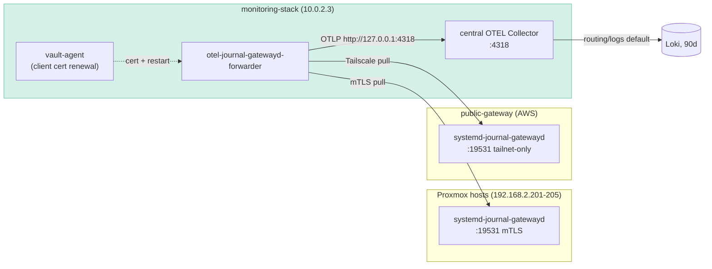

# Journal Log Forwarding (otel-journal-gatewayd-forwarder)

Implementation plan for pull-based journal log collection from the hosts that run no local
OTEL agent: the five Proxmox hosts and the cloud VMs (AWS public-gateway, GCP uptime-monitor). Closes the P0 gap where these
machines expose metrics (node/SMART exporters) but ship no logs.

> **Status (2026-07): implemented and deployed.** Three deviations from the plan
> below, driven by discovery during rollout:
> 1. **Cloud transport is routed WireGuard, not Tailscale.** Tailscale was retired
>    on the AWS/GCP nodes; cloud sources are reached at their routed site IPs
>    (`10.1.0.10`, `10.2.0.10`) over the WireGuard fabric. No `tag:monitoring`
>    client is added. The nftables/VyOS `CLOUD`-zone rules are the authn boundary.
> 2. **Proxmox mTLS is terminated by ghostunnel, not gatewayd `--trust`.** Debian
>    systemd is built with openssl (`-GNUTLS`), so gatewayd's `--trust` is
>    unavailable at runtime. gatewayd serves plain HTTP on loopback and ghostunnel
>    terminates client-cert mTLS (the `pki-journal-client` intermediate is the
>    trust anchor; Go accepts it as an anchor without the root, unlike OpenSSL).
> 3. **Cursors are seeded to the journal tail on fresh deploy** so long-uptime
>    hosts don't backfill weeks of stale entries that Loki rejects as too old.
>
> Deployment: `task configure:journal-gateways` + `task configure:journal-forwarder`.
> See [monitoring.md](../monitoring.md) → "Journal Forwarder".

Source project: `gitlab.home.shdr.ch/shdrch/otel-journal-gatewayd-forwarder` — Rust, static
musl binary, polls `systemd-journal-gatewayd` endpoints and emits OTLP/HTTP JSON with
crash-safe per-source cursors.

## Architecture



No changes to the central collector, Loki, Tempo, or Grafana datasources — logs enter the
existing `routing/logs` connector and land in Loki by default. (Amendment: when the
[monitoring-stack hardening plan](monitoring-stack-nix.md) lands OTLP ingest auth (A5), the
forwarder config gains `otlp_headers = { Authorization = "Bearer <token>" }` rendered by
vault-agent; the collector-side change is owned by that plan.)

## Scope

| Target | Collected? | Why |
| --- | --- | --- |
| niobe, trinity, oracle, smith, neo | ✅ forwarder | No agent today; hypervisors stay agent-free |
| public-gateway (AWS) | ✅ forwarder | No agent today; over Tailscale |
| uptime-monitor (GCP) | ✅ forwarder | No agent today; over Tailscale — pull keeps its dead-man independence |
| All VMs | ❌ | `vm_monitoring_agent` journald receiver already ships these — adding them would duplicate |
| VyOS router | ❌ | Dedicated OTEL collector already deployed |
| NixOS hosts (IDS, blockchain, AdGuard) | ❌ | `otel-agent.nix` already ships journald |

## Authentication design

`systemd-journal-gatewayd` serves **full journal contents unauthenticated** by default, and
its only native authn is mTLS (`--cert/--key/--trust`) with a **chain-only** verifier — no
CN/SAN allowlist. Firewall-only was rejected: VyOS NAT masquerades all VLAN 2/3/4 traffic to
`192.168.2.231`, so host-side source filtering cannot distinguish the forwarder from any VM,
and native `192.168.2.0/24` peers (backup-stack, bazzite-builder, adguard, nfs, …) bypass the
router entirely.

| Hop | Authn |
| --- | --- |
| forwarder → Proxmox hosts | gatewayd native mTLS; trust anchor = dedicated journal-client intermediate |
| forwarder → public-gateway | Tailscale identity (`tag:monitoring → tag:public-gateway:19531`); gatewayd bound to the tailscale IP only |
| forwarder → uptime-monitor | Tailscale identity (`tag:monitoring → tag:uptime-monitor:19531`); gatewayd bound to the tailscale IP only |
| forwarder → OTLP | loopback, plain HTTP |

Because gatewayd's verifier is chain-only, **the trust anchor is the entire authorization
policy**. It must therefore be a CA that signs exactly one kind of leaf: the forwarder's
client cert. That CA is an OpenBao PKI mount whose intermediate is signed by the step-ca
root — the first instance of the [two-tier PKI pattern](two-tier-pki.md).

## PKI layout

| Cert | Issuer | Lives on | Renewal |
| --- | --- | --- | --- |
| gatewayd server cert (×5) | step-ca main authority (`machine-bootstrap`, SAN = mgmt IP + FQDN) | Proxmox hosts | `step ca renew` timer → restart gatewayd |
| forwarder client cert | OpenBao `pki-journal-client` mount (TTL 72h, max 168h) | monitoring-stack | vault-agent template → restart forwarder |
| forwarder's server trust | step-ca root (`ca_cert`) | monitoring-stack | static |
| gatewayd's client trust (`--trust`) | `pki-journal-client` intermediate cert **only** | Proxmox hosts | role fetches `/v1/pki-journal-client/ca/pem` each run; rotation = old+new bundled in the trust file during overlap |

Neither gatewayd nor the forwarder reloads certificates live — every renewal path must
restart its consumer.

### One-time signing ceremony

```bash
# 1. Generate intermediate CSR inside the mount (key never leaves OpenBao)
bao secrets enable -path=pki-journal-client pki
bao secrets tune -max-lease-ttl=43800h pki-journal-client
bao write -field=csr pki-journal-client/intermediate/generate/internal \
  common_name="Aether Journal Client CA" key_type=ec key_bits=256 > journal-client.csr

# 2. Sign with the step-ca root (on the step-ca LXC, root key never leaves)
step certificate sign --profile intermediate-ca \
  journal-client.csr /etc/step-ca/certs/root_ca.crt /etc/step-ca/secrets/root_ca_key \
  --not-after 43800h > journal-client.crt

# 3. Import the signed intermediate
bao write pki-journal-client/intermediate/set-signed certificate=@journal-client.crt

# 4. Issuing role — the only leaf this CA will ever sign
bao write pki-journal-client/roles/forwarder \
  allowed_domains=otel-journal-gatewayd-forwarder allow_bare_domains=true \
  client_flag=true server_flag=false key_type=ec key_bits=256 ttl=72h max_ttl=168h
```

Mount + role are declared in Tofu (`vault_mount`, `vault_pki_secret_backend_role`); only
steps 1–3 are a ceremony, recorded here as the runbook.

## Work items

1. **Forwarder repo CI** — publish versioned releases with a `SHA256SUMS` artifact alongside
   the binary in the GitLab generic package registry. Aether pins a version + checksum;
   never consumes `latest`.
2. **`tofu/home/pki_journal_client.tf`** — `vault_mount` + `vault_pki_secret_backend_role`
   (ceremony above sets the signed intermediate), plus a **dedicated issuance grant**: a
   `vault_policy` allowing `create/update` on `pki-journal-client/issue/forwarder`, bound to
   a new `vault_cert_auth_backend_role` pinned to
   `allowed_common_names = ["monitoring-stack.home.shdr.ch"]`. Never attach this policy to
   the shared `aether-machine` cert-auth role in `tofu/home/openbao_machine_auth.tf` (`*.home.shdr.ch` → `aether-secrets`) — that
   would let any fleet machine cert mint a journal-read credential, reopening the exact
   scoping hole the mount exists to close.
3. **`tofu/tailscale.tf`** — add `tag:monitoring` (admin-sourced), OAuth client for
   monitoring-stack with `depends_on = [tailscale_acl.tailnet_acl]` (uptime-monitor pattern —
   client creation must not race the tag declaration), ACL rule
   `tag:monitoring → tag:{public-gateway,uptime-monitor}:19531`, and a
   `data "tailscale_device" "public_gateway"` lookup exported via tf_outputs so the forwarder
   config consumes a declared tailscale IP, never a hand-copied one.
4. **`ansible/roles/journal_gateway/`** (new, OS-generic: Debian/Proxmox + AL2023 + Debian cloud)
   - install `systemd-journal-gateway` (deb) / `systemd-journal-remote` (AL2023)
   - socket drop-in: `ListenStream=` bound to mgmt IP (Proxmox) / tailscale IP (public gateway, uptime-monitor)
   - Proxmox: service drop-in with `--cert/--key/--trust`, step-ca server cert + renew timer
     (reuse the openbao-cert-renew pattern), `--trust` = journal-client intermediate —
     fetched by the role from the mount's public CA endpoint
     (`https://bao.home.shdr.ch/v1/pki-journal-client/ca/pem`) and deployed as a file;
     intermediate rotation = re-run role with old+new certs bundled
   - cloud VMs (public gateway, uptime-monitor): no TLS args; tailnet binding is the authn boundary
5. **`ansible/roles/otel_journal_forwarder/`** (new)
   - pinned binary from GitLab package registry + SHA-256 verification
   - `config.toml.j2` (below), dedicated `ojgf` system user, hardened unit
     (`Type=notify`, `StateDirectory=otel-journal-gatewayd-forwarder`, README hardening set),
     key `0640 root:ojgf` (alternative: `LoadCredential=` if switching to `DynamicUser`)
   - `--metrics 127.0.0.1:9091`
6. **vault-agent on monitoring-stack** (Ansible port of `nix/modules/openbao-agent.nix`)
   - step-ca machine cert (CN `monitoring-stack.home.shdr.ch`) via `machine-bootstrap` +
     renew timer; vault-agent `auto_auth` uses the dedicated cert-auth role from item 2,
     not `aether-machine`
   - template stanza: `pki-journal-client/issue/forwarder` with `private_key_format=pkcs8`
     (forwarder is rustls; PKCS#8 is the unambiguous key encoding) → cert/key files →
     `exec: systemctl restart otel-journal-gatewayd-forwarder`
   - this establishes the vault-agent pattern on an Ansible-managed VM, which the NixOS
     migration will inherit
7. **monitoring-stack playbook** — add both roles to `site.yml`; tailscaled install + join
   (`tag:monitoring`, mirror the public_gateway tailscale playbook); scrape
   `127.0.0.1:9091` via the VM agent's `prometheus_scrape_configs`.
8. **`ansible/playbooks/public_gateway_stack/site.yml`** — import `journal_gateway`; apply the
   same role to `uptime-monitor` from its configure playbook (`task configure:uptime-monitor`).
9. **Grafana alerts** — see below.
10. **Docs** — `docs/monitoring.md` "Journal Forwarder" subsection; tick `docs/todos.md`.

## Forwarder configuration

```toml
otlp_endpoint = "http://127.0.0.1:4318"
poll_interval = "5s"
batch_size    = 500

[tls]  # applies to all sources; OTLP is plain-HTTP loopback so identity is never engaged there
ca_cert     = "/etc/otel-journal-gatewayd-forwarder/tls/step-root.crt"
client_cert = "/etc/otel-journal-gatewayd-forwarder/tls/client.crt"
client_key  = "/etc/otel-journal-gatewayd-forwarder/tls/client.key"

[[sources]]
name = "niobe"
url  = "https://192.168.2.201:19531"
labels = { instance_type = "proxmox_host" }
# … trinity/oracle/smith/neo identical, templated from inventory …

[[sources]]
name = "public-gateway"
url  = "http://10.1.0.10:19531"   # routed WireGuard site IP (AWS)
tls  = {}   # explicit empty block opts this source out of the global mTLS identity
labels = { instance_type = "vps" }

[[sources]]
name = "uptime-monitor"
url  = "http://10.2.0.10:19531"   # routed WireGuard site IP (GCP)
tls  = {}
labels = { instance_type = "vps" }
```

Full journal per host (no `units` filter) — hypervisor value is precisely the corosync/ceph/
pve noise. Revisit with a filter if Loki ingest objects.

## Metrics & alerting

Forwarder exposes Prometheus metrics per source: `ojgf_entries_forwarded_total`,
`ojgf_poll_errors_total{error}`, `ojgf_last_poll_timestamp_seconds`,
`ojgf_last_success_timestamp_seconds`, `ojgf_poll_duration_seconds`, `ojgf_source_lag_seconds`.

| Alert | Expr sketch | Severity |
| --- | --- | --- |
| Journal poll stale | `time() - ojgf_last_success_timestamp_seconds > 900` | warning |
| Journal poll errors | `increase(ojgf_poll_errors_total[15m]) > 10` | warning |
| Forwarder absent | `absent(ojgf_last_poll_timestamp_seconds)` | warning |

Do **not** alert on `ojgf_source_lag_seconds` — quiet hosts legitimately grow it. TLS-expiry
failures surface through the poll-error/stale alerts (this is the designed failure mode for a
missed renewal).

## Rollout

1. Tag + publish forwarder release with checksum; note version in role defaults.
2. `task tofu:apply` — PKI mount/role, tailscale tag/ACL; run the signing ceremony.
3. Deploy `journal_gateway` to one host (niobe); verify
   `curl --cert … --key … --cacert … https://192.168.2.201:19531/machine` and that a
   cert-less request is rejected.
4. Deploy monitoring-stack in order: issue the step-ca machine cert first
   (`machine-bootstrap`, CN `monitoring-stack.home.shdr.ch` — vault-agent cannot
   authenticate without it), then vault-agent, then forwarder;
   `otel-journal-gatewayd-forwarder --validate` then `--once`; confirm records in Loki
   (filter on the `host.name` resource attribute for `niobe` — Loki's OTLP mapping keeps it
   as structured metadata, not an index label) and metrics on `:9091`.
5. Roll remaining Proxmox hosts, then the cloud VMs (public gateway, uptime-monitor).
6. Land alerts + docs.

## Risks

- **410 Gone / cursor invalidation** re-ingests the current boot → brief duplicates in Loki.
  Keep adequate journald retention on sources; accepted behavior.
- **Missed renewal** stops polling with TLS errors — covered by stale/error alerts.
- **Loki ingest growth** from five unfiltered hypervisor journals — watch volume the first
  week; unit filters are a config-only fallback.
- **Intermediate expiry** (5y here — `43800h`; see [two-tier plan](two-tier-pki.md) for
  rotation discipline) — NOT covered by `tls-cert-expiring-soon`, which only blackbox-probes
  live TLS endpoints. Coverage needs the planned x509-certificate-exporter (P0 todo) reading
  the deployed `--trust` file, or a dedicated check on the mount's `/ca/pem`.

## Decisions record

| Alternative | Rejected because |
| --- | --- |
| Firewall-only, no authn | NAT collapse + native L2 peers make source filtering ineffective; journals are higher-sensitivity than metrics |
| `--trust` = step-ca root | Chain-only verifier ⇒ every fleet machine cert becomes a journal-read credential |
| Second step-ca process as client CA | Works, but standing service for one leaf; OpenBao PKI mount gives the same scoped anchor on existing infra |
| Tofu `tls`-provider CA | Static key in state, second root of trust — fails the trust-model litmus test |
| Basic-auth reverse proxy per host | New proxy on every hypervisor + static credential |
| Public exposure of :19531 with mTLS | No reason to leave the tailnet; keep the Lightsail firewall closed |
