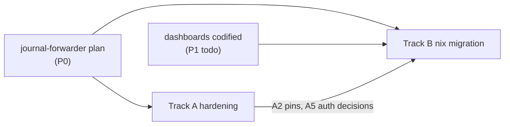

# Monitoring Stack: Hardening + NixOS Migration

Two-track plan for the `monitoring-stack` VM (10.0.2.3, Fedora, Niobe). After the
[journal forwarder](journal-forwarder.md) lands, this box holds a journal-read credential
for every hypervisor, 90 days of fleet logs, tailnet membership, and a vault-agent identity —
it becomes the highest-value target in the estate while currently being one of the softest.

The tracks run at different tempos and MUST NOT be coupled:

- **Track A — hardening**: independently shippable fixes on the existing Fedora VM via
  `task configure:monitoring`. No migration dependency.
- **Track B — NixOS migration**: the existing P3 todo, executed blue-green with the
  ids-stack/blockchain-stack recipe. Inherits Track A decisions as its spec.

## Current state (audited)

Two Podman pods, 13 containers:

| Pod | Containers | Published ports |
| --- | --- | --- |
| monitoring-stack | prometheus, loki, tempo, otel_collector, grafana, janus, clickhouse, blackbox, pve-exporter, pbs-exporter | 4317, 4318, 3000, 8080, 3100, 8888, 8889, 9090, 8123, 9115, 9221, 10019 |
| fleet | fleet v4.75.0, mysql 8.0, redis 7-alpine | 8084 |

Findings (file:line refs from audit):

| # | Finding | Where |
| --- | --- | --- |
| H1 | Every data/config dir created `mode: "0777"` | `monitoring_stack/site.yml` directory tasks |
| H2 | 10 floating image tags across the 13 containers | site.yml + fleet.yml container defs |
| H3 | OTLP ingest has **zero authn anywhere in the chain** — collector listens `0.0.0.0:4317/4318` (otel_config.yml.j2:4-7), Caddy `otel.home.shdr.ch` route adds none, no producer sends credentials | collector config, Caddyfile.j2 |
| H4 | Loki `auth_enabled: false` + port 3100 published and **routed by Caddy** | loki_config.yml:1, Caddyfile.j2 |
| H5 | Prometheus `--web.enable-lifecycle` unauthenticated, :9090 published and routed by Caddy | site.yml, Caddyfile.j2:191 |
| H6 | 12 published ports; several have live out-of-pod consumers via Caddy routes (9090, 3100, 8123, 8888, 8889 — Goldilocks/Holmes/Orion depend on the Prometheus/Loki routes), the rest are pod-internal-only (8080, 9115, 9221, 10019) | Caddyfile.j2:117-209, tofu/home/kubernetes/goldilocks.tf:30, grafana_tenant.yml:74 |
| H7 | Fleet serves plaintext HTTP (`FLEET_SERVER_TLS=false`); Caddy→VM hop unencrypted | fleet.yml:98-99 |
| H8 | MySQL runs `--sql-mode=""`; Redis no auth (both pod-internal) | fleet.yml |
| H9 | PVE/PBS exporters `verify_ssl: false` | site.yml pve.yml block |
| H10 | VyOS is the only producer pushing plain-HTTP direct-IP (`http://10.0.2.3:4318`), bypassing Caddy TLS | home_router/templates/otel-collector-config.yml.j2:104 |
| H11 | ~10 DNS names route to the VM through Caddy with no route-level auth (only Grafana has app-level OIDC) | Caddyfile.j2:117-209 |

Mitigating context: the VM sits on VLAN 2 (TRUSTED zone) — exposure is LAN-internal. But
"trusted VLAN" is the same argument the journal-forwarder plan just rejected for hypervisor
journals, and this box will hold strictly more sensitive material.

## Track A — Hardening (Fedora, now)

Ordered by risk/effort ratio. A1/A2 are independent commits; A3 and A4 are **one ordered
rollout** (route consumers block port closures); A5–A8 are independent.

1. **A1 — directory modes**: `0777` → `0750`/`0755` with explicit owner per service UID.
   Verify containers still write (several images run non-root with fixed UIDs — set owners
   to match, not world-write).
2. **A2 — pin images**: record current running digests, pin all 13 images (10 currently
   floating) in a single vars block. Prerequisite for Track B and for Renovate visibility.
3. **A3+A4 — route/port rationalization** (one sequence, consumers first):
   1. Inventory every consumer of the Caddy monitoring routes — known today: Goldilocks,
      HolmesGPT, Orion hit `prometheus.`/`loki.` routes (tofu/home/kubernetes/*.tf); the
      `grafana_tenant` provisioning hits Janus on the VM
   2. Re-point k8s consumers through Janus (tenant-scoped, JWT-authed) or grant them a
      scoped path; delete the raw Prometheus/Loki/ClickHouse/otel-metrics Caddy routes
   3. THEN unpublish ports with no remaining external consumer: 3100, 9090, 8123, 8888,
      8889, 9115, 9221, 10019, **and 8080** (Janus is consumed pod-locally by Grafana and
      by the tenant playbook on-host; no Caddy route exists for it)
   4. End state: published = 4317/4318 (ingest), 3000 (Grafana via Caddy), 8084 (Fleet via
      Caddy). Prometheus lifecycle API (H5) becomes unreachable as a side effect.
4. **A5 — OTLP ingest authn** (the big one): `bearertokenauth` on the central collector.
   Collector side is three pieces, not one: the extension declared under `extensions:`, the
   token sourced at runtime (env var from a root-owned `0600` EnvironmentFile rendered from
   OpenBao KV `kv/aether/otel-ingest` — never inline in the 0644 config), the extension
   listed in `service.extensions`, and `auth: {authenticator: bearertokenauth}` on both
   receivers. Producer rollout is producers-first, enforce-last (an unexpected header is
   harmless; a missing one after enforcement is an outage). **Complete producer inventory**:
   | Producer | Config surface | Token delivery |
   | --- | --- | --- |
   | 12 Ansible VM agents (`setup_vm_monitoring_agents.yml`) | `vm_monitoring_agent` exporter **and** its `service.telemetry` OTLP metrics exporter | root-owned 0600 env file; config references `${env:...}` |
   | 5 NixOS hosts (`otel-agent.nix` via base.nix) | module exporter config | vault-agent template → `/run/secrets` env file (never the Nix store) |
   | k8s daemonset + deployment collectors (`otel_collector.tf`) | helm values | k8s Secret + env interpolation |
   | vcluster collector (`vcluster.tf:171`) | vcluster values | same Secret pattern |
   | VyOS collector (`configure_otel.yml`) | template | 0600 config on the router |
   | journal forwarder | `otlp_headers` | vault-agent-rendered config (amend forwarder plan — see cross-plan note) |
   Then: flip receivers to require auth; alert on `otelcol_receiver_refused_*` during soak.
   Decision: bearer token over mTLS — config-only at every producer; mTLS remains a later
   upgrade via the two-tier PKI issuing mounts.
5. **A6 — VyOS producer**: point at `https://otel.home.shdr.ch` (+ token) like every other
   producer; removes the plain-HTTP hop and the direct-IP coupling.
6. **A7 — Fleet hop**: enable `FLEET_SERVER_TLS` with a step-ca cert (SANs:
   `fleet.home.shdr.ch` + VM IP; vault-agent renders after the forwarder work lands the
   agent here); Caddy upstream flips to `https://` with the step root in its trust; health
   check + documented plaintext rollback. MySQL `sql-mode` restored to default; Redis stays
   pod-internal.
7. **A8 — PVE/PBS exporter TLS**: trust the Proxmox/PBS API certs properly (pinned CA)
   instead of `verify_ssl: false`. Low urgency — read-only monitoring tokens.

Deliberately NOT in Track A: rootless→root conversions, pod restructuring, config-format
changes — those land once, in Nix, in Track B.

### Cross-plan amendment

[journal-forwarder.md](journal-forwarder.md) claims "no changes to the central collector"
and a plain loopback OTLP hop. A5 supersedes that: when it lands, the forwarder config
gains `otlp_headers = { Authorization = "Bearer <token>" }` (vault-agent-rendered) and the
collector change is owned by this plan. Amendment note added to the forwarder doc.

## Track B — NixOS migration

### Prerequisites (hard)

- **Forwarder plan implemented** — establishes vault-agent + tailnet on this VM's role;
  the Nix host imports `openbao-agent.nix` instead of the Ansible port.
- **Grafana dashboards codified** (existing P1 todo) — 6 dashboards are provisioned today
  (home, ceph, ids-monitoring, kubernetes, security-triage, vm-monitoring); the ~14 in the
  P1 todo list are manual and would not survive a fresh Grafana. That todo stops being
  cosmetic and becomes a migration blocker.
- **A2 (pinned images)** — Nix configs freeze versions; pin on Fedora first so the
  migration is a platform change, not a version change. ClickHouse/Loki/MySQL data copies
  below assume identical versions on both sides.

### Recipe (established by ids-stack / blockchain-stack)

```
Provision:  tofu nixos_cloud_config module → step-ca machine cert via cloud-init
            proxmox VM from cephfs:iso/nixos-base-vm.qcow2.img
Configure:  nix/hosts/niobe/monitoring-stack/{default,prometheus,loki,tempo,grafana,
            otel,clickhouse,janus,exporters,fleet}.nix
Modules:    vm-hardware + vm-common + base + step-ca-cert + openbao-agent + osquery-agent
Containers: virtualisation.quadlet.* (quadlet-nix), pinned images from A2
Secrets:    vault_kv_secret_v2 (already: fleet) → vault-agent templates → /run/secrets/
Deploy:     new Taskfile target via _nixos-deploy (rsync + nixos-rebuild --target-host)
```

### Known gaps vs the recipe (each needs a decision, recorded here)

| Gap | Decision |
| --- | --- |
| No quadlet **pod** in the repo yet | quadlet-nix supports pod units — use one, preserving today's shared-netns/localhost semantics exactly (no config rewrites of localhost references). Fall back to a named network + container-DNS only if the pod unit proves broken in the soak. |
| Fleet MySQL init/recovery (~200 lines of Ansible) | Port to a oneshot systemd unit + vault-agent-rendered credentials; drop the recovery path (fresh install on new VM + data import makes it dead code). |
| Grafana tenant/org provisioning (`grafana_tenant.yml`) | It is an include fragment coupled to `site.yml` vars and the inventory alias — extract into a standalone playbook with its own host/vars so it can target the temp Nix host during soak and the final host after cutover. Porting the imperative API calls to Nix has no payoff. |
| Central collector config is secret-heavy Jinja2 | vault-agent template rendering the full `otel_config.yml` (ClickHouse password) + the A5 token env file, same pattern as wazuh.nix templates. |
| `otel-agent.nix` auto-imported by `base.nix` | Configure with its OTLP receiver disabled on this host (mirrors today's `otlp_receiver_enabled: false`) — agent ships host metrics/journald, central collector owns 4317/4318. |
| Container logs | quadlet + journald → the host otel-agent journald receiver picks them up (ids-stack pattern). |
| Native NixOS services (Prometheus/Grafana/Loki have first-class modules) | **Not now.** Parity-first migration: same pinned images as quadlets, config files carried over. Nativization is a later, per-service refactor with its own diffable blast radius. |

### Data migration (~70+ GB stateful, in **named podman volumes**, not bind dirs)

Copy mechanics: resolve each volume's mountpoint via `podman volume inspect` (or
`podman volume export | import`), preserve UID/GID (`rsync -aH --numeric-ids`), identical
pinned image versions on both sides (A2), then validate with real queries before cutover.

| Dataset | Volume | Retention | Strategy |
| --- | --- | --- | --- |
| Loki chunks/index | loki volume | 90d | two-phase rsync (below) |
| ClickHouse (zeek/suricata) | clickhouse volume | 365d | two-phase rsync; same CH tag both sides; verify with row counts per table |
| Fleet MySQL | fleet mysql volume | n/a | `mysqldump` → import → verify host count in Fleet UI |
| Grafana DB | grafana volume | n/a | copy sqlite (service accounts, tenant orgs) even with dashboards codified |
| Prometheus TSDB | prometheus_storage | 15d | two-phase rsync if convenient; acceptable loss window |
| Tempo blocks | tempo volume | 7d | acceptable loss; skip |

### Cutover (blue-green)

**Tofu lifecycle first** (current blocker: one `monitoring_stack` resource with
`prevent_destroy = true`): add a parallel `monitoring_stack_nix` resource + `config/vm.yml`
entry (new vmid, own permanent IP) built on `nixos_cloud_config`. The Fedora resource is
retired at the end by a dedicated commit that flips `prevent_destroy`, then `tofu destroy
-target` — never as a side effect.

**IP strategy — no re-IP.** The new VM keeps its IP forever; cutover is
`vm.monitoring_stack.ip` (and vmid/name references) updated in `config/vm.yml` +
`tofu apply` + re-running the router/gateway playbooks. The exposure audit confirmed all
operational references are templated (Caddy upstreams, VyOS rule 22, blackbox targets);
A6 removes the one direct-IP producer beforehand. This avoids reconfiguring a bootstrapped
NixOS guest's network and means the machine cert is issued with its final SANs from day
one — no reissue choreography.

1. Provision `monitoring-stack-nix` at its permanent IP, full stack up, empty data. Soak:
   point ONE producer (a low-value VM agent) directly at it and verify end-to-end; run the
   extracted tenant-provisioning playbook against it.
2. **Pre-copy online**: first-pass rsync of Loki/ClickHouse/Prometheus volumes while the
   old stack serves (hours, no outage).
3. Announce window; create an Uptime Kuma **maintenance window** for the DeadMansSwitch
   push monitor (600s grace — it WILL fire otherwise) and expect ntfy silence.
4. Stop old pods. **Telemetry loss during the window is real and accepted**: k8s/vcluster
   collectors buffer in memory only, VM agents retry minutes not hours (receiver cursors
   protect journald/filelog, but exporter queues are not disk-backed). The two-phase copy
   exists to keep this window at delta-rsync size, not 70 GB.
5. Final delta rsync + `mysqldump` import; start stack on new VM; verify Grafana/Loki/CH
   queries against migrated data (row counts, known-log spot checks).
6. Flip `config/vm.yml` → `tofu apply` → router + gateway playbook runs. Producers
   reconnect via unchanged DNS.
7. Verify: OTLP ingest resumes (`otelcol_receiver_accepted_*`), journal forwarder polls
   green, Fleet hosts re-check-in (requires `aether.openbao-agent.enable = true` **and**
   `aether.osquery-agent.enable = true` on the new host — importing the modules alone is a
   no-op), synthetic firing alert traverses Grafana → ntfy, DeadMansSwitch heartbeat
   resumes at Kuma; close the maintenance window.
8. Decommission the Fedora VM only after the full `docs/nixos.md` Definition of Done
   (all **8** criteria) — including the Fleet migration rule (coverage must not regress).

### Deliverables checklist

- `nix/hosts/niobe/monitoring-stack/` + `flake.nix` entry
- `tofu/home/monitoring_stack_nix.tf` (parallel resource) + retirement commit for the
  Fedora resource (`prevent_destroy` flip + targeted destroy)
- Standalone Grafana tenant-provisioning playbook (extracted from site.yml)
- Taskfile: `configure:monitoring-stack` (NixOS deploy) replacing `configure:monitoring`
- `docs/nixos.md`, `docs/monitoring.md`, `docs/virtual-machines.md` updated
- Delete `ansible/playbooks/monitoring_stack/` container/pod tasks; drop `monitoring-stack`
  from `setup_vm_monitoring_agents.yml`

## Sequencing



A1/A2 ship immediately; A3+A4 as one consumer-first sequence; A5 after the forwarder
(its `otlp_headers` is one of the producers). Track B starts when its three prerequisites
are green.

## Risks

- **A5 enforcement flip** is the only hardening step that can cause fleet-wide telemetry
  loss — hence producers-first ordering + refused-metric alert + soak before enforcing.
- **A3 port closures** break Goldilocks/Holmes/Orion if the consumer re-pointing (A4 half)
  is skipped — that is why they are one sequence, not two items.
- **Cutover telemetry loss** is bounded but nonzero (memory-only k8s buffers); accepted
  and minimized via two-phase copy.
- **ClickHouse/Loki version drift** between old/new corrupts the volume-copy strategy —
  pin (A2) and hold tags frozen across the migration.

## Decisions record

| Alternative | Rejected because |
| --- | --- |
| One combined track (harden in Nix only) | Holds cheap urgent fixes (0777, unauthenticated OTLP) hostage to the biggest migration in the repo |
| mTLS for OTLP ingest now | 20+ producers need cert material vs a config-only token; revisit on two-tier PKI issuing mounts |
| Native NixOS services at migration time | Doubles the diff: platform change + packaging change; parity-first, nativize per-service later |
| In-place reinstall of 10.0.2.3 | No rollback; blue-green costs one VM slot and gives full soak + trivial revert |
| Re-IP the new VM to 10.0.2.3 at cutover | Requires network reconfig + cert reissue on a bootstrapped NixOS guest; templated references make an IP change in `config/vm.yml` strictly cheaper |
| Named podman network instead of quadlet pod | Would force rewriting every inter-container localhost reference; quadlet-nix pod units preserve semantics |
| Porting Grafana tenant API provisioning to Nix | Imperative API calls; hybrid Ansible ownership is the repo norm |

## Related

- [journal-forwarder.md](journal-forwarder.md) — prerequisite; lands vault-agent + tailnet on this VM; amended for A5 headers
- [two-tier-pki.md](two-tier-pki.md) — future mTLS upgrade path for ingest
- `../nixos.md` — Definition of Done (8 criteria) for migrations
- `../monitoring.md` — architecture to update post-migration
