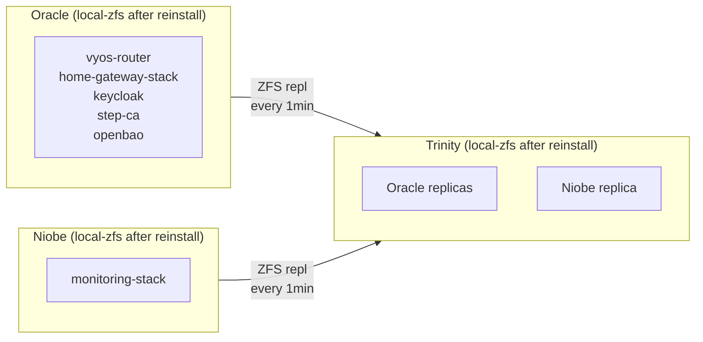

# Proxmox HA Exploration

Exploration of Proxmox High Availability for automatic VM failover.

## Goal

Enable automatic VM recovery when a Proxmox node fails. Instead of manual PBS restore (30-60 min, requires human), VMs should auto-restart on a healthy node (~2 min, unattended).

## Current State

**Ceph is deployed.** Workload VMs are on Ceph. Critical infrastructure remains on local-lvm (not ZFS).

| Host    | Boot Disk      | Ceph Storage | Local Storage       | HA-Ready?                       |
| ------- | -------------- | ------------ | ------------------- | ------------------------------- |
| Oracle  | 1TB NVMe       | —            | local-lvm (on boot) | ❌ LVM, needs reinstall for ZFS |
| Trinity | 1TB NVMe       | 2x 4TB OSD   | local-lvm (on boot) | ❌ LVM, needs reinstall for ZFS |
| Neo     | 2TB NVMe       | 2x 4TB OSD   | local-lvm (on boot) | ✅ Ceph / ❌ GPU passthrough    |
| Niobe   | 512GB NVMe     | —            | local-lvm (on boot) | ❌ LVM, needs reinstall for ZFS |
| Smith   | HDD (ZFS root) | OSDs pending | ZFS available       | ⏳ OSDs pending                 |

**Key finding:** Trinity, Oracle, and Niobe all have local-lvm on their boot disk partition. There is no separate NVMe for ZFS. Converting to ZFS requires either:

1. Reinstalling Proxmox with ZFS root
2. Shrinking boot partition from live USB (risky)

### VM Storage Distribution

| Tier  | Storage          | VMs                                                                   | HA Status          |
| ----- | ---------------- | --------------------------------------------------------------------- | ------------------ |
| Ceph  | ceph-vm-disks    | gitlab, dokploy, ai-tool-stack, dokku, messaging, media, smallweb etc | ✅ Configured (11) |
| Ceph  | ceph-vm-disks    | iot-management, game-server                                           | ❌ Hardware pinned |
| Local | Oracle local-lvm | vyos-router, home-gateway-stack, keycloak, step-ca, openbao           | ❌ Needs ZFS       |
| Local | Niobe local-lvm  | monitoring-stack                                                      | ❌ Needs ZFS       |
| Local | Neo local        | gpu-workstation                                                       | ❌ GPU pinned      |
| Local | Smith local-lvm  | backup-stack                                                          | N/A                |

## Why HA Matters

| Scenario           | Without HA                  | With HA                             |
| ------------------ | --------------------------- | ----------------------------------- |
| Node fails at 3am  | Down until you wake up      | Auto-recovers in ~30-90s (Ceph VMs) |
| Data loss          | Up to 24h (last PBS backup) | 0 (Ceph) or 1 min (ZFS replication) |
| Human intervention | Required                    | Not required                        |

## Proxmox HA Requirements

1. **Shared storage** (Ceph) — ✅ **Done for workload VMs**
2. **Replicated local storage** (ZFS + Proxmox Replication) — ❌ **Still needed for critical infra**

Since critical infrastructure (Oracle) must boot independently of Ceph (needs network/auth to work first), option 2 is required for those VMs.

## Architecture

### Tier 1: Critical Infrastructure (Local ZFS + Replication) — ❌ TODO

VMs that must survive Ceph/storage problems:



**Why local?**

- Critical VMs must survive Ceph problems
- Monitoring must alert WHEN Ceph has issues — can't depend on Ceph itself
- Router/gateway ensure network access for troubleshooting

**Reality check:** All three nodes currently have local-lvm on their boot disk. Reinstalling Proxmox with ZFS root is required.

### Tier 2: Workload VMs (Ceph) — ✅ DONE

VMs on Ceph distributed storage with automatic HA:

| VMID | Name            | Size  | HA Configured |
| ---- | --------------- | ----- | ------------- |
| 1005 | dokploy         | 256GB | ✅            |
| 1006 | gitlab          | 128GB | ✅            |
| 1010 | dev-workstation | 256GB | ✅            |
| 1015 | cockpit         | 32GB  | ✅            |
| 1016 | messaging-stack | 64GB  | ✅            |
| 1018 | ai-tool-stack   | 128GB | ✅            |
| 1019 | ups-management  | 32GB  | ✅            |
| 1020 | media-stack     | 128GB | ✅            |
| 1021 | dokku           | 256GB | ✅            |
| 1024 | smallweb        | 16GB  | ✅            |

**HA configured:** 11 VMs have HA resources in Tofu and will auto-failover on node failure.

### Tier 3: Immovable (No HA)

| VM              | Reason                                    |
| --------------- | ----------------------------------------- |
| gpu-workstation | GPU passthrough pins it to Neo            |
| iot-management  | USB passthrough (Z-Wave) pins it to Niobe |
| game-server     | Not managed by Tofu                       |
| backup-stack    | Must work if Ceph fails                   |

## Migration Plan

### Phase 1: Configure HA for Ceph VMs — ✅ DONE

HA group and resources configured in Tofu (`tofu/home/ha.tf` + individual VM files):

```hcl
# tofu/home/ha.tf
resource "proxmox_virtual_environment_hagroup" "ceph_workloads" {
  group   = "ceph-workloads"
  nodes   = { trinity = 5, neo = 4, smith = 3, niobe = 2 }
  restricted  = true
  no_failback = true
}

# Each VM file (e.g. tofu/home/gitlab.tf)
resource "proxmox_virtual_environment_haresource" "gitlab" {
  resource_id  = "vm:${proxmox_virtual_environment_vm.gitlab.vm_id}"
  state        = "started"
  group        = proxmox_virtual_environment_hagroup.ceph_workloads.group
  max_restart  = 3
  max_relocate = 2
}
```

**Configured:** 11 VMs (dokploy, gitlab, dev-workstation, cockpit, messaging-stack, ai-tool-stack, ups-management, media-stack, dokku, smallweb)

**Excluded:** `iot-management` (USB passthrough), `game-server` (not in Tofu)

### Phase 2: Reinstall Trinity with ZFS (Replication Target)

Trinity's 1TB boot NVMe has local-lvm, not ZFS. Reinstall required.

1. Trinity has only cloudinit ISOs on local-lvm (no real data to migrate)
2. Boot Proxmox installer USB
3. Select ZFS as filesystem (RAID0, single disk)
4. Install to nvme2n1 (1TB boot disk)
5. After reboot, Ceph rejoins automatically (config in cluster)
6. Add `local-zfs` storage to Proxmox datacenter config

**Downtime:** ~20 min (Ceph VMs unaffected — they run on other nodes during reinstall)
**Time:** ~20 minutes

### Phase 3: Reinstall Oracle with ZFS

Oracle has critical VMs on local-lvm. Must migrate to Ceph first.

1. Migrate Oracle VMs to Ceph (temporary):
   ```bash
   qm migrate 1001 trinity --with-local-disks --target-storage ceph-vm-disks
   qm migrate 1002 trinity --with-local-disks --target-storage ceph-vm-disks
   qm migrate 1023 trinity --with-local-disks --target-storage ceph-vm-disks
   qm migrate 1025 trinity --with-local-disks --target-storage ceph-vm-disks
   qm migrate 1026 trinity --with-local-disks --target-storage ceph-vm-disks
   ```
2. Boot Proxmox installer USB
3. Select ZFS as filesystem
4. Install to nvme0n1 (1TB boot disk)
5. After reboot, migrate VMs back to Oracle local-zfs:
   ```bash
   qm migrate 1001 oracle --with-local-disks --target-storage local-zfs
   qm migrate 1002 oracle --with-local-disks --target-storage local-zfs
   qm migrate 1023 oracle --with-local-disks --target-storage local-zfs
   qm migrate 1025 oracle --with-local-disks --target-storage local-zfs
   qm migrate 1026 oracle --with-local-disks --target-storage local-zfs
   ```
6. Enable Proxmox Replication: Oracle → Trinity (1 min schedule)

**Downtime:** ~30 min (critical VMs down during reinstall + migrations)
**Time:** ~45 minutes total

### Phase 4: Reinstall Niobe with ZFS

Niobe has monitoring-stack on local-lvm.

1. Migrate monitoring-stack to Ceph (temporary):
   ```bash
   qm migrate 1003 trinity --with-local-disks --target-storage ceph-vm-disks
   ```
2. Boot Proxmox installer USB
3. Select ZFS as filesystem
4. Install to nvme0n1 (512GB boot disk)
5. After reboot, migrate monitoring back to Niobe local-zfs:
   ```bash
   qm migrate 1003 niobe --with-local-disks --target-storage local-zfs
   ```
6. Enable Proxmox Replication: Niobe → Trinity (1 min schedule)

**Downtime:** ~20 min (monitoring down during reinstall + migrations)
**Time:** ~30 minutes total

### Phase 5: Configure HA for Critical VMs

After ZFS conversion and replication:

```hcl
resource "proxmox_virtual_environment_hagroup" "oracle_critical" {
  group      = "oracle-critical"
  nodes      = ["oracle", "trinity"]
  restricted = true
  nofailback = true
}

resource "proxmox_virtual_environment_haresource" "router" {
  resource_id = "vm:1001"
  state       = "started"
  group       = proxmox_virtual_environment_hagroup.oracle_critical.group
}

# Repeat for gateway (1002), keycloak (1023), step-ca (1025), openbao (1026)

resource "proxmox_virtual_environment_hagroup" "niobe_critical" {
  group      = "niobe-critical"
  nodes      = ["niobe", "trinity"]
  restricted = true
  nofailback = true
}

resource "proxmox_virtual_environment_haresource" "monitoring" {
  resource_id = "vm:1003"
  state       = "started"
  group       = proxmox_virtual_environment_hagroup.niobe_critical.group
}
```

## Failure Modes

### Ceph Tier (Workload VMs) — Current State

VMs on Ceph distributed storage:

| Failure              | Behavior                                  | RTO     | RPO |
| -------------------- | ----------------------------------------- | ------- | --- |
| Any single node dies | VMs restart on surviving nodes, data safe | ~30-60s | 0   |
| Smith dies           | VMs continue on Trinity/Neo               | ~30-60s | 0   |
| Trinity dies         | VMs continue on Smith/Neo                 | ~30-60s | 0   |
| Neo dies             | VMs continue on Smith/Trinity             | ~30-60s | 0   |
| 2 Ceph nodes die     | Ceph loses quorum, VMs freeze             | ∞       | 0   |
| All 3 Ceph nodes die | Manual PBS restore                        | Hours   | 24h |

**Key insight:** Ceph provides RPO=0 (synchronous replication) and ~30-60s RTO for any single node failure.

### Local Tier (Critical Infra) — After ZFS Migration

VMs on local-zfs with Proxmox Replication (Oracle, Niobe):

| Failure              | Behavior                            | RTO    | RPO   |
| -------------------- | ----------------------------------- | ------ | ----- |
| Oracle dies          | VMs restart on Trinity from replica | ~2 min | 1 min |
| Trinity dies         | Oracle VMs unaffected (primary)     | 0      | 0     |
| Niobe dies           | Monitoring restarts on Trinity      | ~2 min | 1 min |
| Oracle + Trinity die | Manual PBS restore for Oracle VMs   | Hours  | 24h   |
| Niobe + Trinity die  | Manual PBS restore for monitoring   | Hours  | 24h   |

### Local Tier (Critical Infra) — Current State (No ZFS Yet)

| Failure     | Behavior                          | RTO   | RPO |
| ----------- | --------------------------------- | ----- | --- |
| Oracle dies | Manual PBS restore                | Hours | 24h |
| Niobe dies  | Manual PBS restore for monitoring | Hours | 24h |

**Priority:** Converting Oracle/Niobe to ZFS would significantly improve RTO/RPO for critical infrastructure.

## Recovery Procedures

### Ceph VMs: Node Returns After Failover

1. Node rejoins cluster automatically
2. Ceph rebalances data in background
3. VMs can be migrated back manually if desired (for load balancing)
4. Use `nofailback = true` to prevent auto-migration

### Local VMs: Node Returns After Failover

**Do NOT let it auto-reclaim VMs.** Use `nofailback = true` in HA group config.

When the failed node returns:

1. Check if replica is stale (it will be — VMs were writing to the other node)
2. Reverse replication direction if needed
3. Manually decide when to fail back

### Split-Brain Prevention

- Proxmox uses Corosync for quorum (5 nodes)
- Ceph uses own quorum (3 MONs on Smith, Trinity, Neo)
- `nofailback` prevents auto-reclaim
- 1-min replication gap is accepted RPO for local tier

## Remaining Work

| Item                    | Hardware | Time     | Downtime                   |
| ----------------------- | -------- | -------- | -------------------------- |
| ~~Ceph HA config~~      | ~~$0~~   | ~~Done~~ | ~~None~~                   |
| Trinity reinstall       | $0       | ~20 min  | None (Ceph VMs unaffected) |
| Oracle reinstall        | $0       | ~45 min  | ~30 min (critical VMs)     |
| Niobe reinstall         | $0       | ~30 min  | ~20 min (monitoring)       |
| Replication + HA config | $0       | ~30 min  | None                       |
| **Total remaining**     | **$0**   | **~2h**  | **~50 min across windows** |

## Decision Factors

### What's Already Done (via Ceph)

- ✅ HA configured for 11 Ceph-backed VMs (auto-failover enabled)
- ✅ RPO=0 for workload VMs
- ✅ No single point of failure for storage

### What Remains (Local Tier)

**Pros of completing local tier:**

- Auto-recovery for critical infra (router, auth, PKI, monitoring)
- 1-min RPO vs 24h with PBS-only
- Fully automated failover for entire infrastructure

**Cons:**

- Adds ZFS replication complexity
- Trinity needs local storage space for replicas
- 1-min data loss window during failover (vs 0 for Ceph)

### Recommendation

1. ~~**Immediate:** Enable HA for Ceph VMs (Phase 1) — no downtime~~ ✅ Done
2. **Scheduled maintenance:** Reinstall Trinity, Oracle, Niobe with ZFS:
   - ~2.5 hours total work
   - ~50 min downtime across two windows (Oracle critical VMs, Niobe monitoring)
   - Improves critical infra RTO from hours → 2 min
   - Improves critical infra RPO from 24h → 1 min

## Dependencies

- ✅ Ceph operational with 3 MONs and 4+ OSDs
- ✅ Proxmox installer USB available
- ⚠️ Maintenance windows for critical VM downtime (~30 min for Oracle, ~20 min for Niobe)

## Status

**Phase 1 complete.** HA is configured for 11 Ceph-backed VMs. Local tier requires 3 Proxmox reinstalls.

| Phase | Description         | Status                | Downtime             |
| ----- | ------------------- | --------------------- | -------------------- |
| 1     | HA for Ceph VMs     | ✅ Done (11 VMs)      | None                 |
| 2     | Reinstall Trinity   | ⏳ Ready              | None                 |
| 3     | Reinstall Oracle    | ⏳ Blocked on Phase 2 | ~30 min critical VMs |
| 4     | Reinstall Niobe     | ⏳ Blocked on Phase 2 | ~20 min monitoring   |
| 5     | Replication setup   | ⏳ Blocked on Phase 4 | None                 |
| 6     | HA for critical VMs | ⏳ Blocked on Phase 5 | None                 |

**Note:** `iot-management` and `game-server` are excluded from HA due to hardware passthrough (USB/GPU).

## Related Documents

- [ceph.md](ceph.md) — Ceph exploration and status
- [../ceph-implementation.md](../ceph-implementation.md) — Step-by-step Ceph implementation guide
- [../storage.md](../storage.md) — Current storage architecture
- [../backups.md](../backups.md) — 3-2-1 backup strategy
