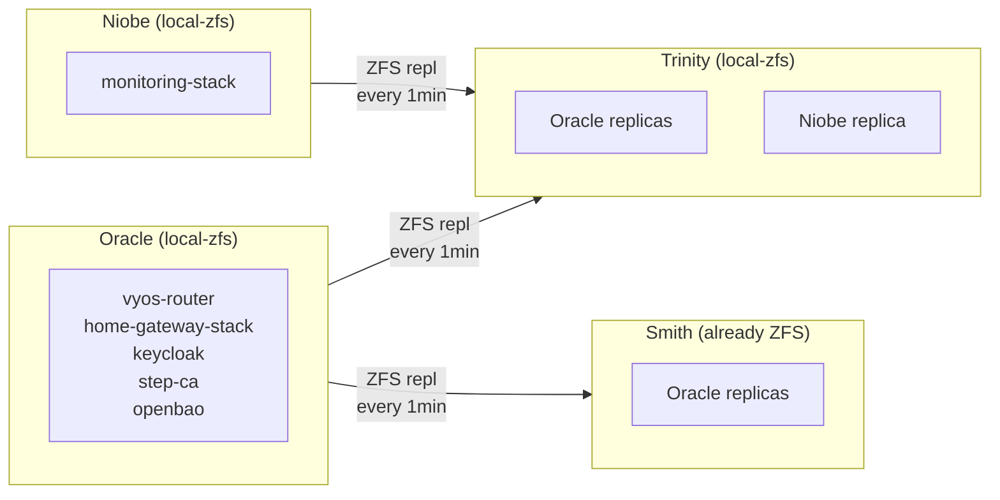

# Proxmox HA Exploration

Exploration of Proxmox High Availability for automatic VM failover.

## Goal

Enable automatic VM recovery when a Proxmox node fails. Instead of manual PBS restore (30-60 min, requires human), VMs should auto-restart on a healthy node (~2 min, unattended).

## Current State

| Host    | Local Storage   | VMs on Local                                | HA-Ready?               |
| ------- | --------------- | ------------------------------------------- | ----------------------- |
| Oracle  | local-lvm       | router, gateway, keycloak, step-ca, openbao | ❌ LVM, no replication  |
| Trinity | local-lvm       | None (VMs use NFS)                          | ❌ LVM                  |
| Neo     | local-lvm       | gpu-workstation                             | ❌ LVM, GPU passthrough |
| Niobe   | local-lvm       | monitoring-stack                            | ❌ LVM                  |
| Smith   | ZFS (nvme, hdd) | NFS server, PBS, SeaweedFS, game-server     | N/A (storage node)      |

## Why HA Matters

| Scenario           | Without HA                  | With HA                            |
| ------------------ | --------------------------- | ---------------------------------- |
| Node fails at 3am  | Down until you wake up      | Auto-recovers in ~2 min            |
| Data loss          | Up to 24h (last PBS backup) | Up to 1 min (replication interval) |
| Human intervention | Required                    | Not required                       |

## Proxmox HA Requirements

1. **Shared storage** (NFS, Ceph) — OR —
2. **Replicated local storage** (ZFS + Proxmox Replication)

Since critical infrastructure (Oracle) must boot independently of Smith (NFS), option 2 is required for those VMs.

## Proposed Architecture

### Tier 1: Critical Infrastructure (Local ZFS + Replication)

VMs that must survive storage node (Smith) failure:



**Why monitoring on local?** Must alert when Smith/NFS is down. If monitoring is on NFS and Smith dies, monitoring freezes — no alerts sent.

### Tier 2: Workload VMs (Ceph or NFS-backed)

VMs that can depend on shared storage. See `ceph.md` for the distributed storage plan.

### Tier 3: Immovable (No HA)

| VM              | Reason                                |
| --------------- | ------------------------------------- |
| gpu-workstation | GPU passthrough pins it to Neo        |
| Smith LXCs      | Storage node can't migrate off itself |

## Migration Plan

### Phase 1: Convert Trinity to ZFS (Replication Target)

Trinity needs ZFS to receive replicas from Oracle and Niobe.

1. Verify no VMs on Trinity's local-lvm (all use NFS)
2. Remove LVM volume group
3. Create ZFS pool: `zpool create -o ashift=12 local-zfs /dev/nvme0n1pX`
4. Add storage to Proxmox

**Downtime:** None (Trinity VMs use NFS)
**Time:** ~10 minutes

### Phase 2: Convert Oracle to ZFS

1. Migrate Oracle VMs to Trinity (temporary, on NFS):
   ```bash
   qm migrate 1001 trinity --with-local-disks --target-storage nfs-nvme-vm-dataset
   qm migrate 1002 trinity --with-local-disks --target-storage nfs-nvme-vm-dataset
   qm migrate 1023 trinity --with-local-disks --target-storage nfs-nvme-vm-dataset
   qm migrate 1025 trinity --with-local-disks --target-storage nfs-nvme-vm-dataset
   qm migrate 1026 trinity --with-local-disks --target-storage nfs-nvme-vm-dataset
   ```
2. Document Oracle disk layout
3. Remove LVM, create ZFS pool
4. Migrate VMs back to Oracle local-zfs
5. Enable Proxmox Replication: Oracle → Trinity (1 min schedule)
6. Enable Proxmox Replication: Oracle → Smith (1 min schedule) — Smith already has ZFS, no conversion needed

**Downtime:** ~20 min (VM reboots during migration)
**Time:** ~45 minutes total

### Phase 3: Convert Niobe to ZFS

1. Migrate monitoring-stack to NFS (temporary)
2. Remove LVM, create ZFS pool
3. Migrate monitoring-stack back to local-zfs
4. Enable Proxmox Replication: Niobe → Trinity (1 min schedule)

**Downtime:** ~10 min (monitoring reboot)
**Time:** ~35 minutes total

### Phase 4: Configure HA Resources

```hcl
# Tofu configuration
resource "proxmox_virtual_environment_hagroup" "oracle_vms" {
  group      = "oracle-critical"
  nodes      = ["oracle", "trinity", "smith"]  # Failover to either
  restricted = true
  nofailback = true  # Don't auto-migrate back
}

resource "proxmox_virtual_environment_haresource" "router" {
  resource_id = "vm:1001"
  state       = "started"
  group       = proxmox_virtual_environment_hagroup.oracle_vms.group
}

# Repeat for gateway, keycloak, step-ca, openbao

resource "proxmox_virtual_environment_hagroup" "niobe_vms" {
  group      = "niobe-critical"
  nodes      = ["niobe", "trinity"]  # Monitoring can failover to Trinity
  restricted = true
  nofailback = true
}

resource "proxmox_virtual_environment_haresource" "monitoring" {
  resource_id = "vm:1003"
  state       = "started"
  group       = proxmox_virtual_environment_hagroup.niobe_vms.group
}
```

## Failure Modes

### Local Tier (ZFS Replication)

VMs on local-zfs with Proxmox Replication (Oracle, Niobe critical infra):

| Failure                      | Behavior                                     | RTO    | RPO   |
| ---------------------------- | -------------------------------------------- | ------ | ----- |
| Oracle dies                  | VMs restart on Trinity or Smith from replica | ~2 min | 1 min |
| Trinity dies                 | Oracle VMs unaffected (primary)              | 0      | 0     |
| Smith dies                   | Oracle VMs unaffected (primary)              | 0      | 0     |
| Niobe dies                   | Monitoring restarts on Trinity               | ~2 min | 1 min |
| Oracle + Trinity die         | Oracle VMs restart on Smith                  | ~2 min | 1 min |
| Oracle + Smith die           | Oracle VMs restart on Trinity                | ~2 min | 1 min |
| Oracle + Trinity + Smith die | Manual PBS restore                           | Hours  | 24h   |

### NFS/Ceph Tier (Shared Storage)

VMs on shared storage (NFS today, Ceph future):

| Failure              | Behavior                               | RTO     | RPO |
| -------------------- | -------------------------------------- | ------- | --- |
| Node running VM dies | VM restarts on another node, same data | ~60-90s | 0   |
| Smith dies (NFS)     | All NFS VMs freeze until Smith returns | ∞       | 0   |
| Any Ceph node dies   | VMs continue, Ceph rebalances (future) | ~30-60s | 0   |
| 2+ Ceph nodes die    | Ceph loses quorum, VMs freeze (future) | ∞       | 0   |

**Key insight:** NFS/Ceph tier has better RTO and RPO for node failures, but trades off storage-level SPOF (NFS) or quorum requirements (Ceph).

## Recovery Procedures

### Node Returns After Failover

**Do NOT let it auto-reclaim VMs.** Use `nofailback = true` in HA group config.

When the failed node returns:

1. Check if replica is stale (it will be — VMs were writing to the other node)
2. Reverse replication direction if needed
3. Manually decide when to fail back

### Split-Brain Prevention

- Proxmox uses Corosync for quorum (needs 3+ nodes, you have 5)
- `nofailback` prevents auto-reclaim
- 15-minute replication gap is accepted RPO

## Costs

| Item        | Cost                                  |
| ----------- | ------------------------------------- |
| NVMe drives | $0 (reuse existing)                   |
| Time        | ~1.5 hours across maintenance windows |

## Decision Factors

### Pros

- Auto-recovery without human intervention
- 1-min RPO vs 24h with PBS-only
- Critical infra (router, auth, PKI) protected

### Cons

- Adds complexity (replication, HA config)
- 1-min data loss window during failover
- Trinity + Smith become replication targets (more load)

## Dependencies

- Trinity must have enough local storage for replicas (~500GB for Oracle + Niobe VMs)
- Trinity's 1TB NVMe is sufficient (or will be upgraded for Ceph anyway)
- Smith already has ZFS with 8TB NVMe — plenty of room for Oracle replicas (~336GB)
- Niobe only needs local storage for monitoring-stack (~128GB) — no conversion needed if not a replication target

## Status

**Exploration phase.** Not yet scheduled for implementation. See `ceph.md` for the related distributed storage plan that may supersede some of this.
