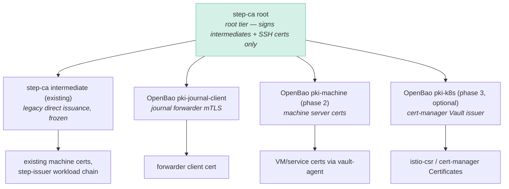

# Two-Tier PKI: step-ca Root, OpenBao Issuing

Plan for evolving the PKI from a single warm CA that signs everything into the canonical
two-tier hierarchy: **step-ca as the root tier** (signs intermediates, rarely), **OpenBao PKI
mounts as the issuing tier** (all day-to-day, API-driven issuance with short TTLs). This is
the pattern HashiCorp and enterprise PKI guidance recommend: long-lived trust anchor
separated from high-velocity issuance ([Vault external-CA tutorial](https://developer.hashicorp.com/vault/tutorials/pki/pki-engine-external-ca),
[Vault PKI docs](https://developer.hashicorp.com/vault/docs/secrets/pki)).

"Two-tier" here means the hierarchy split — **not** physically air-gapping the root. The
step-ca LXC stays where it is; it just stops being the thing every leaf chains to directly.

## Why

Today step-ca is a *warm root*: online 24/7 **and** directly issuing end-entity certs
(machine, workload, SSH, CI). Consequences:

- Root-key compromise ≈ total CA compromise; there is no revocable middle tier.
- Every new cert domain lands as another provisioner on the same intermediate, so **all
  leaves share one trust anchor**. Chain-only verifiers (gatewayd, exporter-toolkit, Docker
  API, Redis — anything doing bare `RequireAndVerifyClientCert`) cannot scope authorization
  below the anchor, which forced the journal-forwarder work to mint a separate anchor.
- OSS step-ca is one issuing intermediate per process — per-domain anchors via step-ca means
  process sprawl. OpenBao PKI mounts give per-domain CAs as *configuration* (one mount each),
  on infrastructure that already runs, with Tofu-managed roles and vault-agent renewal.

Rule of thumb that falls out of this: **the trust anchor must be at least as granular as the
verifier's authorization capability.** Smart verifiers (CN/SAN/SPIFFE-aware: OpenBao cert
auth, Roles Anywhere, Istio) can share the root-anchored chain. Chain-only verifiers each get
their own issuing mount.

## Target hierarchy

Verifiers that anchor at the **root** (Roles Anywhere trust anchor, service `ca_cert`
bundles) keep working unchanged — leaves issued by any mount chain up to the same root.
Verifiers that need scoping anchor at a **specific mount's intermediate**.

## Phases

### Phase 0 — pattern established (part of the journal forwarder work)

`pki-journal-client` mount, intermediate signed by the step-ca root via the ceremony
documented in [journal-forwarder.md](journal-forwarder.md), vault-agent renewal on an
Ansible-managed VM. This is the proof-of-shape — but it already introduces a second
issuing CA, so the `trust-model.md` rewrite lands **here**, not later: hierarchy diagram,
the "one CA" principle (one *root*, multiple issuing CAs), the machine-identity lifecycle
table, and the blast-radius table — which today claims an "air-gapped root" that does not
exist. Describe actual custody: online LXC, key material SOPS-backed via `backup_keys.yml`.

### Phase 1 — policy freeze

- New cert domains go on OpenBao PKI mounts; no new step-ca provisioners for direct leaf
  issuance.
- `trust-model.md` was already rewritten in phase 0; this phase is pure policy enforcement.
- Next expected tenant: `pki-exporter-client` if/when the exporter plane (node_exporter,
  smartctl — exporter-toolkit is chain-only) gets mTLS.

### Phase 2 — opportunistic machine-cert migration

Create `pki-machine`; migrate services from `step ca renew` daemons to vault-agent templates
**as they are touched** — the natural vehicle is the NixOS migration, since every migrated
OpenBao-consuming migrated host already runs `openbao-agent.nix` (IDS, blockchain, bastion —
AdGuard does not) and the delta is swapping `step-ca-cert.nix` issuance for a PKI-mount
template; hosts without the agent adopt it as part of their migration. No big-bang: `machine-bootstrap` and existing renew timers keep
working throughout.

### Phase 3 — Kubernetes (optional)

Replace step-issuer with cert-manager's native **Vault issuer** against a `pki-k8s` mount;
istio-csr is issuer-agnostic. Only worth doing if step-issuer bit-rots or during a cluster
rebuild — no security payoff on its own.

### End state

step-ca signs intermediates on a 1–2 year cadence and SSH certs; all other
**non-exception** leaves issue from OpenBao. "Frozen" means renewal-only, not revoked:
existing consumers keep renewing on the legacy intermediate indefinitely — including the
Kubernetes step-issuer chain if phase 3 is skipped. At that point moving the root key to
SOPS-only custody (restored to the LXC for signing ceremonies) becomes a real option —
deliberately out of scope for now.

## Permanent exceptions

| Exception | Reason |
| --- | --- |
| OpenBao's own listener TLS stays step-ca-issued | Circularity: Bao cannot be sole issuer of the cert it needs to serve issuance. Keeps DR path `Age key → recovery keys → unseal` free of cert chicken-and-egg |
| SSH user/host CAs stay on step-ca | SSH certs have no chain model — there is no "intermediate" tier to move to; `step ssh` + Keycloak OIDC UX is the reason step-ca earns its keep |
| Roles Anywhere trust anchor stays the root | CN-scoped at the IAM role, so root anchoring is correct; issued chains through mounts still validate |

## Operational requirements

- **Intermediate lifecycle**: issue mount intermediates at 5y, plan rotation at ~2y with
  overlap (old + new in verifier trust bundles during transition). Add each mount's CA cert
  to cert-expiry alerting (`tls-cert-expiring-soon` / the planned x509-certificate-exporter).
- **Issuance SPOF**: OpenBao becomes the issuing tier — mitigations already in place (KMS
  auto-unseal, monitoring); enforce leaf TTL floors ≥72h so a Bao outage of hours doesn't
  break renewals, and alert on renewal failure (service-specific, e.g. forwarder poll-stale).
- **CRL hygiene**: enable periodic `tidy` per mount; short TTLs are the primary revocation
  story.
- **Backups**: mount CA keys live in Bao raft storage (existing backup path); step-ca root
  material stays in the SOPS backup (`step_ca/backup_keys.yml`).

## Decisions record

| Alternative | Rejected because |
| --- | --- |
| Second/third step-ca processes per domain | One standing service per anchor; OpenBao gives anchors as config |
| Tofu `tls`-provider CAs | Static keys in state; roots outside the step-ca hierarchy; fails the trust-model litmus test |
| Consolidate everything into OpenBao (drop step-ca) | Loses the minimal, dependency-free root; creates cert⇄secrets circular dependency; merges CA-compromise and secrets-compromise blast radii |
| Literal offline/air-gapped root now | Ceremony overhead without a threat-model driver at homelab scale; revisit at end state |

## Related

- [journal-forwarder.md](journal-forwarder.md) — phase 0 consumer
- `../trust-model.md` — identity planes; to be updated in phase 1
- `../monitoring.md` — cert-expiry alerting
