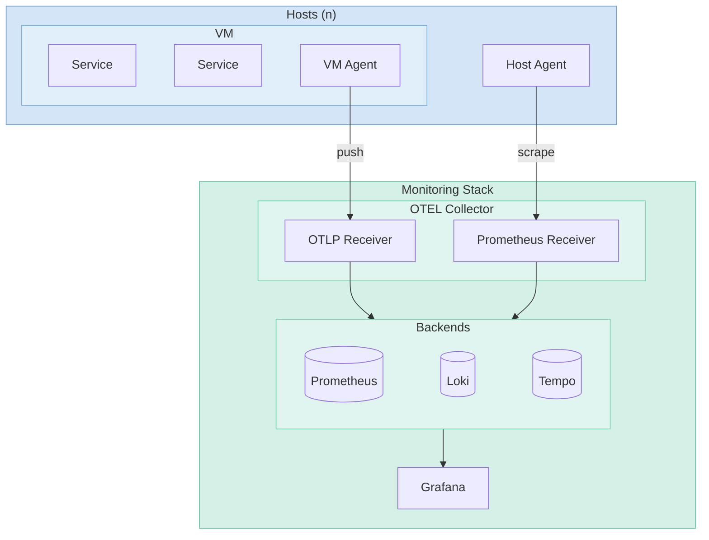

# Monitoring

OpenTelemetry-native observability stack running on Niobe. All telemetry flows through OTEL Collectors — VMs run local agents that scrape and push, hosts expose exporters scraped by the central collector.

## Architecture

## Central Stack

| Component      | Purpose                                             |
| -------------- | --------------------------------------------------- |
| OTEL Collector | Central receiver, scrapes hosts, routes to backends |
| Prometheus     | Metrics storage (TSDB)                              |
| Loki           | Log aggregation and querying                        |
| Tempo          | Distributed trace storage                           |
| Grafana        | Visualization and alerting                          |
| ntopng         | Network traffic analysis (sFlow/NetFlow)            |

### Data Retention

| Backend    | Retention | Notes                        |
| ---------- | --------- | ---------------------------- |
| Prometheus | 15 days   | Default TSDB retention       |
| Loki       | 90 days   | Compactor deletes after 2h   |
| Tempo      | 7 days    | Block retention in compactor |

## Monitoring Agents

### VM Monitoring Agent

Deployed to all VMs via `vm_monitoring_agent` role. Runs OTEL Collector with prometheus receiver for local scraping, pushes all telemetry via OTLP.

**Collects:**

- Host metrics via hostmetrics receiver (CPU, memory, disk, network, filesystem, load)
- Container metrics via podman/docker receiver (auto-detected)
- Local exporter metrics via prometheus receiver (Caddy, app-specific)
- Journald logs (configurable units)
- File logs (configurable patterns)

**Features:**

- Everything exports via OTLP — no direct Prometheus scraping of VMs
- Immutable OS support (rpm-ostree, Bazzite)
- GPU metrics auto-detected (Nvidia SMI exporter installed automatically)
- Persistent cursor storage for reliable log delivery

**Service:** `aether-otel-collector`

### Host Monitoring Agent

Deployed to Proxmox hosts via `host_monitoring_agent` role. Exposes metrics scraped by the central OTEL Collector's prometheus receiver.

| Exporter       | Port | Metrics                                       |
| -------------- | ---- | --------------------------------------------- |
| Node Exporter  | 9100 | CPU, memory, disk I/O, network, filesystems   |
| SMART Exporter | 9633 | Disk health, temps, wear, reallocated sectors |

**Services:** `aether-node-exporter`, `aether-smartctl-exporter`

## API-Based Exporters

Running in the monitoring stack pod, scraped by the central OTEL Collector:

| Exporter     | Target                | Metrics                        |
| ------------ | --------------------- | ------------------------------ |
| PVE Exporter | Proxmox cluster API   | VM/CT status, storage, cluster |
| PBS Exporter | Proxmox Backup Server | Backup jobs, datastore usage   |

## Application Metrics

Collected by VM agents via prometheus receiver, pushed to central stack:

| Source           | VM              | Metrics                     |
| ---------------- | --------------- | --------------------------- |
| AdGuard Exporter | Gateway Stack   | DNS queries, blocked count  |
| HAProxy Exporter | Gateway Stack   | Backend health, connections |
| Postfix Exporter | Messaging Stack | Mail queue, delivery stats  |
| Caddy metrics    | Multiple        | Request rates, latencies    |

## Dashboards

| Dashboard       | Purpose                                 |
| --------------- | --------------------------------------- |
| Proxmox Cluster | Host/VM/LXC resource usage              |
| Hosts           | Node exporter metrics for Proxmox hosts |
| Disk Health     | SMART metrics, disk temps, wear levels  |
| DNS             | AdGuard query stats, blocked domains    |
| Reverse Proxy   | Caddy request rates, latencies, errors  |
| HAProxy         | Backend health, connection stats        |
| PBS             | Backup job status, datastore usage      |
| UPS             | Power status, battery, load             |
| Access Point    | UniFi AP client stats, signal strength  |
| IoT             | Home Assistant                          |
| qBittorrent     | Torrent stats, speeds                   |
| Synapse         | Matrix server metrics                   |
| Postfix         | Mail queue, delivery stats              |
| ntfy            | Push notification delivery              |

## Alerting

Alerts route through Apprise to ntfy for push notifications.

### Severity Levels

| Severity | Routing          | Use Case                     |
| -------- | ---------------- | ---------------------------- |
| critical | apprise-critical | Immediate action required    |
| warning  | apprise-standard | Attention needed, not urgent |

### Alert Rules

| Alert                  | Severity | Condition                        |
| ---------------------- | -------- | -------------------------------- |
| Host Down              | critical | Proxmox node unreachable         |
| Disk Space Low         | critical | <10% free space                  |
| Disk SMART Unhealthy   | critical | SMART status failure             |
| GPU Thermal Throttling | critical | Hardware thermal slowdown active |
| Host High CPU          | warning  | >90% CPU for 5m                  |
| Host High Memory       | warning  | >90% memory for 5m               |
| VM High CPU            | warning  | >90% CPU for 5m                  |
| VM High Memory         | warning  | >90% memory for 5m               |
| Backup Stale           | warning  | Last backup >24h ago             |
| GPU High Temperature   | warning  | >85°C for 2m                     |
| GPU High Memory        | warning  | >95% VRAM for 5m                 |
