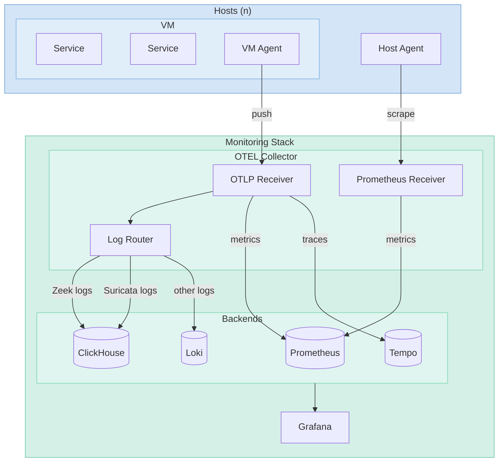

# Monitoring

OpenTelemetry-native observability stack running on Niobe. All telemetry flows through OTEL Collectors — VMs run local agents that scrape and push, hosts expose exporters scraped by the central collector.

## Architecture


```mermaid
flowchart TB
    subgraph Hosts["Hosts (n)"]
        Exporter["Host Agent"]
        subgraph VM["VM"]
            App1["Service"]
            App2["Service"]
            Agent["VM Agent"]
        end
    end

    Agent -->|push| OTLP
    Exporter -->|scrape| PromRx

    subgraph Niobe["Monitoring Stack"]
        subgraph Collector["OTEL Collector"]
            direction LR
            OTLP["OTLP Receiver"]
            PromRx["Prometheus Receiver"]
            Router["Log Router"]
        end

        subgraph Backends["Backends"]
            Prometheus[(Prometheus)]
            Loki[(Loki)]
            Tempo[(Tempo)]
            ClickHouse[(ClickHouse)]
        end

        Grafana[Grafana]
    end

    OTLP --> Router
    Router -->|Zeek logs| ClickHouse
    Router -->|Suricata logs| ClickHouse
    Router -->|other logs| Loki
    OTLP -->|metrics| Prometheus
    OTLP -->|traces| Tempo
    PromRx -->|metrics| Prometheus
    Backends --> Grafana

    style Hosts fill:#d4e5f7,stroke:#6a9fd4
    style VM fill:#e0eefa,stroke:#7ab0e0
    style Niobe fill:#d4f0e7,stroke:#6ac4a0
    style Collector fill:#e0f5ef,stroke:#7ad4b0
    style Backends fill:#e0f5ef,stroke:#7ad4b0
```

## Central Stack

| Component      | Purpose                                              |
| -------------- | ---------------------------------------------------- |
| OTEL Collector | Central receiver, scrapes hosts, routes to backends  |
| Prometheus     | Metrics storage (TSDB)                               |
| Loki           | Log aggregation and querying                         |
| Tempo          | Distributed trace storage                            |
| ClickHouse     | Network/IDS logs (Zeek, Suricata) with SQL analytics |
| Grafana        | Visualization and alerting                           |

### Data Retention

| Backend    | Retention | Notes                                       |
| ---------- | --------- | ------------------------------------------- |
| Prometheus | 30 days   | `--storage.tsdb.retention.time=30d` — covers 14d soak reviews with prior-context margin |
| Loki       | 90 days   | Compactor deletes after 2h                  |
| Tempo      | 7 days    | Block retention in compactor                |
| ClickHouse | Per table | 14-90d raw; selected hourly aggregates retain 90-365d (see ClickHouse SQL) |
| ClickHouse (`metrics` db) | 365 days | dedicated `metrics/archive` pipeline (50k batches, bounded queue, best-effort by construction); Prometheus is the 30d hot path. Cold-tier to SeaweedFS planned — exploration/telemetry-archive.md |

### Zeek `conn.IngestedAt` (Argos ingestion cursor)

`zeek.conn.IngestedAt` is `DateTime64(3, 'UTC')` set by the typed-table materialized view as `now64(3)` when ClickHouse accepts the row into typed storage. It is **not** Zeek sensor event time (`Timestamp`) and **not** OTEL collection time.

| Topic | Contract |
| --- | --- |
| Greenfield DDL | `clickhouse/02-typed-tables.sql` + `clickhouse/03-materialized-views.sql` |
| Live cutover | `clickhouse-migrations/09-zeek-conn-ingested-at.sql` (shadow `conn_v2` + `EXCHANGE TABLES`, then recreate `conn_mv TO zeek.conn`; **not** in `docker-entrypoint-initdb.d`) |
| Historical rows | At cutover, `IngestedAt = toDateTime64(Timestamp, 3, 'UTC')` |
| Producer ack → typed visibility | OTEL `clickhouse/zeek` uses `async_insert: true` with `wait_for_async_insert=1`; MVs remain synchronous on INSERT. Successful exporter acknowledgement implies the typed `zeek.conn` row is query-visible. |
| Visibility SLO | Conservative **60s** (2× server `async_insert_busy_timeout_max_ms` of 30s). With wait-on-flush, post-ack visibility is immediate; the SLO bounds end-to-end batching delay for watermark planning. |
| Argos settle floor | `ARGOS_INGEST_SETTLE_SECONDS >= max(300, 2 × visibility_slo) = 300`. Default Argos `evaluation_interval` is 3600s; `2 × 60 < 3600` holds. |

**Cutover verification (after applying `09-…` on a live volume):**

1. Pre-cutover row: `IngestedAt` is non-null and equals event `Timestamp` (ms UTC).
2. Insert a fixture with an old event `Timestamp` after cutover; `IngestedAt` is near `now64(3)`, not the old event time.
3. Two fixtures on opposite half-open `IngestedAt` boundaries are each selected by exactly one `[start,end)` discovery window.
4. Live `count()` on `zeek.conn` keeps rising; OTEL Zeek exporter shows no insert errors; Grafana panels that filter on `Timestamp` are unchanged.
5. Stress: after an acknowledged insert, the typed row is visible before any configured safe cutoff derived from the visibility SLO.
6. No post-cutover row has `IngestedAt` earlier than the cutover boundary.

Do not apply `09-…` without an explicit live-change approval (pause producers per the SQL runbook header).

## Monitoring Agents

### VM Monitoring Agent

Fedora/Debian VMs use the `vm_monitoring_agent` Ansible role; NixOS guests use
`nix/modules/otel-agent.nix`. Both run a local OTel Collector and push telemetry
to the central OTLP endpoint. Exact receivers vary by host declaration.

**Collects:**

- Host metrics via hostmetrics receiver (CPU, memory, disk, network, filesystem, load)
- Container metrics via podman/docker receiver (auto-detected)
- Local exporter metrics via prometheus receiver (Caddy, app-specific)
- Journald logs (configurable units)
- File logs (configurable patterns)

**Features:**

- Everything exports via OTLP — no direct Prometheus scraping of VMs
- Immutable OS support (rpm-ostree, Bazzite)
- GPU metrics auto-detected (Nvidia SMI exporter installed automatically)
- Persistent cursor storage for reliable log delivery

**Service:** `aether-otel-collector`

### Certificate expiry and renewal health

Certificate coverage is split by the component that owns the certificate:

| Runtime | Source | Metrics path |
| --- | --- | --- |
| Ansible-managed VMs | Explicit step-ca leaf files, plus selected renewal services/timers | `certificate_monitoring` role → local OTEL Prometheus receiver |
| NixOS machine-cert users | `/etc/ssl/certs/machine.crt` and `step-ca-cert-renew.service` | `nix/modules/step-ca-cert.nix` → local OTEL Prometheus receiver |
| Kubernetes | cert-manager controller `certmanager_certificate_*` metrics | cluster OTel collector → central Prometheus |

The local file exporter watches only paths declared by the owning playbook or
Nix module; it does not scan directories or private keys. Grafana rules alert
at less than 30% of the certificate lifetime, on expired files, and when a
configured renewal service or timer is failed/down. Kubernetes uses
cert-manager's renewal timestamp because the cluster contains both long-lived
application certificates and short-lived Istio workload certificates.

Proxmox `pve-ssl.pem` is intentionally not included: Proxmox owns that
certificate and its renewal path. Proxmox hosts become part of this file-cert
coverage when the planned journal-gateway step-ca certificates are deployed.

### Host Monitoring Agent

Deployed to Proxmox hosts via `host_monitoring_agent` role. Exposes metrics scraped by the central OTEL Collector's prometheus receiver.

| Exporter       | Port | Metrics                                       |
| -------------- | ---- | --------------------------------------------- |
| Node Exporter  | 9100 | CPU, memory, disk I/O, network, filesystems   |
| SMART Exporter | 9633 | Disk health, temps, wear, reallocated sectors |

**Services:** `aether-node-exporter`, `aether-smartctl-exporter`

### Journal Forwarder

The agent-free hosts (five Proxmox hypervisors + the AWS/GCP cloud VMs) run no
local OTel agent, so their logs are collected pull-based by
`otel-journal-gatewayd-forwarder` on `monitoring-stack`. It polls each host's
`systemd-journal-gatewayd` (`:19531`) and ships OTLP logs to the local central
collector, which routes them to Loki. Deploy with `task configure:journal-gateways`
(the gateways) and `task configure:journal-forwarder` (the collector side).

| Hop | Transport / authn |
| --- | --- |
| forwarder → Proxmox hosts | HTTPS mTLS. gatewayd serves plain HTTP on loopback; **ghostunnel** terminates client-cert mTLS on the mgmt IP (Debian systemd is openssl-built, so gatewayd's own `--trust` is unavailable). The trust anchor is the `pki-journal-client` intermediate — it signs exactly one leaf, so it *is* the authorization policy — plus an `--allow-cn` allowlist. |
| forwarder → cloud VMs | Plain HTTP bound to the routed WireGuard site IP (`10.1.0.10` AWS, `10.2.0.10` GCP). WireGuard + the host nftables rule (only `10.0.2.3` may reach `:19531`) + the VyOS `CLOUD` zone are the authn boundary. Tailscale was retired on these nodes. |
| forwarder → OTLP | loopback `http://127.0.0.1:4318`, plain. |

The forwarder's client cert is minted by **vault-agent** (Ansible `openbao_agent`
role) from `pki-journal-client/issue/forwarder` via the dedicated
`journal-forwarder` cert-auth role (pinned to `monitoring-stack.home.shdr.ch`,
never the shared `aether-machine` role). Renewal restarts the forwarder; the
gatewayd server certs (step-ca `machine-bootstrap`) renew and restart ghostunnel.

Logs land in Loki as `service_name=<systemd unit>` with `host_name`,
`instance_type` (`proxmox_host`/`vps`), and `os_type` as structured metadata —
e.g. `{service_name="pvedaemon"} | host_name=`niobe``. On a fresh deploy each
source's cursor is seeded to the current journal tail, so long-uptime hosts do
not backfill weeks of stale entries that Loki would reject as too old.

Metrics on `127.0.0.1:9091` (`ojgf_*`) are scraped by the VM agent; the
`Journal Forwarder` Grafana group alerts on poll-stale, poll-errors, and absent
(all `severity: warning`).

## API-Based Exporters

Running in the monitoring stack pod, scraped by the central OTEL Collector:

| Exporter     | Target                | Metrics                        |
| ------------ | --------------------- | ------------------------------ |
| PVE Exporter | Proxmox cluster API   | VM/CT status, storage, cluster |
| PBS Exporter | Proxmox Backup Server | Backup jobs, datastore usage   |

## Application Metrics

Collected by VM agents via prometheus receiver, pushed to central stack:

| Source           | VM              | Metrics                     |
| ---------------- | --------------- | --------------------------- |
| AdGuard Exporter | AdGuard LXCs    | DNS queries, blocked count  |
| HAProxy Exporter | Gateway Stack   | Backend health, connections |
| Postfix Exporter | Notifications Stack | Mail queue, delivery stats  |
| Caddy metrics    | Multiple        | Request rates, latencies    |

## Dashboards

The repository currently provisions seven dashboard JSON files: Home,
Certificates, Virtual Machines, Ceph, Kubernetes, Security Triage, and IDS
Monitoring. The live
Grafana API also retains the other dashboards listed below, but they are not all
represented in `grafana/provisioning/dashboards/`; they are useful live surfaces,
not fully reproducible IaC. Conversely, the declared Virtual Machines dashboard
was not returned by live search on 2026-07-09. Reconcile that drift before
describing the complete dashboard set as code-owned.

| Dashboard       | Purpose                                       |
| --------------- | --------------------------------------------- |
| Proxmox Cluster | Host/VM/LXC resource usage                    |
| Hosts           | Node exporter metrics for Proxmox hosts       |
| Disk Health     | SMART metrics, disk temps, wear levels        |
| DNS             | AdGuard query stats, blocked domains          |
| Reverse Proxy   | Caddy request rates, latencies, errors        |
| HAProxy         | Backend health, connection stats              |
| PBS             | Backup job status, datastore usage            |
| UPS             | Power status, battery, load                   |
| Access Point    | UniFi AP client stats, signal strength        |
| IoT             | Home Assistant                                |
| qBittorrent     | Torrent stats, speeds                         |
| Synapse         | Matrix server metrics                         |
| Postfix         | Mail queue, delivery stats                    |
| ntfy            | Push notification delivery                    |
| IDS Monitoring  | Suricata alerts + Zeek analytics (ClickHouse) |
| Certificates    | Public TLS runway, VM/LXC machine identities, cert-manager inventory, renewal units, and certificate alerts (uid `certificates`) |
| Security Triage | **Single actionable security surface** — firing security-alert queue (`domain=security`) + per-head signal stats & recent-event tables (Suricata, Zeek, Hubble, Tetragon, Trivy, Wazuh, Keycloak) + drill-down links (uid `security-triage`) |
| Home            | Cross-cutting triage: firing alerts, certificate issues, namespace-contract risk map, saturation/headroom, signal-path health (uid `home`) |

## Agent Investigations

The supported interactive investigation workflow is the repo-local
[`$investigate-aether`](../.agents/skills/investigate-aether/SKILL.md) skill. It
uses Grafana as the read-only correlation surface, then selects Prometheus,
Loki, Tempo, ClickHouse, Kubernetes, Fleet, Talos, SSH, or a service API based
on the symptom. Use
[`$navigate-aether`](../.agents/skills/navigate-aether/SKILL.md) first when the
component's placement or ownership is unclear.

From the repository root:

```bash
G=.agents/skills/investigate-aether/scripts/grafana-read.bb
nix develop -c "$G" dashboards
nix develop -c "$G" alerts        # active instances; omits DeadMansSwitch
nix develop -c "$G" alerts --all  # includes the intentional heartbeat
nix develop -c "$G" rules         # provisioned rule definitions
nix develop -c "$G" contact-points # receiver metadata; URLs are omitted
nix develop -c "$G" prom 'count by (job) (up)'
nix develop -c "$G" loki-labels
nix develop -c "$G" tempo-services
```

The helper discovers datasource UIDs dynamically and obtains the Viewer token
from SOPS without printing it. Grafana's ClickHouse datasource uses a separate
local-only `grafana_readonly` identity with server-enforced schema grants and
resource limits; the writable `aether` identity remains limited to ingestion
and administration. Investigation remains read-only. IaC remediation and any
explicitly approved live patch follow `AGENTS.md`.

The automated path is implemented by sibling
[`inquest`](https://gitlab.home.shdr.ch/so/inquest): Grafana dual-delivers every actionable
alert to Kestra, Inquest creates or updates `so/aether/incidents` issues, and
Holmes posts a read-only RCA for human verification. Aether owns Kestra, Holmes,
Grafana routing, secrets, and network policy; Inquest owns the flow IaC and
incident lifecycle. This path is separate from, and not a prerequisite for,
interactive `$investigate-aether` work. The older
[`agentic-incident-response.md`](exploration/agentic-incident-response.md)
document is a superseded AIAgent/Fleet exploration.

## Alerting

Alerts route through Apprise to ntfy for push notifications. Every
`apprise-*` contact point also contains the Inquest webhook receiver, so critical,
standard, digest, and security alerts are delivered to both their existing human
path and the automated incident path. `kuma-deadman` remains exclusively the
always-firing Uptime Kuma heartbeat; it is not an incident source.

### Severity Levels

| Severity | Routing          | Use Case                     |
| -------- | ---------------- | ---------------------------- |
| critical | apprise-critical | Immediate action required    |
| warning  | apprise-standard | Attention needed, not urgent |

### Alert Rules

| Alert                  | Severity | Condition                        |
| ---------------------- | -------- | -------------------------------- |
| Host Down              | critical | Proxmox node unreachable         |
| Disk Space Low         | critical | <10% free space                  |
| Disk SMART Unhealthy   | critical | SMART status failure             |
| GPU Thermal Throttling | critical | Hardware thermal slowdown active |
| Host High CPU          | warning  | >90% CPU for 5m                  |
| Host High Memory       | warning  | >90% memory for 5m               |
| VM High CPU            | warning  | >90% CPU for 5m                  |
| VM High Memory         | warning  | >90% memory for 5m               |
| Backup Stale           | warning  | Last backup >24h ago             |
| Kubernetes ReplicaSet Not Ready | warning  | Desired replicas exceed ready replicas for 15m |
| GPU High Temperature   | warning  | >85°C for 2m                     |
| GPU High Memory        | warning  | >95% VRAM for 5m                 |
| Smith Clocksource Regression | warning | talos-smith host system-CPU >30% for 15m — acpi_pm PIO-exit-storm tripwire (temporary; remove at next Talos bump) |

### App-level alert rules

App-specific LogQL/PromQL rules are provisioned alongside the infrastructure
rules in the same `Infrastructure` group
(`ansible/playbooks/monitoring_stack/grafana/provisioning/alerting/rules.yml`).
They carry `domain=media` (or their app domain) and route via the default
catch-all to `apprise-standard` unless they carry `channel`/`domain=security`
overrides. Current app rules:

| Alert | Severity | Condition | Source |
| --- | --- | --- | --- |
| Jellyfin SSO Auth Provider Broken | critical | `InvalidAuthProvider` in jellyfin ns [30m] > 0 | Loki |
| Jellyfin Gelato Stream Resolution Failures | warning | `Invalid stream, skipping` [1h] > 5 | Loki |
| Jellyfin Click-Play-No-Streams | warning | `SyncStreams finished … streams=0` [1h] > 0 | Loki |
| Jellyfin strm Link Resolution Rot | warning | `Unable to find linked item` [1h] > 200 | Loki |
| Jellyfin Server Down | critical | `jellyfin_up == 0` for 5m | Prometheus (rebelcore/jellyfin_exporter) |

**Authoring Loki alert rules — two gotchas (learned the hard way):**

1. **Wrap `count_over_time(...)` in `sum(...)`.** A bare range query returns one series *per log stream*, trips Loki's 500-series cap, and puts the rule in `Error` state (which pages via `execErrState: Error`) — not `NoData`. Always `sum(count_over_time({...} |= "..." [30m]))`.
2. **Grafana file-provisioning is upsert-only for `groups`.** Removing a rule from a `groups` block does **not** delete it from Grafana (even on restart) — it orphans, stuck in `error`/`firing`. The clean IaC fix is a top-level **`deleteRules`** block in the provisioning file (sibling of `groups`):
   ```yaml
   deleteRules:
     - orgId: 1
       uid: <rule-uid>
   ```
   Re-provision + restart Grafana; the rule is removed with no admin auth or DB access. Remove the `deleteRules` tombstone afterward once confirmed. (Note: Grafana admin here is Keycloak-OIDC only — there is no working static admin credential in SOPS, so API/CLI/basic-auth deletion paths are dead ends; `deleteRules` is the way.)


## Alert routing contract

Alerts are routed by label, not by hard-coded receiver. Every rule carries
`severity` (`warning|critical`) and MAY carry `channel` (`page|digest` — an
explicit override), `domain` (`security|governance`), and — for
namespace-scoped Prometheus rules — the contract labels `tier`, `owner`,
`criticality` inherited from the namespace contract via a PromQL join:

```
(<base expr>) * on(namespace) group_left(tier, owner, criticality) aether:namespace_contract:info
```

The recording rule `aether:namespace_contract:info` is produced from
kube-state-metrics `kube_namespace_labels` (KSM is configured to expose the
`aether.shdr.ch/*` labels via its metric-labels-allowlist). Both sides share
that KSM lifeline, so if KSM dies the join is empty and the metrics-pipeline
dead-man alert pages instead of the rule silently disappearing.

First-match routing tree (`provisioning/alerting/notification-policies.yml`):

| Order | Match | Receiver | Cadence | Meaning |
|---|---|---|---|---|
| 1 | `alertname=DeadMansSwitch` | `kuma-deadman` | repeat 3m | heartbeat to the external Uptime-Kuma push monitor |
| 2 | `channel=page` | `apprise-critical` | default | non-negotiable pages (backup freshness, PSS-blocked, metrics-pipeline-dead) regardless of tier |
| 3 | `channel=digest` | `apprise-digest` | group 15m / repeat 24h | explicit review-class |
| 4 | `domain=security, severity=critical` | `apprise-critical` | default | security pages |
| 5 | `domain=security` | `apprise-security` | digest cadence | security review feed (ntfy `/security` + Matrix) |
| 6 | `criticality=low` | `apprise-digest` | digest cadence | guest/sandbox namespaces — no 3am pages for low-value workloads |
| 7 | `criticality=high` | `apprise-critical` | default | platform namespaces page even at `warning` |
| 8 | `severity=critical` | `apprise-critical` | default | catch-all critical |
| 9 | default | `apprise-standard` | default | everything else |

### Security triage

Each security signal is assigned exactly one bucket:

- **page** — Suricata sev-1 (post-soak), Tetragon escape-class policies
  (post-soak), Wazuh rule level ≥ 12 (post-soak), PSS `FailedCreate`.
- **digest** — Suricata sev-1/2 daily review, Zeek notices, Tetragon
  untrusted-tier policies, Trivy criticals in `backup=critical` /
  `exposure=public` namespaces, Keycloak login-failure bursts, Fleet
  failing-policy notifications (webhook → ntfy `/security`), Kyverno audit-fail
  summary.
- **forensics-only (deliberately no alert)** — Zeek conn/dns/http/ssl/weird,
  Suricata sev-3, Hubble flows, Fleet live/scheduled query history. Query these
  in Grafana/ClickHouse/Fleet; they are evidence, not pages.

### Argos network-beacon detector

Argos is a host-level Native AOT systemd worker on `monitoring-stack`; it is not
a Kubernetes workload and exposes no HTTP listener. Its configuration and
deployment harness live in `ansible/playbooks/monitoring_stack/argos.yml`.
`task configure:argos` installs the immutable CI artifact, renders the declared
baseline, applies the idempotent `001_initial` ClickHouse schema with a checksum
ledger, creates a least-privilege `argos` ClickHouse user, and runs the read-only
`argos check` preflight. The service is disabled by default.

The initial declared source contract is a 14-day `zeek.conn` retention with a
measured-safe 300-second settle delay (the ingestion visibility SLO is 60s), an
hourly evaluation boundary, a one-day feature lookback, and a ten-day aligned
bootstrap watermark. Review the current raw-retention horizon and expected
catch-up time before enabling; do not reuse the bootstrap watermark after it is
outside retention.

Security Triage contains the Argos checkpoint lag, retention headroom, failed
cycle, explicit data-gap, and candidate-finding panels. The corresponding
`argos-*` Grafana rules are deliberately provisioned with `isPaused: true` in
A10. After dashboard-only observation and restart recovery prove healthy, a
reviewed A11 change may unpause them. Candidate findings retain
`domain=security`, `severity=warning`, and `channel=digest`: their annotations
include the finding ID, detector version, and the Security Triage evidence link;
they never page in this milestone.

### Soak-then-promote

Every NEW page-class security rule ships as `severity: warning` (so it lands in
the digest via route 5) for 14 days. After a clean soak — zero unexplained hits
in the security ntfy history / PolicyReports — a single reviewed commit flips
`severity: warning` → `critical` on the promoted rule uids. Any noisy signal
gets its suppression added in the same commit.

### Suppression workflow

Suppressions are code, never live mutes. IDS suppressions live in the rule's
ClickHouse SQL literal — e.g. `ids-suricata-severity1` carries an
`alert_signature_id NOT IN (0 /* seed */)` list; append the SID there and
commit. This keeps every mute versioned and reviewable.

### Fleet policy & query management

Fleet posture is managed as code in `ansible/playbooks/monitoring_stack/fleet.yml`
(tag `fleet-config`), never in the Fleet UI. Policies (`/api/v1/fleet/spec/policies`)
and scheduled queries (`/api/v1/fleet/spec/queries`) are declared as `specs:`
lists and upsert on every playbook run. The failing-policy webhook posts to ntfy
`/security` (digest bucket). Re-running the playbook converges; UI edits are
overwritten.

### Fleet coverage & the migration rule

osquery enrolls into Fleet from two surfaces that share one enroll secret
(`fleet.enroll_secret` in SOPS; also mirrored to OpenBao `kv/data/aether/fleet`
for nix hosts) and an identical flag set:

- **NixOS (end-state):** `nix/modules/osquery-agent.nix`, enroll secret rendered
  by the OpenBao agent. First consumer: `intrusion-detection-stack`.
- **Ansible (bridge for un-migrated VMs):** `vm_monitoring_agent`'s `osquery.yml`,
  rolled out by `setup_vm_monitoring_agents.yml`. VyOS and rpm-ostree hosts
  self-exclude.

**Migration rule (definition-of-done for every Fedora→nix VM migration): import
`nix/modules/osquery-agent.nix` in the new host's config before decommissioning
the old Fedora VM. Fleet coverage must never regress across a migration.**

### Adding an app to the contract

A namespace's `hostnames` + contract labels (`tier`, `owner`, `backup`,
`exposure`, optional `criticality`) live in
`tofu/home/kubernetes/namespace_contracts.tf`. Adding a hostname there
automatically (a) mints a blackbox HTTP synthetic probe for `internal`,
`public`, and `tunnel` apps (wildcard `*.` hostnames are excluded — they are routing policy, not
probeable endpoints) via the `synthetic_probe_targets` output consumed by
`prometheus.yml.j2`, and (b) feeds the `probe_criticality`/`probe_exposure`
labels that decide whether a probe failure pages (`probe-failed-public`) or
digests (`probe-failed-internal`). No alert or scrape edit is needed per app.
