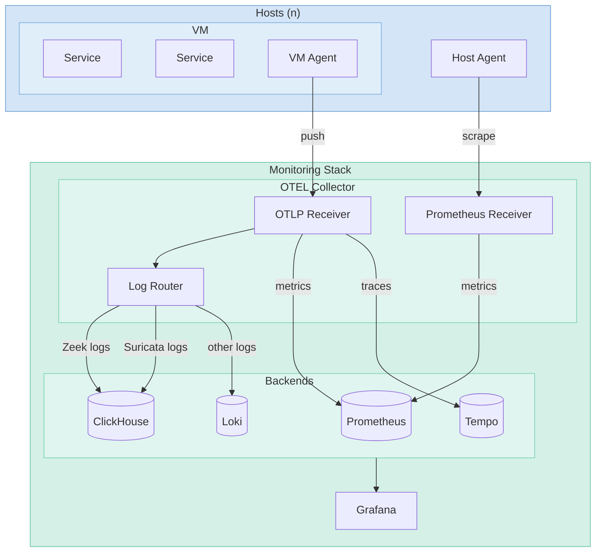

# Monitoring

OpenTelemetry-native observability stack running on Niobe. All telemetry flows through OTEL Collectors — VMs run local agents that scrape and push, hosts expose exporters scraped by the central collector.

## Architecture


```mermaid
flowchart TB
    subgraph Hosts["Hosts (n)"]
        Exporter["Host Agent"]
        subgraph VM["VM"]
            App1["Service"]
            App2["Service"]
            Agent["VM Agent"]
        end
    end

    Agent -->|push| OTLP
    Exporter -->|scrape| PromRx

    subgraph Niobe["Monitoring Stack"]
        subgraph Collector["OTEL Collector"]
            direction LR
            OTLP["OTLP Receiver"]
            PromRx["Prometheus Receiver"]
            Router["Log Router"]
        end

        subgraph Backends["Backends"]
            Prometheus[(Prometheus)]
            Loki[(Loki)]
            Tempo[(Tempo)]
            ClickHouse[(ClickHouse)]
        end

        Grafana[Grafana]
    end

    OTLP --> Router
    Router -->|Zeek logs| ClickHouse
    Router -->|Suricata logs| ClickHouse
    Router -->|other logs| Loki
    OTLP -->|metrics| Prometheus
    OTLP -->|traces| Tempo
    PromRx -->|metrics| Prometheus
    Backends --> Grafana

    style Hosts fill:#d4e5f7,stroke:#6a9fd4
    style VM fill:#e0eefa,stroke:#7ab0e0
    style Niobe fill:#d4f0e7,stroke:#6ac4a0
    style Collector fill:#e0f5ef,stroke:#7ad4b0
    style Backends fill:#e0f5ef,stroke:#7ad4b0
```

## Central Stack

| Component      | Purpose                                              |
| -------------- | ---------------------------------------------------- |
| OTEL Collector | Central receiver, scrapes hosts, routes to backends  |
| Prometheus     | Metrics storage (TSDB)                               |
| Loki           | Log aggregation and querying                         |
| Tempo          | Distributed trace storage                            |
| ClickHouse     | Network/IDS logs (Zeek, Suricata) with SQL analytics |
| Grafana        | Visualization and alerting                           |

### Data Retention

| Backend    | Retention | Notes                                       |
| ---------- | --------- | ------------------------------------------- |
| Prometheus | 15 days   | Default TSDB retention                      |
| Loki       | 90 days   | Compactor deletes after 2h                  |
| Tempo      | 7 days    | Block retention in compactor                |
| ClickHouse | 365 days  | TTL on tables, hourly aggregates for 1 year |

## Monitoring Agents

### VM Monitoring Agent

Deployed to all VMs via `vm_monitoring_agent` role. Runs OTEL Collector with prometheus receiver for local scraping, pushes all telemetry via OTLP.

**Collects:**

- Host metrics via hostmetrics receiver (CPU, memory, disk, network, filesystem, load)
- Container metrics via podman/docker receiver (auto-detected)
- Local exporter metrics via prometheus receiver (Caddy, app-specific)
- Journald logs (configurable units)
- File logs (configurable patterns)

**Features:**

- Everything exports via OTLP — no direct Prometheus scraping of VMs
- Immutable OS support (rpm-ostree, Bazzite)
- GPU metrics auto-detected (Nvidia SMI exporter installed automatically)
- Persistent cursor storage for reliable log delivery

**Service:** `aether-otel-collector`

### Host Monitoring Agent

Deployed to Proxmox hosts via `host_monitoring_agent` role. Exposes metrics scraped by the central OTEL Collector's prometheus receiver.

| Exporter       | Port | Metrics                                       |
| -------------- | ---- | --------------------------------------------- |
| Node Exporter  | 9100 | CPU, memory, disk I/O, network, filesystems   |
| SMART Exporter | 9633 | Disk health, temps, wear, reallocated sectors |

**Services:** `aether-node-exporter`, `aether-smartctl-exporter`

## API-Based Exporters

Running in the monitoring stack pod, scraped by the central OTEL Collector:

| Exporter     | Target                | Metrics                        |
| ------------ | --------------------- | ------------------------------ |
| PVE Exporter | Proxmox cluster API   | VM/CT status, storage, cluster |
| PBS Exporter | Proxmox Backup Server | Backup jobs, datastore usage   |

## Application Metrics

Collected by VM agents via prometheus receiver, pushed to central stack:

| Source           | VM              | Metrics                     |
| ---------------- | --------------- | --------------------------- |
| AdGuard Exporter | Gateway Stack   | DNS queries, blocked count  |
| HAProxy Exporter | Gateway Stack   | Backend health, connections |
| Postfix Exporter | Notifications Stack | Mail queue, delivery stats  |
| Caddy metrics    | Multiple        | Request rates, latencies    |

## Dashboards

| Dashboard       | Purpose                                       |
| --------------- | --------------------------------------------- |
| Proxmox Cluster | Host/VM/LXC resource usage                    |
| Hosts           | Node exporter metrics for Proxmox hosts       |
| Disk Health     | SMART metrics, disk temps, wear levels        |
| DNS             | AdGuard query stats, blocked domains          |
| Reverse Proxy   | Caddy request rates, latencies, errors        |
| HAProxy         | Backend health, connection stats              |
| PBS             | Backup job status, datastore usage            |
| UPS             | Power status, battery, load                   |
| Access Point    | UniFi AP client stats, signal strength        |
| IoT             | Home Assistant                                |
| qBittorrent     | Torrent stats, speeds                         |
| Synapse         | Matrix server metrics                         |
| Postfix         | Mail queue, delivery stats                    |
| ntfy            | Push notification delivery                    |
| IDS Monitoring  | Suricata alerts + Zeek analytics (ClickHouse) |
| Security Triage | **Single actionable security surface** — firing security-alert queue (`domain=security`) + per-head signal stats & recent-event tables (Suricata, Zeek, Hubble, Tetragon, Trivy, Wazuh, Keycloak) + drill-down links (uid `security-triage`) |
| Home            | Cross-cutting triage: firing alerts, namespace-contract risk map, saturation/headroom, signal-path health (uid `home`) |

## Alerting

Alerts route through Apprise to ntfy for push notifications.

### Severity Levels

| Severity | Routing          | Use Case                     |
| -------- | ---------------- | ---------------------------- |
| critical | apprise-critical | Immediate action required    |
| warning  | apprise-standard | Attention needed, not urgent |

### Alert Rules

| Alert                  | Severity | Condition                        |
| ---------------------- | -------- | -------------------------------- |
| Host Down              | critical | Proxmox node unreachable         |
| Disk Space Low         | critical | <10% free space                  |
| Disk SMART Unhealthy   | critical | SMART status failure             |
| GPU Thermal Throttling | critical | Hardware thermal slowdown active |
| Host High CPU          | warning  | >90% CPU for 5m                  |
| Host High Memory       | warning  | >90% memory for 5m               |
| VM High CPU            | warning  | >90% CPU for 5m                  |
| VM High Memory         | warning  | >90% memory for 5m               |
| Backup Stale           | warning  | Last backup >24h ago             |
| Kubernetes ReplicaSet Not Ready | warning  | Desired replicas exceed ready replicas for 15m |
| GPU High Temperature   | warning  | >85°C for 2m                     |
| GPU High Memory        | warning  | >95% VRAM for 5m                 |

## Alert routing contract

Alerts are routed by label, not by hard-coded receiver. Every rule carries
`severity` (`warning|critical`) and MAY carry `channel` (`page|digest` — an
explicit override), `domain` (`security|governance`), and — for
namespace-scoped Prometheus rules — the contract labels `tier`, `owner`,
`criticality` inherited from the namespace contract via a PromQL join:

```
(<base expr>) * on(namespace) group_left(tier, owner, criticality) aether:namespace_contract:info
```

The recording rule `aether:namespace_contract:info` is produced from
kube-state-metrics `kube_namespace_labels` (KSM is configured to expose the
`aether.shdr.ch/*` labels via its metric-labels-allowlist). Both sides share
that KSM lifeline, so if KSM dies the join is empty and the metrics-pipeline
dead-man alert pages instead of the rule silently disappearing.

First-match routing tree (`provisioning/alerting/notification-policies.yml`):

| Order | Match | Receiver | Cadence | Meaning |
|---|---|---|---|---|
| 1 | `alertname=DeadMansSwitch` | `kuma-deadman` | repeat 3m | heartbeat to the external Uptime-Kuma push monitor |
| 2 | `channel=page` | `apprise-critical` | default | non-negotiable pages (backup freshness, PSS-blocked, metrics-pipeline-dead) regardless of tier |
| 3 | `channel=digest` | `apprise-digest` | group 15m / repeat 24h | explicit review-class |
| 4 | `domain=security, severity=critical` | `apprise-critical` | default | security pages |
| 5 | `domain=security` | `apprise-security` | digest cadence | security review feed (ntfy `/security` + Matrix) |
| 6 | `criticality=low` | `apprise-digest` | digest cadence | guest/sandbox namespaces — no 3am pages for low-value workloads |
| 7 | `criticality=high` | `apprise-critical` | default | platform namespaces page even at `warning` |
| 8 | `severity=critical` | `apprise-critical` | default | catch-all critical |
| 9 | default | `apprise-standard` | default | everything else |

### Security triage

Each security signal is assigned exactly one bucket:

- **page** — Suricata sev-1 (post-soak), Tetragon escape-class policies
  (post-soak), Wazuh rule level ≥ 12 (post-soak), PSS `FailedCreate`.
- **digest** — Suricata sev-1/2 daily review, Zeek notices, Tetragon
  untrusted-tier policies, Trivy criticals in `backup=critical` /
  `exposure=public` namespaces, Keycloak login-failure bursts, Fleet
  failing-policy notifications (webhook → ntfy `/security`), Kyverno audit-fail
  summary.
- **forensics-only (deliberately no alert)** — Zeek conn/dns/http/ssl/weird,
  Suricata sev-3, Hubble flows, Fleet live/scheduled query history. Query these
  in Grafana/ClickHouse/Fleet; they are evidence, not pages.

### Soak-then-promote

Every NEW page-class security rule ships as `severity: warning` (so it lands in
the digest via route 5) for 14 days. After a clean soak — zero unexplained hits
in the security ntfy history / PolicyReports — a single reviewed commit flips
`severity: warning` → `critical` on the promoted rule uids. Any noisy signal
gets its suppression added in the same commit.

### Suppression workflow

Suppressions are code, never live mutes. IDS suppressions live in the rule's
ClickHouse SQL literal — e.g. `ids-suricata-severity1` carries an
`alert_signature_id NOT IN (0 /* seed */)` list; append the SID there and
commit. This keeps every mute versioned and reviewable.

### Fleet policy & query management

Fleet posture is managed as code in `ansible/playbooks/monitoring_stack/fleet.yml`
(tag `fleet-config`), never in the Fleet UI. Policies (`/api/v1/fleet/spec/policies`)
and scheduled queries (`/api/v1/fleet/spec/queries`) are declared as `specs:`
lists and upsert on every playbook run. The failing-policy webhook posts to ntfy
`/security` (digest bucket). Re-running the playbook converges; UI edits are
overwritten.

### Fleet coverage & the migration rule

osquery enrolls into Fleet from two surfaces that share one enroll secret
(`fleet.enroll_secret` in SOPS; also mirrored to OpenBao `kv/data/aether/fleet`
for nix hosts) and an identical flag set:

- **NixOS (end-state):** `nix/modules/osquery-agent.nix`, enroll secret rendered
  by the OpenBao agent. First consumer: `intrusion-detection-stack`.
- **Ansible (bridge for un-migrated VMs):** `vm_monitoring_agent`'s `osquery.yml`,
  rolled out by `setup_vm_monitoring_agents.yml`. VyOS and rpm-ostree hosts
  self-exclude.

**Migration rule (definition-of-done for every Fedora→nix VM migration): import
`nix/modules/osquery-agent.nix` in the new host's config before decommissioning
the old Fedora VM. Fleet coverage must never regress across a migration.**

### Adding an app to the contract

A namespace's `hostnames` + contract labels (`tier`, `owner`, `backup`,
`exposure`, optional `criticality`) live in
`tofu/home/kubernetes/namespace_contracts.tf`. Adding a hostname there
automatically (a) mints a blackbox HTTP synthetic probe for `internal`/`public`
apps (wildcard `*.` hostnames are excluded — they are routing policy, not
probeable endpoints) via the `synthetic_probe_targets` output consumed by
`prometheus.yml.j2`, and (b) feeds the `probe_criticality`/`probe_exposure`
labels that decide whether a probe failure pages (`probe-failed-public`) or
digests (`probe-failed-internal`). No alert or scrape edit is needed per app.
