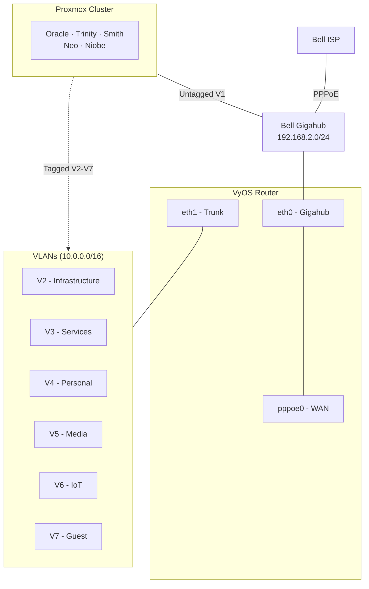
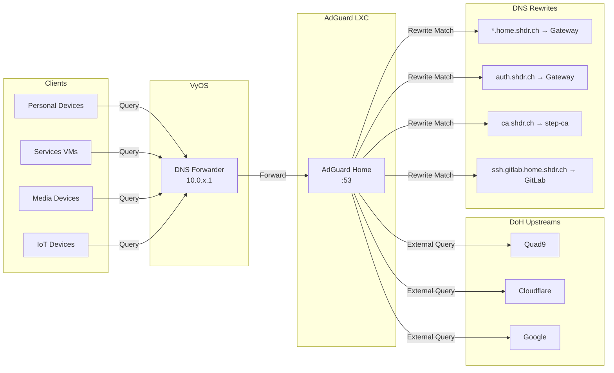
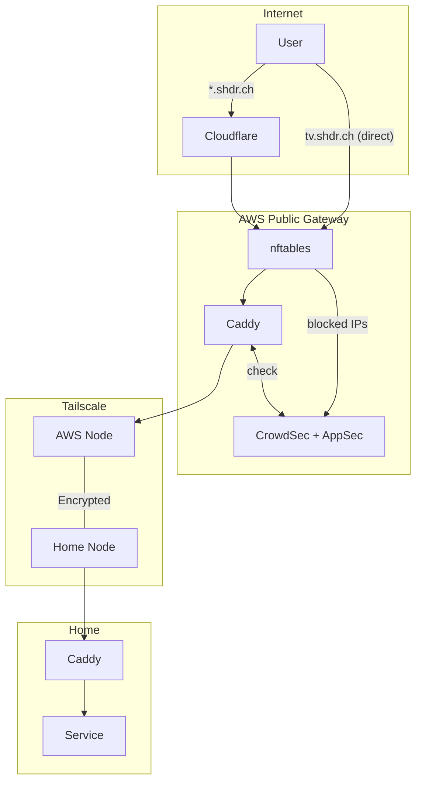
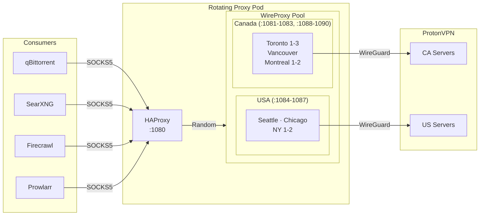

# Networking

## WAN

Assigned by Bell Gigahub via PPPoE. 3Gbps up/down.

## LAN

Bell Gigahub LAN Base: 192.168.2.0/24
VyOS LAN Base: 10.0.0.0/16

### VLANs

| VLAN | Name           | Subnet         | Gateway     | DHCP Range | Description                                                        |
| ---- | -------------- | -------------- | ----------- | ---------- | ------------------------------------------------------------------ |
| 1    | Gigahub        | 192.168.2.0/24 | 192.168.2.1 | 2 - 200    | Gigahub LAN (Direct access, rack hardware)                         |
| 2    | Infrastructure | 10.0.2.0/24    | 10.0.2.1    | 240 - 254  | Core infrastructure services (NFS, DNS, monitoring, backups)       |
| 3    | Services       | 10.0.3.0/24    | 10.0.3.1    | 240 - 254  | Application services and workloads (GitLab, game servers, etc.)    |
| 4    | Personal       | 10.0.4.0/24    | 10.0.4.1    | 2 - 254    | Primary network for trusted devices with full management access    |
| 5    | Media          | 10.0.5.0/24    | 10.0.5.1    | 2 - 254    | Home entertainment devices with access to internet and service VMs |
| 6    | IoT            | 10.0.6.0/24    | 10.0.6.1    | 2 - 254    | Home IoT devices with access to internet                           |
| 7    | Guest          | 10.0.7.0/24    | 10.0.7.1    | 2 - 254    | Guest network with internet access only                            |

### Firewall

| VLAN | Name           | Zone      | Internet | Infrastructure (V2)            | Services (V3)                 | Personal (V4)                 | Media (V5)            | IoT (V6)                 | Guest (V7) | Router Access              | Gigahub |
| ---- | -------------- | --------- | -------- | ------------------------------ | ----------------------------- | ----------------------------- | --------------------- | ------------------------ | ---------- | -------------------------- | ------- |
| 2    | Infrastructure | TRUSTED   | ✅       | ✅ (Full)                      | ✅ (Full)                     | ✅ (Full)                     | ✅ (Full)             | ✅ (Full)                | ✅ (Full)  | ✅ (Full)                  | ✅      |
| 3    | Services       | SERVICES  | ✅       | ✅ (DNS, NFS, monitoring only) | ✅ (Full)                     | ❌ (Cannot initiate)          | ✅ (To serve content) | ✅ (For automation/mgmt) | ❌         | ✅ (DNS, DHCP only)        | ❌      |
| 4    | Personal       | TRUSTED   | ✅       | ✅ (Full)                      | ✅ (Full)                     | ✅ (Full)                     | ✅ (Full)             | ✅ (Full)                | ✅ (Full)  | ✅ (Full)                  | ✅      |
| 5    | Media          | MEDIA     | ✅       | ❌ (Can receive from trusted)  | ✅ (For media servers)        | ❌ (Can receive from trusted) | ✅ (Full)             | ❌                       | ❌         | ✅ (DNS, DHCP, mDNS, ping) | ❌      |
| 6    | IoT            | UNTRUSTED | ✅       | ❌ (Can receive from trusted)  | ❌ (Can receive from trusted) | ❌ (Can receive from trusted) | ❌                    | ✅ (Full)                | ❌         | ✅ (DNS, DHCP only)        | ❌      |
| 7    | Guest          | UNTRUSTED | ✅       | ❌ (Can receive from trusted)  | ❌ (Can receive from trusted) | ❌ (Can receive from trusted) | ❌                    | ❌                       | ✅ (Full)  | ✅ (DNS, DHCP only)        | ❌      |

## DNS

AdGuard Home provides DNS resolution and ad blocking for the home network. Runs on a standalone LXC container on Oracle.

### Upstream Resolvers

| Provider   | Protocol |
| ---------- | -------- |
| Quad9      | DoH      |
| Cloudflare | DoH      |
| Google     | DoH      |

### DNS Rewrites

Internal services resolve to the home gateway for reverse proxy routing:

| Domain                  | Target       |
| ----------------------- | ------------ |
| \*.home.shdr.ch         | Gateway IP   |
| home.shdr.ch            | Gateway IP   |
| auth.shdr.ch            | Gateway IP   |
| ca.shdr.ch              | step-ca IP   |
| ssh.gitlab.home.shdr.ch | GitLab IP    |
| smtp.home.shdr.ch       | Messaging IP |

## Reverse Proxy

Caddy handles TLS termination and reverse proxying for all internal services. Runs on the Gateway Stack.

### Features

- Automatic HTTPS via ACME DNS validation (Cloudflare)
- Wildcard certificate for `*.home.shdr.ch`
- Auth integration with Keycloak (forward auth)
- HAProxy frontend for high-availability upstreams

### Public Access

Public traffic flows: Cloudflare → AWS Public Gateway (CrowdSec + Caddy) → Tailscale → Home Gateway → Caddy → Service

## CrowdSec

Intrusion detection and prevention system on the AWS public gateway, analyzing Caddy access logs for malicious traffic.

| Component        | Purpose                             |
| ---------------- | ----------------------------------- |
| CrowdSec Agent   | Log analysis and threat detection   |
| Firewall Bouncer | nftables IP blocking                |
| AppSec WAF       | Application-layer attack prevention |

**Detection Collections**:

- SSH brute force and sudo abuse
- HTTP CVE exploits
- Scanners and bad user agents
- HTTP flood attacks

**AppSec Rules**:

- CRS (Core Rule Set)
- CVE virtual patches
- WordPress-specific protections

## Rotating Proxy

SOCKS5 proxy for anonymized outbound traffic. HAProxy load balances across multiple WireProxy backends connected to ProtonVPN. Usage is opt-in—services must explicitly configure the proxy endpoint.

### Architecture

| Component | Purpose                           |
| --------- | --------------------------------- |
| HAProxy   | TCP load balancer (random)        |
| WireProxy | WireGuard to SOCKS5 bridge        |
| ProtonVPN | VPN provider (WireGuard protocol) |

### Endpoint

- SOCKS5: `proxy.home.shdr.ch:1080`

### Consumers

| Service     | Purpose                       |
| ----------- | ----------------------------- |
| qBittorrent | Torrent traffic anonymization |
| SearXNG     | Search query privacy          |
| Firecrawl   | Web scraping IP rotation      |
| Prowlarr    | Indexer access                |

## Physical Infrastructure

### Rack Switch

**Device Name**: QNAP QSW-M3216R-8S8T-US

**Specs**:

- 8x 10Gbps Ethernet ports
- 8x 10Gbps SFP+ ports

| Port | Type     | Device                                                | VLAN Untagged | VLAN Tagged      | Speed   |
| ---- | -------- | ----------------------------------------------------- | ------------- | ---------------- | ------- |
| 1    | Ethernet | Bell Gigahub                                          | 1             | -                | 10Gbps  |
| 2    | Ethernet | Access Point                                          | 2             | -                | 2.5Gbps |
| 3    | Ethernet | Niobe                                                 | 1             | 2, 3, 4, 5, 6, 7 | 2.5Gbps |
| 4    | Ethernet | UPS                                                   | 1             | -                | 100Mbps |
| 5    | Ethernet | Office Switch                                         | 1             | 4, 5             | 2.5Gbps |
| 6    | Ethernet | JetKVM                                                | 1             | -                | 1Gbps   |
| 7    | Ethernet | MoCA Adapter (Uplink to unmanaged living room switch) | 5             | -                | 2.5Gbps |
| 9    | SFP+     | Oracle                                                | 1             | 2, 3, 4, 5, 6, 7 | 10Gbps  |
| 10   | SFP+     | Trinity                                               | 1             | 2, 3, 4, 5, 6, 7 | 10Gbps  |
| 11   | SFP+     | Smith                                                 | 1             | 2, 3, 4, 5, 6, 7 | 10Gbps  |
| 12   | SFP+     | Neo                                                   | 1             | 2, 3, 4, 5, 6, 7 | 10Gbps  |

- VLAN 1: Bell Gigahub LAN (192.168.2.0/24) - Direct access, bypasses VyOS firewall

### Office Switch

**Device Name**: Nicgiga 8-Port 2.5Gbps Switch 10Gbps SFP Uplink

**Specs**:

- 1x 10Gbps SFP+ port
- 8x 2.5Gbps Ethernet ports

| Port | Type     | Device             | VLAN Untagged | VLAN Tagged | Speed   |
| ---- | -------- | ------------------ | ------------- | ----------- | ------- |
| 1    | Ethernet | Google TV Streamer | 5             | -           | 1Gbps   |
| 2    | Ethernet | Raspberry Pi 5     | 4             | -           | 1Gbps   |
| 3    | Ethernet | Laptop Dock        | 4             | -           | 2.5Gbps |
| 4    | Ethernet | Raspberry Pi 5     | 4             | -           | 1Gbps   |
| 9    | SFP+     | Rack Switch        | 1             | 4, 5        | 10Gbps  |

### Access Point

**Device Name**: Ubiquiti Unifi U7 Pro

**Specs**:

- 2.5Gbps PoE+

| SSID         | VLAN |
| ------------ | ---- |
| Ruby Nexus   | 4    |
| Sienna Helix | 5    |
| Indigo Tide  | 6    |
| Moss Cove    | 7    |
