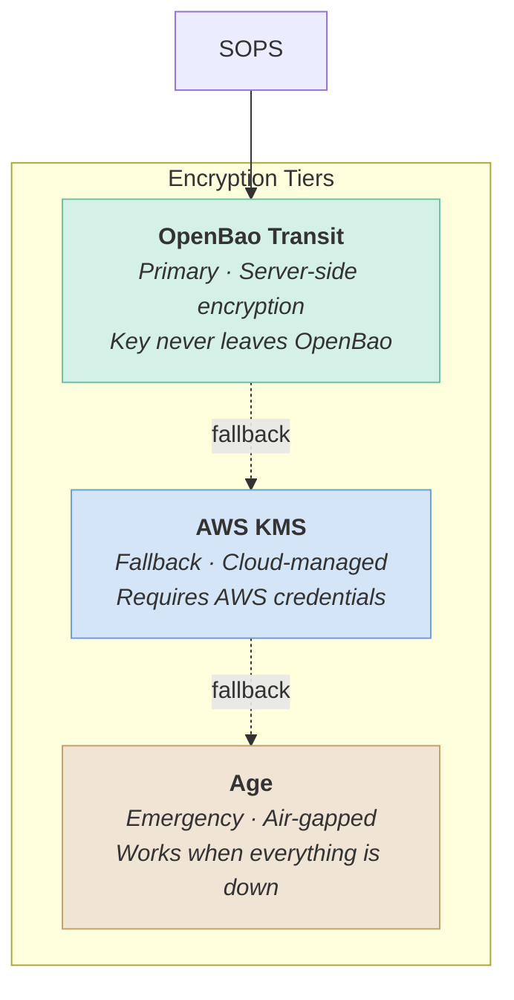

# Secrets

Three-tier encryption hierarchy for secrets at rest. SOPS uses OpenBao Transit as primary, with AWS KMS and Age as fallbacks.

## Architecture



| Tier | Provider        | When Used                    | Key Location |
| ---- | --------------- | ---------------------------- | ------------ |
| 1    | OpenBao Transit | Normal operations            | Server-side  |
| 2    | AWS KMS         | OpenBao unavailable          | AWS managed  |
| 3    | Age             | Bootstrap, disaster recovery | Air-gapped   |

**Any tier can decrypt.** SOPS tries in order and uses the first available.

## OpenBao

Secrets management platform running as an LXC on Oracle.

| Setting     | Value                                              |
| ----------- | -------------------------------------------------- |
| URL         | https://bao.home.shdr.ch                           |
| Storage     | Integrated Raft                                    |
| TLS         | step-ca certificate with auto-renewal              |
| Auto-unseal | AWS KMS via IAM Roles Anywhere (certificate-based) |

### Secrets Engines

| Engine  | Path      | Purpose                        |
| ------- | --------- | ------------------------------ |
| Transit | `aether/` | SOPS encryption (AES256-GCM96) |

### Policies

| Policy  | Access                  | Assigned To             |
| ------- | ----------------------- | ----------------------- |
| `sops`  | Transit encrypt/decrypt | All authenticated users |
| `admin` | Full access             | Keycloak `admin` role   |

## SOPS Configuration

Defined in `.sops.yaml`:

| Pattern               | Description        |
| --------------------- | ------------------ |
| `secrets/*.yml`       | Main secrets       |
| `ansible/*vault*.yml` | Ansible vaults     |
| `*.enc.*`             | Any encrypted file |

## Recovery

The Age key is the master key for disaster recovery:

```
Age Key → decrypts → Recovery Keys → unseals → OpenBao → unlocks → Everything
```

**Keep the Age key backed up offline** (printed, USB in safe).

| Scenario                        | Solution                             |
| ------------------------------- | ------------------------------------ |
| OpenBao up, authenticated       | Normal workflow (`task login`)       |
| OpenBao up, need admin          | `task bao:root-token` → provide keys |
| OpenBao sealed, AWS available   | Auto-unseal on restart               |
| OpenBao sealed, AWS unavailable | Manual unseal with recovery keys     |
| OpenBao down, AWS available     | SOPS falls back to KMS               |
| Everything down                 | Age key to `config/age-key.txt`      |
