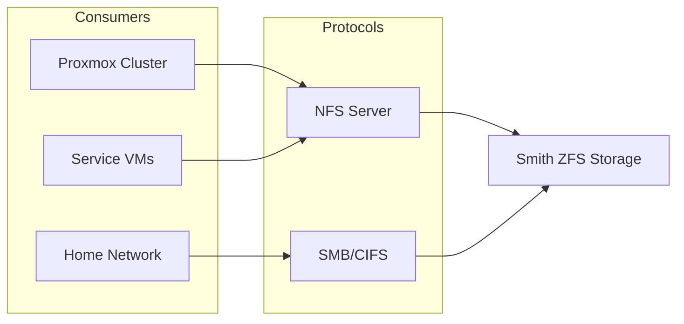
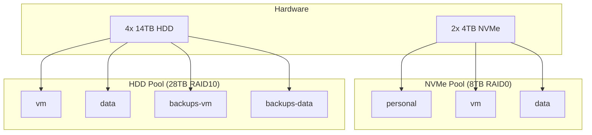

# Storage

## Shared Storage (Smith)

Smith is the designated shared storage node in the home cluster. It runs ZFS with arrays consisting of:

| Count | Type | Size | RAID   | Total(Raw) | Total(Usable) |
| ----- | ---- | ---- | ------ | ---------- | ------------- |
| 2     | NVME | 4TB  | RAID0  | 8TB        | 8TB           |
| 4     | HDD  | 14TB | RAID10 | 56TB       | 28TB          |

### ZFS Pools

| Pool | Description |
| ---- | ----------- |
| nvme | NVMe drives |
| hdd  | HDD drives  |

### Datasets

| Name             | Mountpoint            | Compression | Record Size | Description                                    |
| ---------------- | --------------------- | ----------- | ----------- | ---------------------------------------------- |
| nvme/personal    | /mnt/nvme/personal    | lz4         | default     | Personal data storage                          |
| nvme/vm          | /mnt/nvme/vm          | lz4         | 16K         | Performance-optimized storage for VMs          |
| nvme/data        | /mnt/nvme/data        | lz4         | default     | Performance-optimized storage for generic data |
| hdd/vm           | /mnt/hdd/vm           | lz4         | default     | Capacity-optimized storage for VMs             |
| hdd/data         | /mnt/hdd/data         | lz4         | default     | Capacity-optimized storage for generic data    |
| hdd/backups-vm   | /mnt/hdd/backups-vm   | lz4         | default     | VM backups                                     |
| hdd/backups-data | /mnt/hdd/backups-data | lz4         | default     | Generic data backups                           |

## Node-Local Storage

Some workloads use node-local NVME instead of NFS for specific reasons:

| Host    | Workloads                                   | Reason                                               |
| ------- | ------------------------------------------- | ---------------------------------------------------- |
| Oracle  | Router, Gateway, Keycloak, step-ca, OpenBao | NFS-independent (core infra must boot without Smith) |
| Neo     | GPU Workstation                             | Model/checkpoint I/O performance                     |
| Trinity | Development Workstation                     | Fast local disk for builds                           |
| Niobe   | Monitoring Stack                            | TSDB write performance                               |

Smith's VMs (Gaming Server, NFS Server, Backup Server) use local storage by definition — Smith _is_ the storage node.

## NFS Storage

Smith hosts an NFS server that serves as a storage backend for the Proxmox cluster. VMs and LXCs use NFS mounts for:

- **Stateless workloads** — PaaS apps, sandboxes
- **Migratability** — VMs that may move between hosts
- **Shared data** — Media, documents accessed by multiple services

### NFS Exports

| Export       | Tier | Consumers                                                     |
| ------------ | ---- | ------------------------------------------------------------- |
| /mnt/nvme/vm | NVME | GitLab, Dokku, Dokploy, AI Tool Stack, Lute, most service VMs |
| /mnt/hdd/vm  | HDD  | Capacity workloads (future use)                               |

## SMB/CIFS

Smith hosts a Samba server for sharing files within the home network.

### SMB/CIFS Exports

- /mnt/nvme/personal
- /mnt/nvme/data
- /mnt/hdd/data
