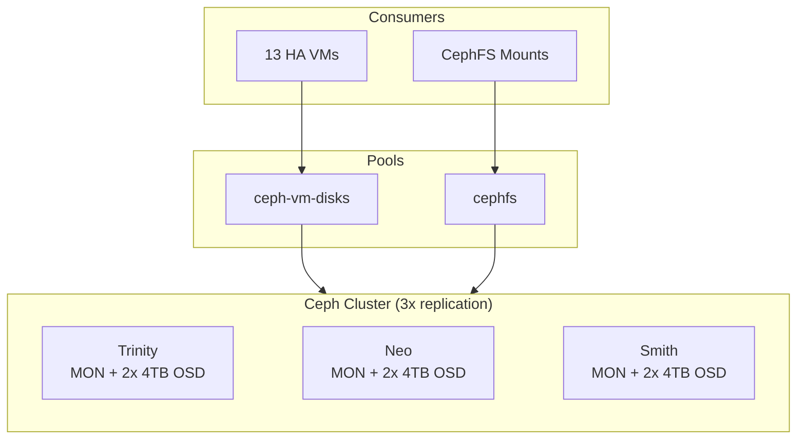
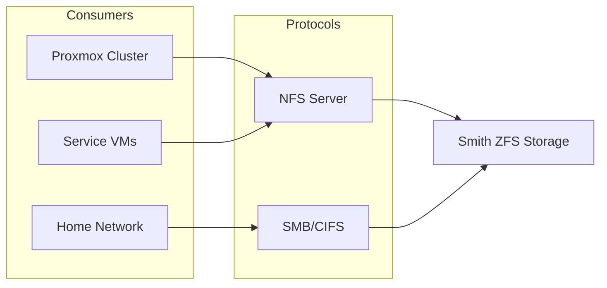

# Storage

## Shared Storage

### Ceph (Distributed)

Ceph provides distributed storage for HA-capable workloads across the cluster.

| Node      | OSDs   | Raw      | Network    |
| --------- | ------ | -------- | ---------- |
| Trinity   | 2x 4TB | 8TB      | 10Gbps     |
| Neo       | 2x 4TB | 8TB      | 10Gbps     |
| Smith     | 2x 4TB | 8TB      | 3Gbps\*    |
| **Total** | **6**  | **24TB** | ~8Gbps avg |

\* Smith limited by PCIe x1 (B550 M.2 lane sharing)

**Usable capacity:** ~8TB (3x replication)

| Pool          | Type   | Use Case                             |
| ------------- | ------ | ------------------------------------ |
| ceph-vm-disks | RBD    | VM disks (HA-enabled)                |
| cephfs        | CephFS | Runtime mounts, shared data, backups |

### CephFS Mounts

VMs that mount CephFS for shared data access:

| VM              | Mount Point | Use Case                  |
| --------------- | ----------- | ------------------------- |
| dev-workstation | /mnt/cephfs | Projects, shared data     |
| gpu-workstation | /mnt/cephfs | Checkpoints, outputs      |
| media-stack     | /mnt/cephfs | Media files               |
| game-server     | /mnt/cephfs | Game saves, configuration |
| backup-stack    | /mnt/cephfs | Offsite backup source     |

### ZFS (Smith HDD)

Smith's HDD array provides bulk/cold storage via ZFS:

| Count | Type | Size | RAID   | Total(Raw) | Total(Usable) |
| ----- | ---- | ---- | ------ | ---------- | ------------- |
| 4     | HDD  | 14TB | RAID10 | 56TB       | 28TB          |

**Note:** Smith's NVMe drives (2x 4TB) are now Ceph OSDs, not ZFS.

### ZFS Pool

| Pool | Description             |
| ---- | ----------------------- |
| hdd  | HDD array for bulk data |

### Datasets

| Name             | Mountpoint            | Compression | Description                         |
| ---------------- | --------------------- | ----------- | ----------------------------------- |
| hdd/data         | /mnt/hdd/data         | lz4         | Bulk data storage                   |
| hdd/personal     | /mnt/hdd/personal     | lz4         | Personal files (migrated from NVMe) |
| hdd/backups-vm   | /mnt/hdd/backups-vm   | lz4         | PBS VM backups                      |
| hdd/backups-data | /mnt/hdd/backups-data | lz4         | Data backups                        |

## Node-Local Storage

Critical infrastructure uses node-local storage to remain independent of Ceph/NFS:

| Host   | Workloads                                   | Reason                                               |
| ------ | ------------------------------------------- | ---------------------------------------------------- |
| Oracle | Router, Gateway, Keycloak, step-ca, OpenBao | Ceph-independent (core infra must boot without Ceph) |
| Neo    | GPU Workstation                             | GPU passthrough pins to host                         |
| Niobe  | Monitoring Stack                            | Must alert when Ceph has issues                      |
| Smith  | Backup Stack                                | Must work if Ceph fails                              |

**Note:** Most workload VMs (GitLab, Dokku, Dokploy, messaging, media, etc.) now run on Ceph for HA capability.

## NFS Storage

With workload VMs on Ceph and runtime mounts on CephFS, NFS usage is minimal:

- **Legacy compatibility** — Services that still expect NFS paths
- **HDD tier access** — Bulk data for capacity workloads

### NFS Exports

| Export      | Tier | Consumers        |
| ----------- | ---- | ---------------- |
| /mnt/hdd/vm | HDD  | Capacity storage |

## SMB/CIFS

Smith hosts a Samba server for sharing files within the home network.

### SMB/CIFS Exports

- /mnt/hdd/data — Bulk data storage
- /mnt/hdd/personal — Personal files (migrated from NVMe)
