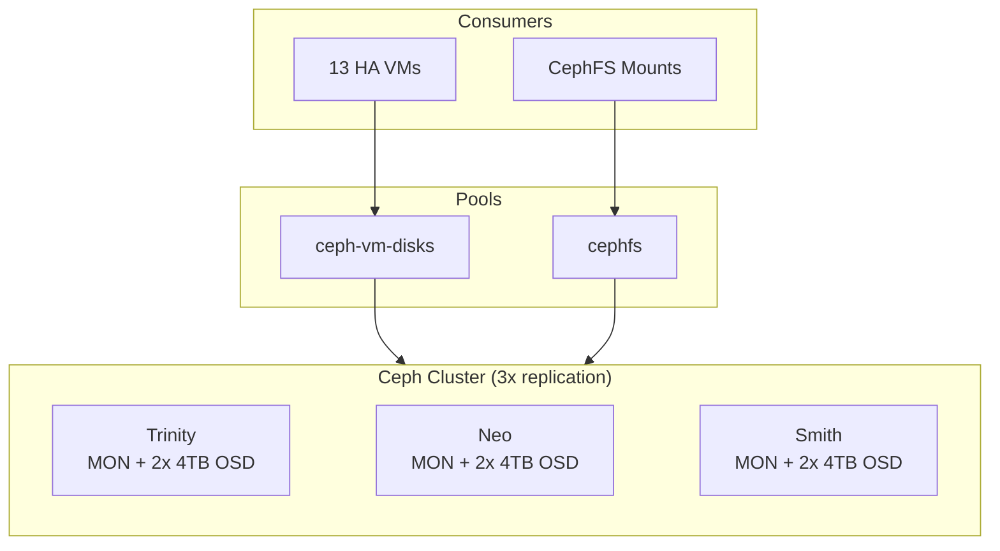
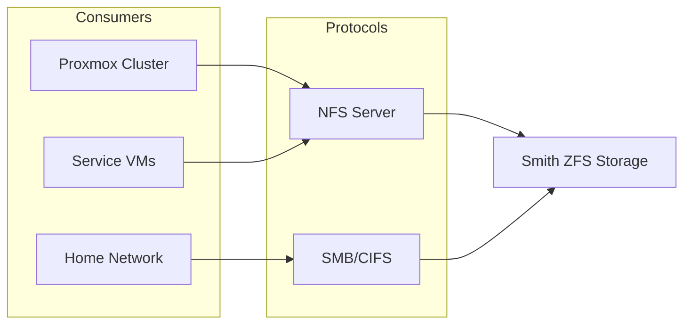

# Storage

## Shared Storage

### Ceph (Distributed)

Ceph provides distributed storage for HA-capable workloads across the cluster.

```mermaid
flowchart TB
    subgraph Consumers
        HAVMs[13 HA VMs]
        CephFSMounts[CephFS Mounts]
    end

    subgraph Pools
        RBD[ceph-vm-disks]
        FS[cephfs]
    end

    subgraph Cluster["Ceph Cluster (3x replication)"]
        Trinity[Trinity<br/>MON + 2x 4TB OSD] ~~~ Neo[Neo<br/>MON + 2x 4TB OSD] ~~~ Smith[Smith<br/>MON + 2x 4TB OSD]
    end

    HAVMs --> RBD
    CephFSMounts --> FS
    RBD --> Cluster
    FS --> Cluster
```

| Node      | OSDs   | Raw      | Network    |
| --------- | ------ | -------- | ---------- |
| Trinity   | 2x 4TB | 8TB      | 10Gbps     |
| Neo       | 2x 4TB | 8TB      | 10Gbps     |
| Smith     | 2x 4TB | 8TB      | 3Gbps\*    |
| **Total** | **6**  | **24TB** | ~8Gbps avg |

\* Smith limited by PCIe x1 (B550 M.2 lane sharing)

**Usable capacity:** ~8TB (3x replication)

| Pool          | Type   | Use Case                             |
| ------------- | ------ | ------------------------------------ |
| ceph-vm-disks | RBD    | VM disks (HA-enabled)                |
| cephfs        | CephFS | Runtime mounts, shared data, backups |

### Notes

- **Trinity drive constraint.** Trinity's NVMes are Lexar EQ790 4TB (consumer DRAM-less, SLC-cached). Under sustained Ceph writes they show elevated commit latency and periodic `aio_submit` retries. Neo's WD Blue SN5000 and Smith's drives do not. The MS-01 chassis also forces only one drive per host onto the single PCIe 4.0 x4 slot; the other sits in a PCIe 3.0 x4 slot.
- **Primary-affinity mitigation.** `osd.0` and `osd.1` (trinity) run with `primary-affinity=0` so all PG primaries land on neo/smith. Trinity remains in the acting set as a replica — durability is unchanged (size=3, min_size=2) — but client commits no longer block on trinity's slower disks. Revert with `ceph osd primary-affinity osd.{0,1} 1` once trinity's drives are replaced.
- **Scrubs disabled.** `noscrub,nodeep-scrub` flags are set while trinity is constrained. Re-enable after drives are replaced.

### CephFS Mounts

VMs that mount CephFS for shared data access:

| VM              | Mount Point | Use Case                  |
| --------------- | ----------- | ------------------------- |
| dev-workstation | /mnt/cephfs | Projects, shared data     |
| talos-neo (GPU PV) | local NVMe (`gpu-model-storage`) | Model weights, ComfyUI state |
| media-stack     | /mnt/cephfs | Media files               |
| game-server     | /mnt/cephfs | Game saves, configuration |
| backup-stack    | /mnt/cephfs | Offsite backup source     |

### ZFS (Smith HDD)

Smith's HDD array provides bulk/cold storage via ZFS:

```mermaid
graph LR
    subgraph Consumers
        PVE["Proxmox Cluster"]
        VMs["Service VMs"]
        HomeNet["Home Network"]
    end

    subgraph Protocols
        NFS["NFS Server"]
        SMB["SMB/CIFS"]
    end

    Smith["Smith ZFS Storage"]

    PVE & VMs --> NFS
    HomeNet --> SMB

    NFS & SMB --> Smith
```

| Count | Type | Size | RAID   | Total(Raw) | Total(Usable) |
| ----- | ---- | ---- | ------ | ---------- | ------------- |
| 4     | HDD  | 14TB | RAID10 | 56TB       | 28TB          |

**Note:** Smith's NVMe drives (2x 4TB) are now Ceph OSDs, not ZFS.

### ZFS Pool

| Pool | Description             |
| ---- | ----------------------- |
| hdd  | HDD array for bulk data |

### Datasets

| Name             | Mountpoint            | Compression | Description                         |
| ---------------- | --------------------- | ----------- | ----------------------------------- |
| hdd/data         | /mnt/hdd/data         | lz4         | Bulk data storage                   |
| hdd/personal     | /mnt/hdd/personal     | lz4         | Personal files (migrated from NVMe) |
| hdd/backups-vm   | /mnt/hdd/backups-vm   | lz4         | PBS VM backups                      |
| hdd/backups-data | /mnt/hdd/backups-data | lz4         | Data backups                        |

## Node-Local Storage

Critical infrastructure, control-plane churn, and disposable build scratch use
node-local storage to remain independent of Ceph/NFS latency.

| Host   | Workloads                                   | Reason                                               |
| ------ | ------------------------------------------- | ---------------------------------------------------- |
| Oracle | Router, Gateway, Keycloak, step-ca, OpenBao | Ceph-independent (core infra must boot without Ceph) |
| Neo    | Talos GPU node, GPU model storage           | GPU passthrough pins to host; model loads need local I/O |
| Niobe  | Monitoring Stack                            | Must alert when Ceph has issues                      |
| Smith  | Backup Stack                                | Must work if Ceph fails                              |

**Note:** Most workload VMs (GitLab, messaging, media, etc.) now run on Ceph for HA capability.

### Talos Control Plane and CI

Talos control-plane roots and CI build scratch are intentionally local. These
paths are latency-sensitive and write-heavy: etcd, kubelet, containerd, logs,
image layers, dependency unpacking, build caches, and temporary build
directories. They are poor fits for Ceph because Ceph's replication and network
commit path add latency to small-file and fsync-heavy workloads.

Durable Kubernetes application data remains on Ceph-backed PVCs. The local
Talos disks are for node state, runtime churn, and disposable CI scratch.

| Node           | Root disk                      | CI scratch                    | Notes |
| -------------- | ------------------------------ | ----------------------------- | ----- |
| talos-trinity  | 128G `local-lvm` on Trinity     | 128G `local-lvm` at `/var/mnt/ci` | Old 32G etcd disk removed; etcd now uses root/EPHEMERAL |
| talos-niobe    | 128G `local-fast` on Niobe      | 128G `local-fast` at `/var/mnt/ci` | Old 32G etcd disk removed; etcd now uses root/EPHEMERAL |
| talos-neo      | 256G `local-lvm` on Neo         | Pending separate `/var/mnt/ci` disk | Root and GPU storage are local; old 32G etcd disk still attached |

GitLab Runner scratch is intended to use `/ci` inside job pods, backed by the
node-local `/var/mnt/ci` hostPath once all selected CI nodes have the mount.
Until `talos-neo` has the same CI disk, either leave the Runner `/ci` hostPath
change unapplied or exclude `talos-neo` from Runner scheduling.

### Placement Rule of Thumb

- **Use local disk for:** Talos root, etcd/runtime churn, kubelet/containerd,
  CI scratch, build caches, temporary files, and GPU model/cache locality.
- **Use Ceph for:** durable application PVCs, HA-capable VM disks, replicated
  service data, movable workloads, shared data, and backup sources.

## NFS Storage

With workload VMs on Ceph and runtime mounts on CephFS, NFS usage is minimal:

- **Legacy compatibility** — Services that still expect NFS paths
- **HDD tier access** — Bulk data for capacity workloads

### NFS Exports

| Export      | Tier | Consumers        |
| ----------- | ---- | ---------------- |
| /mnt/hdd/vm | HDD  | Capacity storage |

## SMB/CIFS

Smith hosts a Samba server for sharing files within the home network.

### SMB/CIFS Exports

- /mnt/hdd/data — Bulk data storage
- /mnt/hdd/personal — Personal files (migrated from NVMe)
