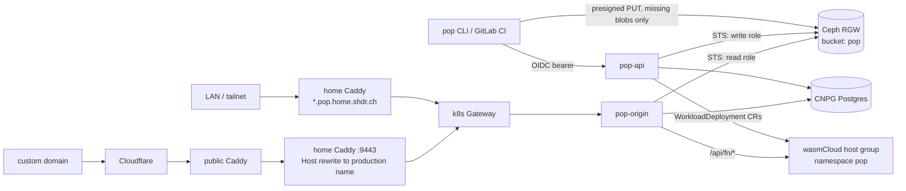

# pop — Self-Hosted Static + Wasm Deploy Service Design

## Status

Draft for review. Single-operator, LAN-first infrastructure. Not a CDN, not a multi-tenant platform.

## Goal

`pop deploy` publishes a directory of static files (plus optional Rust/TypeScript server-side functions) from a laptop or GitLab CI to an origin on the home cluster:

- Every deploy is immutable and gets its own URL: `<deploy>--<project>.pop.home.shdr.ch`.
- Each project has a production pointer: `<project>.pop.home.shdr.ch`. Promote and rollback move the pointer; nothing is re-uploaded.
- Authentication is Keycloak SSO (device flow from the CLI, GitLab CI ID tokens from pipelines). No static deploy tokens or S3 keys exist anywhere.
- Static content lives in Ceph RGW. Functions run as wasmCloud components.
- Selected projects become public through a custom domain the operator already owns (e.g. `attain.ing`), mapped at the edge onto the project's production hostname.

This replaces the hand-written per-site RGW rewrites in the home Caddyfile (`@shdrch`, `@attaining` in `ansible/playbooks/home_gateway_stack/caddy/Caddyfile.j2`), which only resolve `/` to `index.html` and cannot serve subdirectory indexes, custom 404s, SPA fallbacks, or per-site headers.

## Non-goals

- No CDN behaviour: no edge caching, no geo, no purge API. Public custom domains sit behind Cloudflare, which caches according to pop's response headers.
- No hosted build service. The CLI runs the project's own build command locally or in CI.
- No public pop hostnames. `*.pop.home.shdr.ch` is LAN-only; public reach is only via explicitly declared custom domains, and only for production.
- No visitor authentication in v1 (LAN is the perimeter). Deferred to a later phase; see Phasing.
- No forms, split testing, identity product, image transforms, or edge middleware.
- No multi-tenancy. One operator; projects are an organisational unit, not a security boundary between users.

## Naming and hostnames

| Hostname | Meaning |
|---|---|
| `pop.home.shdr.ch` | Control-plane API |
| `<project>.pop.home.shdr.ch` | Production pointer for `<project>` |
| `<deploy>--<project>.pop.home.shdr.ch` | One immutable deploy |

- The flat `--` form keeps every site one label under `pop.home.shdr.ch`, so a single wildcard certificate covers everything. Per-project nested wildcards would need one certificate per project and would publish every project slug to Certificate Transparency logs.
- Project slug: `^[a-z0-9]+(-[a-z0-9]+)*$`, ≤ 40 chars, so no `--` can appear in a slug.
- Deploy ID: 8 lowercase base32 chars, generated server-side. The combined label stays ≤ 63 chars.

## Architecture



Two binaries plus a CLI:

- **pop-api** — control plane: projects, deploys, pointers, presigned uploads, function lifecycle, retention.
- **pop-origin** — data plane: hostname → deploy → manifest → blob, redirects, headers, function proxying. Stateless; scales horizontally.
- **pop** CLI — login, build, upload, promote, rollback, list.

## Repository ownership

Follow the daimyo pattern (`tofu/home/kubernetes/daimyo.tf`): a sibling repo ships images and a Helm chart; aether owns every cluster object.

The `pop` repository (sibling of aether, GitLab `shdrch/pop`) owns:

- Rust source for `pop-api`, `pop-origin`, and the `pop` CLI (one Cargo workspace; daimyo is the Rust precedent).
- `_redirects` / `_headers` parser and the origin resolution logic, with behaviour tests.
- Helm chart, Dockerfile, GitLab CI (images pinned by digest; CLI released as a static binary).
- Function build adapters (cargo / jco) and component templates for Rust and TypeScript.

Aether owns:

- Namespace `pop` via `namespace_contracts.tf`, the Helm release, the image digest pins, and the CNPG cluster.
- Keycloak client(s) and roles (`tofu/home/keycloak.tf`).
- RGW bucket, RGW roles and their trust policies.
- OpenBao policy and the per-namespace SecretStore for function secrets.
- GitLab registry deploy tokens for function components.
- Home Caddy `*.pop.home.shdr.ch` block, Technitium/AdGuard records, and every `:9443` custom-domain mapping.
- The Grafana dashboard (monitoring_stack provisioning).

## Data model

### RGW bucket `pop`

```
blobs/<sha256>                       file bytes, content-addressed, shared across deploys
manifests/<deploy-id>.json           immutable, written once at finalize
```

A manifest maps every published path to `{sha256, size, content_type}`, and carries the parsed `_redirects` and `_headers` rules plus the deploy's function table. Content type is fixed at deploy time from the extension; `.wasm` is `application/wasm`.

Content addressing makes repeat deploys cheap (only changed files upload) and makes manifests and blobs immutable, so the origin can cache them forever.

### Postgres (CNPG)

- `projects(slug, created_at, created_by)`
- `deploys(id, project, state, manifest_sha, git_ref, created_by, created_at, functions jsonb)` with `state ∈ {uploading, ready, failed, expired}`
- `pointers(project, deploy_id, updated_at, updated_by)` — the production pointer
- `events(id, project, deploy_id, kind, actor, at)` — deploy / promote / rollback / expire audit trail

Postgres is the control plane only. The origin reads pointers and deploy states, caches them in memory, refreshes on `LISTEN pop_pointer` notifications with a 30-second poll fallback, and keeps serving last-known pointers if Postgres is unreachable.

## Deploy flow

1. CLI reads `pop.toml` (project slug, build command, publish dir, functions), runs the build, and hashes every file in the publish dir.
2. `POST /deploys` with the file list `{path, sha256, size}`. The API creates the deploy (`uploading`) and returns presigned PUT URLs for blobs not already in RGW.
3. CLI uploads missing blobs directly to RGW (`s3.home.shdr.ch`).
4. CLI builds functions (see Functions) and pushes components to the registry by digest.
5. `POST /deploys/<id>/finalize`. The API verifies every blob exists (HEAD), parses `_redirects`/`_headers` (rejecting invalid rules with line numbers), writes the manifest, creates function workloads, and marks the deploy `ready`.
6. With `--prod`, the API moves the production pointer after `ready`.
7. CLI prints the deploy URL, the production URL if promoted, and a Grafana Explore link filtered to the deploy.

Promote and rollback are compare-and-set updates on `pointers` (`UPDATE … WHERE deploy_id = $expected`). The pointer can only target `ready` deploys of the same project. Deploys that never finalize expire after 1 hour.

## Serving rules (pop-origin)

Per request:

1. Resolve the Host header: `<project>.pop.home.shdr.ch` → production pointer; `<deploy>--<project>.pop.home.shdr.ch` → that deploy if it belongs to the project and is `ready`. Anything else → 404.
2. Load the manifest (in-memory LRU, keyed by deploy ID, never invalidated).
3. Apply forced redirect/rewrite rules (`!`), first match wins.
4. If the deploy has functions and the path is `/api/<fn>` or `/api/<fn>/…`, proxy to the function (see Functions).
5. File lookup: exact path; a directory path with trailing slash → `index.html`; a directory without trailing slash → 301 to the slash form; `/foo` → `/foo.html` if present.
6. Apply non-forced redirect/rewrite rules (Netlify semantics: rules only fire when no file matched). SPA fallback is a rule (`/* /index.html 200`), not a flag.
7. No match → `/404.html` with status 404 if present, else a plain 404.

Response headers: `Content-Type` from the manifest, `ETag` = blob sha256, then `_headers` rules. Default `Cache-Control`: `public, max-age=0, must-revalidate` for HTML and anything without a content hash in its filename; `_headers` overrides per path (e.g. `/assets/* Cache-Control: public, max-age=31536000, immutable`). Conditional requests (`If-None-Match`) and `Range` are honoured.

Supported `_redirects`/`_headers` subset: splats, `:placeholders`, status `200`/`301`/`302`/`404`, force `!`. Not supported: country/language/role conditions, proxying to external URLs.

Browser-side wasm needs nothing special beyond the content type; cross-origin isolation (COOP/COEP) for wasm threads is configured per project through `_headers`.

## Functions (wasmCloud)

Runtime facts from `docs/paas.md` and `tofu/home/kubernetes/wasmcloud.tf`: wasmCloud runtime-operator 2.5.2, components declared as `WorkloadDeployment` CRs, WASI 0.2 only (`wasip3 = { enabled = false }`), outbound HTTP denied unless listed in `localResources.allowedHosts`, and hosts cache components (digest-pinned, never-mutated workloads avoid that).

- **Contract:** each function is a component exporting `wasi:http/incoming-handler` (WASI 0.2).
- **Source layout:** `functions/<name>/` with `Cargo.toml` (built with `cargo build --target wasm32-wasip2`) or `package.json` (built with `jco componentize`). The CLI picks the toolchain from the manifest file present.
- **Config in `pop.toml`, per function:** env vars, OpenBao secret keys, `allowed_hosts`.
- **Shipping:** components are pushed by digest to the GitLab registry under `shdrch/pop-functions/<project>/<fn>` with a pop-scoped deploy token. The existing `gitlab-registry` pull secret in `wasmcloud-system` is built from GitLab root credentials and is not reused.
- **Running:** one `WorkloadDeployment` + selector-less `Service` per (deploy, function), named `<project>-<fn>-<deploy>` and pinned by digest. They live in namespace `pop` on a pop-owned host group, not in `wasmcloud-system`, because pop creates them at runtime (it is the declared controller for that namespace, the same way Keel is for its targets).
- **Routing:** pop-origin proxies `/api/<fn>/*` to the function Service, rewriting Host to the component's registered name (the URLRewrite requirement in `docs/paas.md`), forwarding `traceparent`, and stripping inbound `X-Pop-*` headers. No HTTPRoute per function.
- **Secrets:** pop-api creates an `ExternalSecret` per function from `kv/pop/<project>/<fn>` in OpenBao; the namespace's SecretStore policy is limited to `kv/pop/*`. The workload consumes it via `localResources.environment.secretFrom`.
- **Lifecycle:** production and previews younger than 7 days keep live workloads. Older preview workloads are deleted; their `/api/*` returns 410 while static files keep serving.

## Authentication and authorization

- **CLI:** new public Keycloak client `pop-cli` with the device authorization grant, a realm-roles mapper and audience `pop`, mirroring the `toolbox` client (`tofu/home/keycloak.tf:928-992`). Token cached at `~/.config/pop/`.
- **CI:** GitLab CI `id_tokens` with `aud: pop`. pop-api trusts the GitLab issuer and maps `project_path` to allowed pop projects (configured in aether).
- **Roles:** `pop:deploy` (create deploys and promote), `pop:admin` (create/delete projects, force retention). Enforced in pop-api.
- **Storage:** pop-api and pop-origin hold no S3 keys. Each assumes an RGW role via `AssumeRoleWithWebIdentity` with its Kubernetes service-account token (RGW already trusts the cluster OIDC issuer). pop-api gets read/write on bucket `pop`; pop-origin gets read-only.
- **Visitors:** none in v1. Accepted risk: sites share the `.home.shdr.ch` cookie scope with other LAN apps; acceptable while the operator is the only author.

## Edge, DNS and TLS

- **Home Caddy:** a `pop.home.shdr.ch, *.pop.home.shdr.ch` block proxying to the Gateway VIP, with a DNS-01 wildcard certificate via `home_acme_dns`. Precedent: the `arpa.attain.ing, *.arpa.attain.ing` block. The existing `*.home.shdr.ch` Caddy site matches only one label, so it does not cover these names.
- **DNS:** Technitium and AdGuard wildcard records for `*.pop.home.shdr.ch` → `10.0.2.2` (same shape as `*.arpa.attain.ing`).
- **Gateway:** an HTTPRoute for `pop.home.shdr.ch` and `*.pop.home.shdr.ch` on the internal listener, declared in the `pop` namespace contract's `hostnames`.
- **Tailnet:** the Tailscale-facing Caddy listener only serves shared routes; `*.pop.home.shdr.ch` is added there only if off-LAN access is wanted.
- **Custom domains:** one `:9443` host matcher + handle per public project, rewriting Host to `<project>.pop.home.shdr.ch` (same pattern as `@ai`). Mappings only ever target production hostnames. Root-apex domains need their Cloudflare record; `*.shdr.ch` names are already covered by the proxied wildcard record in `tofu/cloudflare.tf`.

## Observability

- **Export:** OTLP to `otel-daemonset-opentelemetry-collector.observability.svc.cluster.local:4318`, the in-cluster convention used by `colony.tf` and `celld.tf`.
- **Metrics:** request count, latency histogram and bytes sent, labelled `project`, `env` (`production` | `preview`), `status_class`. `deploy_id` is never a metric label or Loki label — it goes in trace attributes and Loki structured metadata.
- **Traces:** one server span per origin request, child spans for manifest load, RGW GET and the function call; `traceparent` propagated to functions.
- **Events:** deploy, promote, rollback and expire are emitted as structured log lines; the dashboard renders them as Loki annotations. No Grafana write token is needed.
- **Dashboard:** `pop.json` provisioned through `monitoring_stack`: requests and 404 rate per project, latency, RGW error rate, function errors, recent deploy events.
- **CLI:** prints a Grafana Explore link filtered to the deploy.

## Failure handling

| Failure | Behaviour |
|---|---|
| RGW unavailable | Cached manifests still resolve; uncached blobs return 502. Deploy finalize fails; deploy stays `uploading` and expires. |
| Postgres unavailable | Origin serves last-known pointers; API returns 503. |
| Function workload not ready | `/api/<fn>/*` returns 503; static paths are unaffected. |
| Invalid `_redirects`/`_headers` | Finalize rejects the deploy with file and line; no pointer change. |
| Concurrent promotes | Compare-and-set loses cleanly with 409; CLI reports the current production deploy. |

## Retention

- Kept: the current production deploy, the previous 10 production deploys (rollback targets), and previews younger than 14 days.
- Expired deploys move to `expired`; their URLs return 410.
- A daily GC deletes blobs no retained manifest references, after a 24-hour grace period so uploads in flight are never collected.
- Function workloads follow the Functions lifecycle; registry tags for expired deploys are deleted by the same job.

## Phasing

1. **Static core.** pop-api, pop-origin, CLI (`login`, `init`, `deploy`, `promote`, `rollback`, `ls`), Postgres, bucket, LAN DNS/TLS, OIDC (CLI + CI), metrics/traces/dashboard, retention.
2. **Custom domains.** `:9443` mappings; migrate `shdr.ch` and `attain.ing` off their direct RGW rewrites and switch their CI pipelines to `pop deploy`.
3. **Functions.** Rust first, TypeScript second; pop host group, registry tokens, ExternalSecrets, function lifecycle.
4. **Visitor auth (only if needed).** Central callback host, host-only session cookies, verified identity headers forwarded to functions.

## Verification

- **pop repo:** table-driven behaviour tests for origin resolution (index, trailing slash, `.html` fallback, forced vs non-forced rules, splats/placeholders, 404 page, `_headers` precedence, conditional and range requests), slug/deploy-ID parsing, and pointer compare-and-set.
- **End-to-end smoke (per phase, against the live cluster):** deploy a fixture site; curl the deploy URL and production URL from the LAN; promote, roll back, and observe the pointer flip; confirm `.wasm` content type; confirm a preview `--` host is 404 through `:9443`; for phase 3, call a Rust and a TS function and see their spans in Tempo.

## Open questions and risks

1. **Second wasmCloud host group.** `Host` became namespaced in 2.5.2, but it is unverified whether a pop-namespace host group can run under the existing operator release or needs a second release. Spike before phase 3.
2. **Function egress.** wasmCloud enforces `allowed_hosts` inside the host, but the `pop` namespace's default-deny CiliumNetworkPolicy must also allow host-pod egress. Decide between FQDN policies generated from `pop.toml` and a broad egress allowance with wasmCloud as the only gate.
3. **wasmCloud host telemetry.** No OTel settings are configured for wasmCloud hosts today (`wasmcloud.tf:35-75`). Function spans need the chart's host telemetry enabled, if the chart supports it.
4. **TypeScript component weight.** jco bundles a JavaScript engine into every component. Measure size and per-instance memory with a hello-world function before sizing the host group.
5. **CLI name.** `pop` collides with `charmbracelet/pop` if that is ever installed; irrelevant inside the Nix dev shell.
