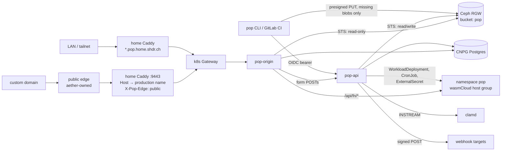

# pop — Self-Hosted Static + Wasm Deploy Service Design

## Status

Draft for review. Single-operator, LAN-first infrastructure. Not a CDN, not a multi-tenant platform. Everything in this document ships as one release; the build order at the end only reflects dependencies.

## Goal

`pop deploy` publishes a directory of static files, plus optional Rust/TypeScript server-side functions, from a laptop or GitLab CI to an origin on the home cluster:

- Every deploy is immutable and gets its own URL: `<deploy>--<project>.pop.home.shdr.ch`.
- Named aliases (`production`, `staging`, a branch name…) point at deploys. Promote and rollback move an alias; nothing is re-uploaded.
- Authentication is Keycloak SSO for deployers (device flow from the CLI, GitLab CI ID tokens from pipelines) and, per project, for visitors. No static deploy tokens or S3 keys exist anywhere.
- Static content lives in Ceph RGW. Functions run as wasmCloud components, on request or on a schedule.
- HTML forms (with file uploads) work without backend code.
- Lifecycle events go to signed webhooks.
- `pop dev` reproduces the origin's behaviour locally.
- Agents drive everything the CLI can do through an MCP server, authenticated with the same Keycloak OIDC.
- Selected projects become public through a custom domain the operator already owns (e.g. `attain.ing`), mapped at the edge onto the project's production hostname.

This replaces the hand-written per-site RGW rewrites in the home Caddyfile (`@shdrch`, `@attaining` in `ansible/playbooks/home_gateway_stack/caddy/Caddyfile.j2`), which only resolve `/` to `index.html` and cannot serve subdirectory indexes, custom 404s, SPA fallbacks, or per-site headers.

## Non-goals

- No CDN behaviour: no edge caching, no geo, no purge API. pop emits standard HTTP cache headers and knows nothing about whatever edge aether puts in front of a custom domain.
- No hosted build service. The CLI runs the project's own build command locally or in CI.
- No public pop hostnames. `*.pop.home.shdr.ch` is LAN-only; public reach is only via explicitly declared custom domains, and only for the `production` alias.
- No merge-request comments, email notifications, or Slack integration; webhooks cover notifications.
- No split testing, image transforms, edge functions, key-value blob store, or end-user identity product (Keycloak is the identity provider).
- No hostile multi-tenancy. Orgs (see Orgs and identity providers) are an authorization boundary between trusted collaborators. Every org shares pop's storage, function host group and egress, all run by the operator.

## Naming and hostnames

| Hostname | Meaning |
|---|---|
| `pop.home.shdr.ch` | Control-plane API and visitor-login callback |
| `<project>.pop.home.shdr.ch` | The `production` alias of `<project>` |
| `<alias>--<project>.pop.home.shdr.ch` | Any other alias (e.g. `staging--blog`) |
| `<deploy>--<project>.pop.home.shdr.ch` | One immutable deploy |

- The flat `--` form keeps every site one label under `pop.home.shdr.ch`, so one wildcard certificate covers everything. Per-project nested wildcards would need one certificate per project and would publish every project slug to Certificate Transparency logs.
- Project slug: `^[a-z0-9]+(-[a-z0-9]+)*$`, ≤ 40 chars, so no `--` can appear in a slug.
- Deploy ID: exactly 8 chars from `[a-z2-7]` (base32), generated server-side.
- Alias name: same grammar as a slug, ≤ 20 chars, and must not match the deploy-ID pattern `^[a-z2-7]{8}$`. `production` is reserved for the bare project hostname. The origin therefore resolves the left side of `--` unambiguously: deploy-ID syntax → deploy, otherwise → alias.
- The longest label (`20 + 2 + 40`) stays under the 63-char DNS limit.

## Architecture



Two services plus a CLI:

- **pop-api** — control plane: projects, deploys, aliases, presigned uploads, function and schedule lifecycle, form submissions and uploads, malware scanning, webhooks, visitor-login callback, retention, and the MCP server at `/mcp`.
- **pop-origin** — data plane: hostname → deploy → manifest → blob, visitor sessions, redirects, headers, function proxying. Read-only on storage; form POSTs are forwarded to pop-api. Stateless; scales horizontally.
- **pop** CLI — `login`, `init`, `dev`, `deploy`, `promote`, `rollback`, `alias`, `ls`, `forms`, `hooks`, `mcp` (stdio bridge).

## Repository ownership

Follow the daimyo pattern (`tofu/home/kubernetes/daimyo.tf`): a sibling repo ships images and a Helm chart; aether owns every cluster object.

The `pop` repository (sibling of aether, GitLab `shdrch/pop`) owns:

- Rust source for `pop-api`, `pop-origin` and the `pop` CLI in one Cargo workspace (daimyo is the Rust precedent). Resolution, `_redirects`/`_headers` parsing and form extraction live in one shared crate used by pop-origin, pop-api finalize and `pop dev`, so all three behave identically.
- Behaviour tests, Helm chart, Dockerfile, GitLab CI (images pinned by digest; CLI released as a static binary).
- Function build adapters (cargo / jco) and component templates for Rust and TypeScript.

Aether owns:

- Namespace `pop` via `namespace_contracts.tf`, the Helm release, image digest pins, and the CNPG cluster.
- Per-org identity configuration (see Orgs and identity providers): in each org's Keycloak realm, the clients `pop-cli`, `pop-visitor`, `pop-mcp` and `pop-agent` plus the realm roles `pop:deploy` and `pop:admin`, and the `pop-orgs` ConfigMap and its OpenBao secrets.
- RGW bucket, RGW roles and their trust policies.
- OpenBao policy, the per-namespace SecretStore for function secrets, and the session-signing key.
- GitLab registry deploy tokens for function components.
- The pop host group, `operator.hostNamespaces` and `operator.allowSharedHosts` in `tofu/home/kubernetes/wasmcloud.tf`.
- `OTEL_EXPORTER_OTLP_ENDPOINT` / `OTEL_RESOURCE_ATTRIBUTES` for every pop workload, including the host group.
- Home Caddy `pop.home.shdr.ch, *.pop.home.shdr.ch` block, Technitium/AdGuard records, every `:9443` custom-domain mapping, and the matching Keycloak redirect URIs.
- CiliumNetworkPolicies for the namespace, including egress for webhooks, ClamAV signature updates and function `allowed_hosts`.
- The Grafana dashboard (monitoring_stack provisioning).

## Project config (`pop.toml`)

```toml
project = "blog"

[build]
command = "npm run build"
publish = "dist"
dev_command = "npm run dev -- --port 5173"   # optional, proxied by `pop dev`

[access]
production = "open"            # "open" | "sso"
aliases    = "open"            # applies to non-production aliases and raw deploy URLs
roles      = []                # when "sso": empty = any realm user, else any of these realm roles

[functions.contact-sync]
env           = { LOG_LEVEL = "info" }
secrets       = ["CRM_TOKEN"]          # keys under kv/pop/<org>/<project>/<fn>
allowed_hosts = ["api.example.com"]
schedule      = "*/15 * * * *"         # optional; production only

[telemetry]
browser = true                         # enable the same-origin OTLP relay at /_pop/otel/v1/*
```

## Data model

### RGW bucket `pop`

```
blobs/<sha256>                                   site files, content-addressed, shared across deploys
manifests/<deploy-id>.json                       immutable, written once at finalize
uploads/<project>/<form>/<submission>/<file>     form uploads; never readable by pop-origin or any public route
```

A manifest maps every published path to `{sha256, size, content_type}` and carries the parsed `_redirects` and `_headers` rules, the form table, the function table and the deploy's access policy. Content type is fixed at deploy time from the extension; `.wasm` is `application/wasm`.

Content addressing makes repeat deploys cheap (only changed files upload) and makes manifests and blobs immutable, so the origin caches them forever.

### Postgres (CNPG)

- `projects(slug, created_at, created_by)`
- `deploys(id, project, state, manifest_sha, git_ref, created_by, created_at)`, `state ∈ {uploading, ready, failed, expired}`
- `aliases(project, name, deploy_id, updated_at, updated_by)` and `alias_history(project, name, deploy_id, at, actor)`
- `events(id, project, deploy_id, kind, actor, at, payload jsonb)` — the audit trail and webhook source
- `webhooks(id, project, url, events text[], secret, created_at)` and `webhook_deliveries(id, webhook_id, event_id, attempt, status, response_code, at)`
- `form_submissions(id, project, deploy_id, form, fields jsonb, edge, spam_verdict, created_at)`
- `form_files(submission_id, name, key, size, content_type, scan_status)`, `scan_status ∈ {pending, clean, infected, error}`

Postgres is the control plane only. pop-origin reads aliases and deploy states, caches them in memory, refreshes on `LISTEN pop_alias` with a 30-second poll fallback, and keeps serving last-known aliases if Postgres is unreachable.

## Deploy flow

1. CLI reads `pop.toml`, runs `build.command`, and hashes every file in the publish dir.
2. `POST /deploys` with `{path, sha256, size}` for each file. pop-api creates the deploy (`uploading`) and returns presigned PUT URLs for blobs not already in RGW.
3. CLI uploads missing blobs directly to RGW (`s3.home.shdr.ch`).
4. CLI builds functions (see Functions) and pushes components to the registry by digest.
5. `POST /deploys/<id>/finalize`. pop-api verifies every blob exists, parses `_redirects`/`_headers` and extracts forms from HTML (rejecting invalid rules or form declarations with file and line), writes the manifest, creates function workloads and ExternalSecrets, and marks the deploy `ready`.
6. With `--alias <name>` (or `--prod`, which means `--alias production`), pop-api moves that alias after `ready`. Moving `production` also re-points scheduled functions.
7. CLI prints the deploy URL, any alias URL that moved, and a Grafana Explore link filtered to the deploy.

Alias moves are compare-and-set updates (`UPDATE aliases … WHERE deploy_id = $expected`) and append to `alias_history`. An alias can only target `ready` deploys of the same project. `pop rollback [--alias X]` moves the alias to its previous `alias_history` entry. Deploys that never finalize expire after 1 hour.

## Serving rules (pop-origin)

Per request:

1. Resolve the Host header: `<project>.pop.home.shdr.ch` → `production`; `<x>--<project>.pop.home.shdr.ch` → deploy if `x` has deploy-ID syntax, else alias `x`. The deploy must belong to the project and be `ready`. Anything else → 404; expired deploys → 410.
2. Load the manifest (in-memory LRU keyed by deploy ID, never invalidated); it carries the deploy's access policy.
3. Reserved paths `/_pop/callback` (visitor login) and `/_pop/logout` are handled here, before access enforcement, so login can complete.
4. Enforce the access policy (see Visitor access).
5. pop-owned paths behind access: `/_pop/challenge`, `/_pop/challenge.js` (form challenge, see Forms) and `/_pop/otel/v1/{traces,metrics,logs}` (browser telemetry relay, see Observability).
6. A `POST` whose path matches a declared form's `action` is forwarded to pop-api (see Forms).
7. Apply forced redirect/rewrite rules (`!`); first match wins.
8. If the deploy has functions and the path is `/api/<fn>` or `/api/<fn>/…`, proxy to the function.
9. File lookup: exact path; a directory with trailing slash → `index.html`; a directory without trailing slash → 301 to the slash form; `/foo` → `/foo.html` if present.
10. Apply non-forced rules (Netlify semantics: they only fire when no file matched). SPA fallback is a rule (`/* /index.html 200`), not a flag.
11. No match → `/404.html` with status 404 if present, else a plain 404.

Response headers: `Content-Type` from the manifest, `ETag` = blob sha256, then `_headers` rules. Default `Cache-Control`: `public, max-age=0, must-revalidate` for HTML and anything without a content hash in its filename; `_headers` overrides per path (e.g. `/assets/* Cache-Control: public, max-age=31536000, immutable`). SSO-protected responses are always `private, no-store`. Conditional requests (`If-None-Match`) and `Range` are honoured.

Supported `_redirects`/`_headers` subset: splats, `:placeholders`, status `200`/`301`/`302`/`404`, force `!`. Not supported: country/language/role conditions, proxying to external URLs.

Browser-side wasm needs nothing beyond the content type; cross-origin isolation (COOP/COEP) for wasm threads is configured through `_headers`.

The `:9443` handler for every custom domain overwrites `X-Pop-Edge: public` on the way in. Every request arriving through the public path therefore carries it, and a LAN client setting it only makes its own request stricter (the form challenge becomes mandatory), so it cannot be abused to relax anything. This header is pop's only notion of "public"; pop has no knowledge of the edge itself.

## Aliases

- `pop deploy --alias staging`, `pop promote <deploy> [--alias X]`, `pop rollback [--alias X]`, `pop alias ls|rm`.
- CI convention: deploy each branch with `--alias <branch-slug>` for a stable per-branch URL, and with `--prod` on the default branch.
- Custom domains only ever map to `production`.

## Functions (wasmCloud)

Runtime facts from `docs/paas.md` and `tofu/home/kubernetes/wasmcloud.tf`: wasmCloud runtime-operator 2.5.2, components declared as `WorkloadDeployment` CRs, WASI 0.2 only (`wasip3 = { enabled = false }`), outbound HTTP denied unless listed in `localResources.allowedHosts`, and hosts cache components (digest-pinned, never-mutated workloads avoid that).

- **Contract:** each function is a component exporting `wasi:http/incoming-handler` (WASI 0.2).
- **Source layout:** `functions/<name>/` with `Cargo.toml` (built with `cargo build --target wasm32-wasip2`) or `package.json` (built with `jco componentize`). The CLI picks the toolchain from the manifest file present.
- **Shipping:** components are pushed by digest to `registry.gitlab.home.shdr.ch/so/pop/functions/<org>/<project>/<fn>` with a pop-scoped deploy token. The existing `gitlab-registry` pull secret in `wasmcloud-system` is built from GitLab root credentials and is not reused.
- **Running:** one `WorkloadDeployment` + selector-less `Service` per (deploy, function), named `<project>-<fn>-<deploy>` and pinned by digest, in namespace `pop`. pop creates them at runtime, so it is the declared controller for that namespace (as Keel is for its targets) rather than writing into `wasmcloud-system`.
- **Host group:** a second entry in the existing `helm_release.wasmcloud` `runtime.hostGroups` with `namespace = "pop"`, plus `pop` in `operator.hostNamespaces` (both chart 2.5.2 values). `operator.allowSharedHosts = false` locks every workload to hosts in its own namespace, so pop functions never land on `wasmcloud-system` hosts and vice versa. Its own `resources` are sized for TypeScript components (see Open questions).
- **Routing:** pop-origin proxies `/api/<fn>/*` to the function Service, rewriting Host to the component's registered name (the URLRewrite requirement in `docs/paas.md`), forwarding `traceparent`, stripping inbound `X-Pop-*` headers, and adding verified visitor headers when the request is authenticated (see Visitor access). No HTTPRoute per function.
- **Secrets:** pop-api creates an `ExternalSecret` per function from `kv/pop/<org>/<project>/<fn>` in OpenBao; the namespace SecretStore policy is limited to `kv/pop/*`. The workload consumes it via `localResources.environment.secretFrom`.
- **Schedules:** a function with `schedule` gets one CronJob per (project, function), active only for the `production` deploy. Each run sends `POST /` to that deploy's function Service with `X-Pop-Trigger: schedule`. Moving `production` re-points the CronJob; non-production deploys never run schedules. Same mechanism as `tofu/home/kubernetes/comfyui_reaper.tf`.
- **Lifecycle:** workloads stay live for every deploy an alias points at, and for other deploys younger than 7 days. Older ones are deleted; their `/api/*` returns 410 while static files keep serving.

## Forms

- **Declaration:** `<form data-pop-form="contact" action="/contact" method="post">`. Finalize extracts every declared form (name, action path, field names, file inputs and their `accept`) into the manifest. Optional `data-pop-success="/thanks"`, `data-pop-max-files` (default 0 = no uploads), `data-pop-max-size` (per file, default 10 MB, capped at 50 MB).
- **Submission path:** pop-origin forwards a matching `POST` (with project, deploy, form definition and the edge flag) to pop-api's internal endpoint. pop-origin itself never writes storage.
- **Spam:** every form gets a honeypot field check and a per-client, per-form rate limit (default 10 submissions per 10 minutes, keyed on a hash of the client IP header). Forms also support a self-hosted proof-of-work challenge: pop-api issues HMAC-signed, single-use, 5-minute challenges at `/_pop/challenge`, and `/_pop/challenge.js` (served by pop, no third party) solves one in the browser and adds the solution to the submission. The challenge is mandatory on requests carrying `X-Pop-Edge: public` and optional on the LAN. `pop forms snippet` prints the one-line script tag. Spam is stored with `spam_verdict = spam`, never webhooked, and dropped by retention.
- **Uploads:** multipart files stream to `uploads/…`. Count, per-file size and type (`accept` on the input) are enforced while streaming, so an oversized request is rejected before it is fully stored. pop's own request cap is `max_files × max_size + 1 MB`; larger requests get 413 from the `Content-Length` header or as soon as the stream exceeds it.
- **Scanning:** a `clamd` Deployment (with `freshclam` signature updates) runs in namespace `pop`. pop-api streams every upload to clamd. `infected` files are deleted immediately, the submission is flagged, and an `upload.infected` event fires. Only `clean` files are downloadable.
- **Response:** 303 to `data-pop-success`, else back to the submitting page with `?submitted=<form>`.
- **Reading:** `pop forms ls <project> [form]`, `pop forms export <project> <form> --csv`, `pop forms download <submission>` (short-lived presigned GET; requires `pop:deploy`). No route — public, LAN, or origin — ever serves upload bytes.
- **Events:** `form.submitted` fires after the spam check and, when files are attached, after scanning finishes.

## Webhooks

- Managed per project: `pop hooks add <url> [--events …]`, `pop hooks ls|rm`, `pop hooks deliveries <id>`. The signing secret is generated server-side and shown once.
- Events: `deploy.ready`, `deploy.failed`, `deploy.expired`, `alias.updated` (covers promote and rollback), `form.submitted`, `upload.infected`.
- Payload: JSON `{id, type, at, project, deploy_id, alias, url, actor, data}`; the deploy and alias URLs are included so a receiver like ntfy can link straight to them.
- Signature: `X-Pop-Signature: t=<unix>,v1=<hex HMAC-SHA256(secret, t + "." + body)>`; receivers reject timestamps older than 5 minutes.
- Delivery: at-least-once from the `events` table, 5 s timeout, up to 6 attempts with exponential backoff over about an hour, recorded in `webhook_deliveries`. Delivery never blocks a deploy or a form submission.
- Egress: targets must be reachable through the namespace's egress policy; see Open questions.

## Visitor access

- Per project, in `pop.toml`: `production` and `aliases` (which also covers raw deploy URLs) are each `open` or `sso`; `roles` restricts `sso` to any of the listed Keycloak realm roles.
- **Keycloak:** a confidential client `pop-visitor` in the project's org realm, with the standard authorization-code flow and PKCE.
- **LAN hostnames:** pop-origin redirects to the org's issuer with redirect URI `https://pop.home.shdr.ch/auth/<org>/callback`. pop-api completes the code exchange, then sends the browser back to `https://<site-host>/_pop/callback?code=<one-time handoff code>`. pop-origin redeems that code with pop-api and sets the session cookie. One fixed redirect URI per org covers every `*.pop.home.shdr.ch` host. [INFERENCE: Keycloak only allows a trailing `*` in redirect URIs, not wildcard hostnames, so per-host callbacks for unbounded preview hosts are not possible.]
- **Custom domains:** the central callback host is LAN-only, so each custom domain uses `https://<domain>/_pop/callback` directly. That URI is registered on `pop-visitor` in aether next to the domain's `:9443` mapping.
- **Session:** a host-only `__Host-pop_session` cookie, HMAC-signed with a key from OpenBao, 12-hour lifetime, holding `sub`, `email`, `roles` and `exp`. Stateless; no session table.
- **Function identity:** authenticated requests to functions carry `X-Pop-User`, `X-Pop-Email` and `X-Pop-Roles` set by pop-origin after stripping any inbound copies.
- Accepted risk: open sites share the `.home.shdr.ch` cookie scope with other LAN apps; acceptable while the operator is the only author.

## Deployer authentication and authorization

- **CLI:** new public Keycloak client `pop-cli` with the device authorization grant, a realm-roles mapper and audience `pop`, mirroring the `toolbox` client (`tofu/home/keycloak.tf:928-992`). Token cached at `~/.config/pop/`.
- **CI:** GitLab CI `id_tokens` with `aud: pop`. pop-api trusts the GitLab issuer and maps `project_path` to allowed pop projects (configured in aether).
- **Roles:** `pop:deploy` (deploy, move aliases, read forms, manage hooks) and `pop:admin` (create/delete projects, force retention). Enforced in pop-api.
- **Storage:** no S3 keys. Each service assumes an RGW role via `AssumeRoleWithWebIdentity` with its Kubernetes service-account token (RGW already trusts the cluster OIDC issuer). pop-api gets read/write on bucket `pop`; pop-origin gets read-only on `blobs/` and `manifests/` and nothing on `uploads/`.

## Orgs and identity providers

Every project belongs to exactly one org, and each org brings its own OIDC issuer. Precedent: aether already runs separate Keycloak realms `aether` (`tofu/home/keycloak.tf`) and `seven30` (`tofu/home/keycloak_seven30.tf`), and daimyo models Orgs.

- **Seed orgs:** `aether` (issuer `https://auth.shdr.ch/realms/aether`) and `seven30` (issuer `https://auth.shdr.ch/realms/seven30`).
- **Org config is IaC, not API.** Changing who can authenticate is an aether change. pop-api loads org definitions at startup, and on change, from the `pop-orgs` ConfigMap, with secrets from OpenBao:
  - `slug`, `display_name`, `issuer`, `audience` (`pop`);
  - `roles_claim` (default `roles`) and a role map from the org's claim values to `pop:deploy` / `pop:admin`;
  - client IDs for `pop-cli`, `pop-mcp`, `pop-visitor` and `pop-agent`, plus a reference to the visitor client's secret;
  - `ci_project_paths`: GitLab `project_path` prefixes allowed to deploy into this org with `id_tokens` (e.g. `so/seven30/*`).
- **Data model:** `orgs(slug, display_name)`. `projects` gains `org`. Project slugs stay globally unique, so hostnames keep the one-label `<project>.pop.home.shdr.ch` scheme with no org in the name. Events, webhooks, forms and aliases are scoped through their project.
- **Token → org:** pop-api picks the org from the token's `iss` (GitLab CI tokens: from `project_path` via `ci_project_paths`) and verifies signature, audience and expiry against that issuer's JWKS. A token from org A's issuer can never act on org B's projects. `pop:admin` in the `aether` org is the platform operator: it may create orgs' projects and act across orgs. Every other role is org-local.
- **CLI:** `pop.toml` gains `org = "seven30"` (default `aether`). `pop login [--org X]` runs the device flow against that org's issuer, and tokens are cached per org.
- **MCP:** one endpoint per org, `https://pop.home.shdr.ch/mcp/<org>`, with path-suffixed protected-resource metadata (RFC 9728) at `/.well-known/oauth-protected-resource/mcp/<org>` naming only that org's issuer. MCP clients discover the right authorization server unambiguously. `pop mcp --org X` bridges to it.
- **Visitor SSO:** a project's `sso` access uses its org's issuer and `pop-visitor` client. The central LAN callback becomes `https://pop.home.shdr.ch/auth/<org>/callback`. `roles` in `[access]` refer to the org's realm roles.
- **Isolation limits, stated:** orgs share the bucket, the function host group and egress, and their sites share the `.pop.home.shdr.ch` cookie parent. Visitor sessions are `__Host-` cookies, which a sibling host cannot set or overwrite. Org members can still write arbitrary site JavaScript, so an org is for trusted collaborators only. A hostile tenant would need its own domain and host group, which is out of scope.

## MCP server

pop-api serves MCP over streamable HTTP at `https://pop.home.shdr.ch/mcp/<org>` (Rust `rmcp`, the version pinned in daimyo). It reuses the REST handlers, so MCP and CLI behaviour cannot drift.

- **Authorization (MCP authorization spec, OAuth 2.1):** pop-api is the resource server. Unauthenticated requests get `401` with `WWW-Authenticate: Bearer resource_metadata=…`, pointing at `/.well-known/oauth-protected-resource/mcp/<org>`. That document names the org's issuer as the authorization server and `pop` as the resource. Tokens must carry audience `pop`. Roles are enforced exactly as on the REST API.
- **Clients:**
  - `pop-mcp`: a public Keycloak client with authorization code + PKCE, loopback redirect URIs (`http://127.0.0.1/*`, `http://localhost/*`), and the realm-roles and audience mappers. Interactive agents (Claude Code, Codex, omp) log in as the operator.
  - `pop-agent`: a confidential client with the client-credentials grant and a service account holding `pop:deploy`. Headless agents (Colony, daimyo, CI-like jobs) use it, with the secret delivered through OpenBao.
  - Any token accepted on the REST API (`pop-cli` device flow, GitLab CI `id_tokens`) is also accepted on `/mcp`.
- **Stdio bridge:** `pop mcp` runs a local stdio MCP server that forwards to `/mcp` using the CLI's cached `pop-cli` token, for MCP clients that only speak stdio.
- **Tools** (the destructive ones annotated `destructiveHint`):
  - Read: `projects_list`, `deploys_list`, `deploy_get`, `aliases_list`, `events_list`, `forms_list`, `hooks_list`, `telemetry_link` (Grafana Explore URL for a project or deploy).
  - Deploy: `deploy_files` (inline file contents; up to 20 MB total; runs create, upload and finalize in one call), plus `deploy_begin` and `deploy_finalize` for larger sites through presigned URLs.
  - Alias: `alias_set` (promote), `alias_rollback`, `alias_delete`.
  - Forms: `forms_export` (CSV text), `form_file_link` (short-lived presigned download, `clean` files only).
  - Hooks: `hook_add` (returns the secret once), `hook_remove`.
  - Admin: `project_create`, `project_delete` (require `pop:admin`).
- **Resources:** `pop://projects/{project}/deploys/{deploy}/manifest` (manifest JSON) and `pop://projects/{project}/aliases`.
- **Audit:** every MCP call records `actor` (token `sub`), `client_id` and `via = "mcp"` in `events`, and emits an OTel span named after the tool.

## Local development (`pop dev`)

- Serves the publish dir on `127.0.0.1:8888` with the same resolution crate as pop-origin, so `_redirects`, `_headers`, index, 404 and form-declaration errors match finalize exactly. It watches the publish dir and reloads rules on change.
- If `build.dev_command` is set, pop dev runs it and proxies paths that are not pop-owned (not functions, forms or `/_pop/*`) to it, giving framework hot reload with pop routing on top.
- Functions are built and run locally with `wasmtime serve`, one port per function, proxied at `/api/<fn>/*`. Env comes from `pop.toml` plus a git-ignored `.pop/dev.env` for secrets.
- `pop dev trigger <fn>` fires a scheduled function once.
- Forms are stored in `.pop/dev-submissions.jsonl` and uploads in `.pop/uploads/`; the challenge is served but optional, and there is no scanning.
- Visitor access is simulated: `pop dev --as user@example --roles a,b` injects the `X-Pop-*` identity headers.
- Telemetry: the browser relay and pop dev's own spans export to `OTEL_EXPORTER_OTLP_ENDPOINT` when set (e.g. a local collector, or the cluster's `otel-metrics.home.shdr.ch` ingest), else they print one-line span summaries to the terminal.

## Edge, DNS and TLS

- **Home Caddy:** a `pop.home.shdr.ch, *.pop.home.shdr.ch` block proxying to the Gateway VIP, with a DNS-01 wildcard certificate via `home_acme_dns`. Precedent: the `arpa.attain.ing, *.arpa.attain.ing` block. The existing `*.home.shdr.ch` Caddy site matches only one label, so it does not cover these names.
- **DNS:** Technitium and AdGuard wildcard records for `*.pop.home.shdr.ch` → `10.0.2.2` (same shape as `*.arpa.attain.ing`).
- **Gateway:** an HTTPRoute for `pop.home.shdr.ch` and `*.pop.home.shdr.ch` on the internal listener, declared in the `pop` namespace contract's `hostnames`.
- **Tailnet:** the Tailscale-facing Caddy listener only serves shared routes; `*.pop.home.shdr.ch` is added there only if off-LAN access is wanted.
- **Custom domains:** one `:9443` host matcher + handle per public project, rewriting Host to `<project>.pop.home.shdr.ch` (same pattern as `@ai`) and overwriting `X-Pop-Edge: public`. Mappings only ever target `production`. Public DNS and the public edge for each domain stay entirely in aether; pop only ever sees the rewritten Host and `X-Pop-Edge`.
- **Migration:** `shdr.ch` and `attain.ing` move off their direct RGW rewrites onto pop custom-domain mappings, and their CI pipelines switch to `pop deploy --prod`.

## Observability (OpenTelemetry)

Everything pop runs, and everything it runs for projects, speaks OTLP. pop never hard-codes a collector: every component reads the standard `OTEL_EXPORTER_OTLP_ENDPOINT` / `OTEL_RESOURCE_ATTRIBUTES` environment variables, and aether sets them to `http://otel-daemonset-opentelemetry-collector.observability.svc.cluster.local:4318`, the in-cluster convention used by `colony.tf`, `celld.tf` and `mnemo.tf`.

- **Resource attributes:** `service.namespace=pop` and `deployment.environment=home` everywhere (same shape as `mnemo.tf`). `service.name` is `pop-api`, `pop-origin`, `<project>.<fn>` for functions, or `<project>.browser` for browser telemetry. Project-scoped telemetry also carries `pop.project`, `pop.deploy_id` and `pop.alias`.
- **pop-api and pop-origin:** traces, metrics and logs over OTLP via the OpenTelemetry Rust SDK, with trace and span IDs on every log record so Loki lines link to Tempo traces.
- **Metrics:** request count, latency histogram and bytes sent, labelled `project`, `alias_kind` (`production` | `alias` | `deploy`) and `status_class`. Plus form submissions by verdict, upload scan results, webhook delivery outcomes, scheduled-run outcomes and browser-relay accept/reject counts. `deploy_id` and alias names are never metric or Loki labels; they go in trace attributes and Loki structured metadata.
- **Traces:** one server span per origin request, with child spans for manifest load, RGW GET, function call and form forwarding. `traceparent` is honoured on the way in and forwarded to functions and pop-api.
- **Functions:** the pop host group runs `wash host` with `--wasi-otel` (the WASI OpenTelemetry plugin) and `--enable-meters`, both present in `wash host --help` on the live `ghcr.io/wasmcloud/wash:2.5.2` image. They are passed through the chart's `hostGroups[].extraArgs`, and the OTLP endpoint through `hostGroups[].env`. The Rust and TypeScript function templates are instrumented through `wasi:otel`, so function spans become children of the origin request span and function logs and metrics carry the same resource attributes. Scheduled runs start a root span tagged `pop.trigger=schedule`.
- **Browser:** with `[telemetry] browser = true`, pop-origin accepts OTLP/HTTP (protobuf and JSON) at the same-origin path `/_pop/otel/v1/{traces,metrics,logs}`, so no CORS and no collector exposure. Before forwarding, it overwrites `service.name`, `service.namespace` and the `pop.*` attributes from the request's resolved project and deploy, so a page cannot report as another service. Bodies are capped at 256 KB, and requests are rate-limited per client. The relay sits behind the access policy. A site that configures its browser SDK to propagate `traceparent` on same-origin requests gets one trace from browser through pop-origin to the function.
- **Events:** every `events` row is also a structured OTLP log record; the dashboard renders deploy and alias events as Loki annotations. No Grafana write token is needed.
- **Dashboard:** `pop.json` provisioned through `monitoring_stack`: requests and 404 rate per project, latency, RGW errors, function errors and latency, schedule failures, form spam rate, infected uploads, webhook failures, browser errors, recent deploy events.
- **CLI:** prints a Grafana Explore link filtered to the deploy.

## Failure handling

| Failure | Behaviour |
|---|---|
| RGW unavailable | Cached manifests still resolve; uncached blobs return 502. Finalize and form submissions fail; deploys expire. |
| Postgres unavailable | Origin serves last-known aliases; API, form submissions and visitor login return 503. |
| Function workload not ready | `/api/<fn>/*` returns 503; static paths unaffected. |
| Scheduled run fails | CronJob records failure; metric and log line; no retry beyond the next schedule. |
| Invalid `_redirects`/`_headers`/form declaration | Finalize rejects the deploy with file and line; no alias change. |
| Concurrent alias moves | Compare-and-set loses cleanly with 409; CLI reports the current target. |
| clamd unavailable | Uploads stay `pending` and undownloadable; `form.submitted` waits; scan retries until clamd returns. |
| Webhook target down | Retries with backoff, then marked failed; visible in `pop hooks deliveries`. |
| Keycloak unavailable | Open sites unaffected; existing sessions valid until expiry; new SSO logins fail. |

## Retention

- Deploys: kept while any alias points at them, plus the last 10 entries of each alias's history (rollback targets), plus any deploy younger than 14 days. Expired deploys return 410.
- Blobs: a daily GC deletes blobs no retained manifest references, after a 24-hour grace period so in-flight uploads are never collected. Registry tags for expired deploys are deleted by the same job.
- Function workloads: see Functions → Lifecycle.
- Form submissions and their files: 90 days; spam: 7 days.
- Webhook deliveries: 30 days.

## Build order

Dependency order only; nothing ships until all of it is done.

1. Shared resolution crate (rules, forms extraction) with its behaviour tests, then `pop dev` on top of it.
2. Aether plumbing: namespace, CNPG, bucket and RGW roles, Keycloak clients, DNS/TLS, Gateway route.
3. pop-api deploy/alias flow and pop-origin serving; CLI `login`, `init`, `deploy`, `promote`, `rollback`, `alias`, `ls`.
4. Events, webhooks, observability, dashboard, and the MCP server plus `pop mcp` bridge.
5. Functions: host group, registry tokens, ExternalSecrets, routing, schedules; `pop dev` function support.
6. Forms, challenge, uploads, clamd.
7. Visitor access.
8. Custom domains and the `shdr.ch` / `attain.ing` migration.

## Verification

- **Shared crate:** table-driven behaviour tests for host parsing (slug, alias vs deploy-ID disambiguation, reserved names), resolution (index, trailing slash, `.html` fallback, forced vs non-forced rules, splats/placeholders, 404 page, `_headers` precedence) and form extraction errors.
- **pop-api:** alias compare-and-set and rollback history; webhook signature and retry schedule; upload limits rejected mid-stream; challenge mandatory only with `X-Pop-Edge: public`, single-use and expiring; form rate limit; download refused for non-`clean` files; schedule re-pointing on `production` move.
- **pop-origin:** conditional and range requests; `private, no-store` on SSO responses; inbound `X-Pop-*` stripped before functions; the browser relay overwrites `service.name` and `pop.*` attributes and rejects oversized bodies.
- **End-to-end smoke against the live cluster:** deploy a fixture site; curl deploy, alias and production URLs from the LAN; promote, roll back and observe the flip and the `alias.updated` webhook; confirm `.wasm` content type; call a Rust and a TypeScript function and find their spans in Tempo as children of the origin span; fire a schedule; send browser spans through the relay and find them under `<project>.browser`; submit a form with an upload and an EICAR test file (expect `infected`); log in to an `sso` site; confirm a preview `--` host is 404 through `:9443` and a custom domain serves production.
- **`pop dev` parity:** the same fixture produces identical status codes and headers under `pop dev` and the live origin.
- **MCP and orgs:** an unauthenticated `/mcp/aether` call returns 401 with protected-resource metadata naming only the aether issuer. With a `pop-mcp` token, an MCP client deploys a fixture through `deploy_files` and promotes it with `alias_set`. A `pop-agent` token without `pop:admin` is refused by `project_delete`. A `seven30` token is refused on every `aether` project, on both REST and MCP. `pop mcp` works from a stdio-only client. Every call appears in `events` with `via = "mcp"`.

## Decisions on former open questions

1. **Function egress.** Cilium policies select pods, and every function shares the same host pods, so per-function FQDN policies cannot tell functions apart. The pop host-group pods therefore get one CiliumNetworkPolicy: kube-dns, wasmCloud NATS, the OTel collector, and the `world` entity on TCP 80/443. Cluster and LAN destinations are denied unless aether adds them explicitly. Per-function restriction is wasmCloud's `allowed_hosts`. Cilium blocks lateral movement; wasmCloud scopes each function.
2. **pop-api egress.** Same shape: `world` on 80/443 plus explicitly declared internal targets (initially `ntfy.home.shdr.ch` through the home gateway). pop-api also refuses webhook URLs that resolve to loopback, link-local, pod, service or LAN ranges unless the host is on an aether-provided allowlist (`POP_WEBHOOK_INTERNAL_ALLOW`), which guards against SSRF. The clamd pod gets egress only to `database.clamav.net` (FQDN policy) for `freshclam`.
3. **CLI name.** `pop` stays. A collision with `charmbracelet/pop` only matters if someone installs that tool, and the Nix dev shell controls `PATH`.

## Verification items carried into the plans

1. **wasmCloud OTLP exporter configuration.** `--wasi-otel` and `--enable-meters` exist on wash 2.5.2. Confirm on the first pop host-group pod that the host exports to `OTEL_EXPORTER_OTLP_ENDPOINT`. If it does not, stop and report before writing function templates.
2. **`allowSharedHosts = false`.** Confirm `aether-wasm-hello` and `comfyui-reaper` stay `Ready` right after the apply; revert the flag if either loses its host.
3. **TypeScript component weight.** Measure a hello-world jco component (size, cold start, per-instance RSS). The pop host group starts at 2 replicas, requests `250m` / `256Mi`, limit `2Gi`, and is resized from the measurement.
4. **Cross-namespace NATS.** The chart ships a NetworkPolicy for NATS (`networkPolicy.enabled: true`). Confirm pop host pods can reach `nats.wasmcloud-system:4222`; if not, add an explicit ingress allow in aether.
